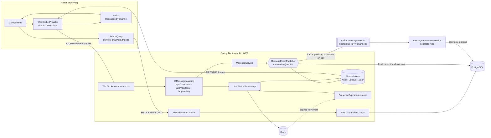

# DiscordClone — Interview Prep

Prepared 2026-10-05 from branch `docs` at `933793b`, which has the same code as `main` plus `docs/`.
Target role: Full Stack, 3+ years.

## Contents

0. [Read this first](#0-read-this-first)
1. [Project pitch](#1-project-pitch)
2. [Architecture walkthrough](#2-architecture-walkthrough)
3. [Questions and answers](#3-questions-and-answers) (70 questions)
4. [Follow-ups and curveballs](#4-follow-ups-and-curveballs)
5. [Weak spots](#5-weak-spots)
6. [Quick revision sheet](#6-quick-revision-sheet)

---

## 0. Read this first

**Path shorthand.** `J/` means `src/main/java/com/discordclone/`, and `F/` means `frontend/src/`.
Line numbers match commit `933793b`.

**`[VERIFY: …]`** marks things the code can't tell me, such as metrics, motivation, deployment
status, or what you actually experienced. Fill in the real answer or drop the claim. Don't make up
numbers in the interview.

**Ownership.** You left "My contribution" blank. Every commit in the history is under your name or
email (`anil`, `anilkr09`, `Anil Kumar`), and the companion `message-consumer-service` repo is on
your GitHub account. So these answers say **"I built it solo."** [VERIFY: confirm. The first commit,
`4b7d984` "Initial commit" (2025-03-02), is by `aaaa-001` with a different email. If that was a
template, a course starter, or someone else, be ready to say what it contained.]

**Don't commit this file to a public repo.** Interviewers read READMEs and file lists. Keep it local,
or add it to `.git/info/exclude`.

### The honest state of `main`

An interviewer who clones the repo can find these in minutes. Bring them up yourself, before they do.
§5 has the answers.

1. **The backend probably doesn't compile.** `spring-boot-starter-data-redis` is missing from
   `build.gradle` (it was removed in `cd97e97`), but the Redis code imports it. [VERIFY: this was
   inferred from the imports and the dependency block. No build was run, because no JDK was
   available. Run `./gradlew compileJava` yourself before you say it.]
2. **Two test classes are stale and don't compile:** `UserStatusServiceTest` and
   `MessageServiceTest`.
3. **Presence never pushes OFFLINE.** Redis keyspace notifications are off in `docker-compose.yml`.
4. **Several endpoints have no authorization**, and some responses return JPA entities that include
   BCrypt hashes.
5. **Two secrets are committed:** the JWT signing secret (`application.properties:56`) and a
   SonarCloud token (`build.gradle:29`). The Sonar token needs revoking, not just deleting.

If you have a free evening before interviews, fix 1–3 and rotate the secrets in 5. That changes
several answers below from "I know about it" to "I found it and fixed it." `docs/BUGS.md` has the
fix for each one: B07, B08, B09, B14.

### How to answer

- Lead with the key point, then give the detail. Stop and let them steer.
- When they find a flaw: acknowledge it, say why it happened (no excuses), give the fix, then name
  the pattern that stops it coming back.
- Name the file. "That's in `UserStatusServiceImpl.resolveStatus`" shows you know the code.

---

## Project at a glance

### Tech stack

| Layer | What | Versions |
|---|---|---|
| Backend | Spring Boot (Web, Security, Data JPA, WebSocket/STOMP, Validation), jjwt, Lombok | Boot 3.2.2, Java 17, jjwt 0.11.5 |
| Frontend | React, TypeScript, Vite, MUI, Redux Toolkit, TanStack Query, `@stomp/stompjs`, axios, react-router | React 18, TS 5.7, Vite 6, MUI 6, RTK 2, Query 5, stompjs 7, router 7 |
| Data | PostgreSQL is the system of record, and Redis holds presence | Postgres 16, Redis 7 |
| Messaging | Optional Kafka path (`kafka` profile) in KRaft mode, plus a separate consumer service | cp-kafka 7.5.0; consumer on Boot 4.0.5 |
| Ops | docker compose (local infra), backend Dockerfile, multi-stage frontend Dockerfile with nginx, Vercel config, manual GitHub Actions workflow, JaCoCo, PMD | |

### Entry points and core modules

- **Backend:** `J/DiscordCloneApplication.java`. The packages are `controller/` (REST and
  `@MessageMapping`), `service/` (plus `impl/`), `repository/`, `model/`, `security/`, `config/`,
  `websocket/`, `exception/`, and `dto/` + `payload/`.
- **Frontend:** `F/main.tsx` → `F/App.tsx`, which sets up routes and wraps providers in this order:
  `AuthProvider → Redux → WebSocketProvider → StatusProvider → QueryClientProvider → Router`.
- **Infra:** `docker-compose.yml` runs postgres, redis, kafka, kafka-init, kafka-ui, and pgadmin.
- **Tests:** 6 Mockito unit-test classes in `src/test/java/com/discordclone/service/`, with 50
  `@Test` methods. There are no frontend tests.

### Key design decisions

1. **A profile seam for message delivery.** `MessageService` hands each message to a
   `MessageEventPublisher` and a `MessagePersistenceService`. `@Profile("local")` or
   `@Profile("kafka")` decides which implementations are wired in.
2. **Message IDs are generated by the producer.** `Message.id` is a `String` UUID, so the broadcast,
   the Kafka record, and the DB row all share one ID.
3. **STOMP over native WebSocket.** It uses the in-memory simple broker, and the JWT is checked once,
   at STOMP `CONNECT`.
4. **Presence is derived from Redis keys that expire.** Liveness (heartbeat) and engagement
   (activity) are separate signals, which is what makes IDLE possible. A disconnect doesn't force
   OFFLINE; the heartbeat key expiring does.
5. **Presence is only broadcast when it changes.**
6. **Client state is split three ways.** React Query holds REST data, Redux holds pushed messages,
   and Context holds auth, the socket, and presence.

### Timeline (from `git log`, 145 commits)

| When | What | Commits |
|---|---|---|
| Mar–Jun 2025 | First version: frontend, friends, WebSocket config, real-time status, idle status, DMs, first Redis service, Dockerfile, unit tests, CI workflow, join-by-link, server chat | `4b7d984`…`291fa8d` |
| Jan–Mar 2026 | Second pass: secure DMs, React Query friend list, WS event structure, server/channel/invite APIs, global exception handler, responsive UI, Render + Vercel deploy config. PRs #1–#3 | `2654cb2`…`f4c9ffe` |
| 2026-02-26 | DMs moved onto per-user STOMP queues | `c90b3e8` |
| 2026-04-02 → 04-09 | Kafka: profile seam, `Message.id` changed to UUID, broker-failure handling, KRaft. PR #5 | `3a4809e`, `d93b176`, `a413932`, `ec67190`, `7bbac3d` |
| 2026-04-03 | `message-consumer-service`, in a separate repo | `4fcde05` |
| 2026-04-09 | Fix for duplicate WebSocket connections | `3281a10` |
| 2026-04-19 → 05-17 | Redis presence rewrite: heartbeat and activity, expiry listener, leading-edge debounce. PR #6 | `8d3bb55`, `dc1ca97`, `7d4c9a6`, `7270c74`, `d10d627` |
| 2026-09 → 10 | Architecture review, a defect catalog (B01–B58), and a roadmap, all in `docs/` | `44d1ec1`…`933793b` |

---

## 1. Project pitch

### 30 seconds

> "I built a Discord-style real-time chat app, solo and end to end. The backend is Spring Boot 3 on
> Java 17, and the frontend is React with TypeScript. You can create servers and channels, invite
> people with codes, add friends, DM them, and see live presence: online, idle, do-not-disturb, or
> offline. Real-time runs over STOMP on WebSockets. Postgres is the source of truth, and Redis
> drives presence with heartbeat keys that expire. There's also an optional Kafka pipeline,
> switched on by a Spring profile, where a separate consumer service writes messages to the
> database. I'm proudest of the presence model. If I did it again, I'd centralise authorization."

### 2 minutes

> "It's a Discord clone: servers, channels, invite codes, friends, DMs, and presence. It's a Spring
> Boot monolith with a React and TypeScript single-page app. I built it alone, on and off from
> early 2025 [VERIFY: how much active time], and used it to move from CRUD into real-time and
> distributed-systems problems.
>
> Real-time runs on STOMP over a native WebSocket. The browser opens one connection and sends its
> JWT in the STOMP CONNECT frame, because browsers can't set headers on a WebSocket handshake. That
> one connection carries channel messages, DMs on per-user queues, friend-request events, and
> presence updates.
>
> There are two design decisions I'd point to. First, message delivery sits behind an interface,
> `MessageEventPublisher`, and a Spring profile picks the implementation. By default I save to
> Postgres and then broadcast. In the Kafka profile, I produce to a topic keyed by channel ID,
> which keeps each channel in order, and broadcast once Kafka acknowledges the write. A separate
> consumer service saves it to the database. To make that work, I generate the message UUID up
> front. The broadcast, the Kafka record, and the database row all carry the same ID, and the
> consumer uses it to skip duplicates.
>
> Second, presence is derived, not stored. The client sends a heartbeat every 10 seconds and an
> activity signal on real input. Each one writes a Redis key that expires. The server works out
> ONLINE, IDLE, or OFFLINE from which keys exist and how old they are, and it only broadcasts when
> the status changes. A disconnect doesn't mark you OFFLINE; the heartbeat key expiring does. So a
> page refresh doesn't make you flicker offline for your friends.
>
> Afterwards, I did a structured review of my own code and wrote up a defect catalog. The biggest
> lessons were about authorization and API boundaries, not infrastructure. My next steps would be
> central authorization checks, DTOs on every endpoint, CI on every push, and replacing the
> in-memory broker so the app can run on more than one instance."

---

## 2. Architecture walkthrough

### System diagram



Plain-text version, to sketch on a whiteboard:

```
Browser ──HTTP+JWT──▶ JwtAuthenticationFilter ─▶ REST controllers ─▶ services ─▶ Postgres
   │
   └─STOMP/WS─▶ WebSocketAuthInterceptor ─▶ @MessageMapping ─▶ MessageService ─▶ MessageEventPublisher
                                                │                      ├─ local: save ─▶ Postgres, then broadcast
                                                │                      └─ kafka: produce ─▶ Kafka ─▶ consumer ─▶ Postgres
                                                │                                (broadcast on ack)
                                                └─▶ UserStatusService ◀─▶ Redis TTL keys ─(expiry)─▶ OFFLINE
                    Simple broker (in JVM) ──MESSAGE frames──▶ Browser (Redux / React Query / Context)
```

### One channel message, from keypress to screen

1. **Compose.** `MessageInput` builds `MessageRequest { content, channelId, dm, receiver }` and sends
   it as a STOMP `SEND` to `/app/chat.send`. It uses the single connection that
   `WebSocketProvider` owns.
2. **Inbound interceptor.** `WebSocketAuthInterceptor.preSend` checks that the session has an
   authenticated principal. The principal was bound at CONNECT. (`J/security/WebSocketAuthInterceptor.java:131-144`)
3. **Handler.** `MessageController.sendMessage` gets the `UserPrincipal` from the session, never from
   the payload, and calls `MessageService.sendMessage(request, userId)`.
   (`J/controller/MessageController.java:33-41`)
4. **Domain work.** Inside `@Transactional`, it loads the User and Channel, generates a UUID and a
   timestamp, builds a `MessageResponse` DTO, and calls `eventPublisher.publish(...)`.
   (`J/service/MessageService.java:37-74`)
5. **Delivery. The profile decides the implementation.**
   - **local:** `LocalMessageEventPublisher` saves through `LocalMessagePersistenceService`, then
     calls `convertAndSend("/topic/channels/{id}/messages")`. For a DM it calls
     `convertAndSendToUser(sender)` and `convertAndSendToUser(receiver)` on `/queue/messages`.
   - **kafka:** `KafkaMessageEventPublisher` sends to `message-events` with the channel ID as the
     key. When Kafka acknowledges, it broadcasts the same way. On failure it sends "Message failed"
     to `/user/queue/errors`. Then `message-consumer-service` reads the record, inserts the row
     unless that UUID already exists, and acknowledges manually.
6. **Fan-out.** The simple broker pushes a MESSAGE frame to every subscribed session.
7. **Client.** `registerGroupMessageSocket` (channels) or `registerMessageSocket` (DMs) parses the
   frame and dispatches `addMessage`. The reducer removes duplicates by ID, sorts by timestamp, and
   keeps the last 200. (`F/websocket/message.socket.ts`, `F/store/messages/messages.slice.ts`)
8. **Render.** `ChatArea` selects `byChannelId[id]`. The first time a channel opens, the
   `fetchMessages` thunk loads history from `GET /api/messages/channels/{id}`, 20 per page, into the
   same slice.

### Presence

1. **Connect.** `WebSocketEventListener.handleSessionConnected` calls `handleActivity`, so the user
   shows ONLINE right away.
2. **Heartbeat.** `PresenceProvider` sends `/app/heartbeat` every 10 s. `handleHeartbeat` sets
   `presence:heartbeat:{id}` with a 30 s expiry, then calls `updateAndBroadcast`.
3. **Activity.** `IdleProvider` listens for DOM input, debounced to 1 s on the leading edge, and sends
   `/app/activity`, but only when the status isn't already ONLINE. `handleActivity` skips writes
   less than 5 s apart and sets `presence:last_activity:{id}` with a 10 min expiry.
4. **Resolve and broadcast.** `resolveStatus` works out the status, and `updateAndBroadcast`
   compares it with the cached `presence:status:{id}`. It publishes `{userId, status}` to
   `/topic/status` **only if it changed**. `PresenceProvider` handles your own status, and
   `FriendStatusProvider` keeps the friends map.
5. **Leave.** Disconnect deliberately does *not* set OFFLINE. When the heartbeat key expires, Redis
   publishes `__keyevent@*__:expired`, and `PresenceExpirationListener` broadcasts OFFLINE.
   *Caveat:* this requires `notify-keyspace-events Ex`, which compose doesn't set, so the push never
   happens today.

### Login

`POST /api/auth/login` → `AuthenticationManager` → `CustomUserDetailsService` checks the password
with BCrypt → `JwtService` issues an access token (HS512, subject = user ID, 24 h) and a refresh
token (7 d) → the SPA stores both in localStorage → the axios interceptor adds `Bearer` to each
request → `JwtAuthenticationFilter` validates the token, loads the user, and fills the
`SecurityContext`. The WebSocket does the same once, at STOMP CONNECT, with the token in a frame
header.

---

## 3. Questions and answers

Tags: `[Basic]` `[Intermediate]` `[Advanced]`. Each question has the **key point** first, then the
fuller answer in spoken form, then the files to review.

### A. Project overview and motivation

#### Q1. Walk me through this project. `[Basic]`
**Key point:** A real-time, Discord-style chat app. Spring Boot and React, with STOMP for real-time,
Postgres for data, Redis for presence, and Kafka as an optional message path.

Give the 2-minute pitch from §1, then hand control back: *"I can go deeper on the messaging
pipeline or on how presence works. Which would be more useful?"* That lets them choose a topic you
know well. Have the §2 diagram ready, because "can you draw it?" is the usual follow-up.

#### Q2. Why did you build it, and how did it evolve? `[Basic]`
**Key point:** I wanted to learn real-time and distributed-systems problems in a domain where
everyone knows what correct looks like. I added each layer on purpose.

"[VERIFY: your real motivation.] Chat works well for this because everyone knows the expected
behaviour: messages arrive in order, you can see who's online, and refreshing doesn't lose
anything. The history shows three phases. In spring 2025 I built a first version with friends,
WebSockets, status, and DMs. In early 2026 I came back and rebuilt the core properly: servers,
channels, invites, React Query on the frontend, and a deployment. Then I added two harder layers on
separate branches. Kafka came in April as PR #5, and the Redis presence rewrite came in May as PR #6.
Each one started from a question. For Kafka: how do I get the database write off the send path
without losing ordering? For presence: how do I stop people flickering offline every time they
refresh?"

#### Q3. What can a user actually do? `[Basic]`
**Key point:** Servers, channels, invites, friends with blocking, DMs, and live presence with a
custom status. No voice, attachments, or working edit/delete.

"You register and log in, create a server, which makes you its OWNER, and add text channels. You
invite people with an 8-character code that has a max-use count and an expiry. Friend requests can
be sent, accepted, rejected, and removed, you can block people, and both sides see updates live. You
can DM friends, chat in channels, see each friend as ONLINE, IDLE, DND, or OFFLINE, and set a custom
status. It doesn't have voice, file uploads, typing indicators, read receipts, or search. The backend
has endpoints for editing and deleting messages, but they're broken. Delete can never succeed, and
edit has no ownership check. So I don't count them as features."

*Review:* `J/controller/FriendController.java`, `ServerController.java`, `InviteController.java`,
`UserStatusController.java`.

#### Q4. What part are you most proud of? `[Intermediate]`
**Key point:** The presence model. Liveness and engagement are separate signals, expiry is what
defines offline, and the server only broadcasts on change.

"Presence. My first version was tied to the connection. Connecting wrote ONLINE to the database, and
disconnecting wrote OFFLINE. That flickered on every page refresh. Closing one of two tabs made you
look offline. After a server crash, everyone stayed ONLINE forever, because no disconnect events
fired. I rebuilt it on two Redis signals. A heartbeat key with a 30-second expiry answers 'is the
client alive?', and an activity key answers 'is the person actually there?' Keeping them separate is
what makes IDLE possible. The server derives the status and only broadcasts when it changes, so
when nothing's changing, almost nothing is sent. I'll also be upfront that it shipped with a bug:
OFFLINE never gets pushed, because Redis expiry events are off by default. I can walk you through
the fix." (→ Q59)

*Review:* `J/service/impl/UserStatusServiceImpl.java:100-148`.

### B. Architecture and design decisions

#### Q5. Explain the high-level architecture. `[Intermediate]`
**Key point:** A layered Spring monolith and a single-page app. REST handles request/response, STOMP
handles push, and Postgres, Redis, and Kafka each have one job.

"The backend is a standard layered Spring Boot app: controllers, services, Spring Data repositories,
and JPA entities, with security and WebSocket config in their own packages. There are two kinds of
entry point. REST controllers live under `/api/**`, and STOMP handlers use `@MessageMapping` for
`/app/chat.send`, `/app/heartbeat`, and `/app/activity`. Outbound real-time traffic goes through
Spring's in-memory simple broker. Each store has one job. Postgres holds everything durable, Redis
holds presence data that's meant to expire, and when the Kafka profile is on, Kafka is the message
log that a separate consumer writes to the database. On the frontend, the providers are nested in a
deliberate order: auth, Redux, the WebSocket client, presence, then React Query and the router.
Presence needs the socket, and idle detection needs presence."

*Review:* `docs/ARCHITECTURE.md` §1–3, `F/App.tsx:25-67`.

#### Q6. Why a monolith rather than microservices? `[Intermediate]`
**Key point:** One developer, one database, and operations that need to share transactions. I only
split out the part that scales and fails differently.

"Servers, channels, members, and invites are closely linked. Creating a server has to create the
owner's membership row in the same transaction, and a monolith gives me that for free. As one
developer, I'd have paid the cost of microservices, like deployments and versioning, without the
benefit of separate team boundaries. The one thing I split out was the Kafka consumer,
`message-consumer-service`, because consuming and saving messages scales and fails differently from
serving requests. Looking back, I split it the wrong way. It shares the main app's database and runs
its own `ddl-auto=update` on the same tables, so the two are still coupled at the data layer. Today
I'd make it a module in the same repo, with one owner for the schema."

*Review:* `J/service/ServerService.java:30-60`, `docs/KAFKA.md` §4.6.

#### Q7. Why did you put message delivery behind a profile-selected interface? `[Advanced]`
**Key point:** It's the strategy pattern with Spring `@Profile`. `MessageService` decides *what* a
message is, and the publisher decides *how* it's delivered.

"`MessageService.sendMessage` does the domain work. It loads the user and channel, assigns the UUID
and timestamp, and builds the response DTO. Then it calls `eventPublisher.publish(...)` and its job
is done. There are two implementations. `LocalMessageEventPublisher` saves and then broadcasts.
`KafkaMessageEventPublisher` produces to Kafka and broadcasts in the acknowledgement callback. Each
is a `@Service` marked `@Profile("local")` or `@Profile("kafka")`, and the persistence interface is
paired the same way. I chose this over an `if (kafkaEnabled)` branch for three reasons. The Kafka
beans don't even exist in the local profile, so it runs without a broker. Each implementation can be
tested on its own. And `MessageService` didn't change at all when I added Kafka. One honest
footnote: there's an `app.kafka.enabled` property in both profile files that nothing reads. The
profile alone controls the wiring, so that property is just misleading and should go."

*Review:* `J/service/MessageService.java:37-74`, `LocalMessageEventPublisher.java`,
`KafkaMessageEventPublisher.java`, commits `3a4809e`, `469d69d`.

#### Q8. Why STOMP instead of raw WebSocket or Socket.IO? `[Intermediate]`
**Key point:** STOMP adds routing, pub/sub destinations, and per-user queues on top of WebSocket, and
Spring supports it out of the box.

"Raw WebSocket is just a pipe. I'd have had to invent message types, routing, and subscription
tracking myself. With STOMP, `@MessageMapping("/chat.send")` works like a REST handler, with the
payload bound and the principal available. I get topics for channels and user destinations like
`/user/queue/messages`, which Spring resolves to every session that user has open. Channel chat, DMs,
friend events, and presence all run over one connection as separate subscriptions. Socket.IO isn't
plain WebSocket; it has its own protocol, so on a Java backend I'd need a third-party server port.
That's a worse fit than Spring's built-in STOMP. I connect with native WebSocket and no SockJS
fallback, because every browser I target supports it. `sockjs-client` and `socket.io-client` are
still in `package.json` from early experiments. Nothing uses them, and I'd remove them."

*Review:* `J/config/WebSocketConfig.java:26-41`, `F/providers/WebSocketProvider.tsx:61-100`.

#### Q9. Why Redis for presence instead of Postgres or an in-memory map? `[Advanced]`
**Key point:** Presence is written constantly, worthless after a few seconds, and has to expire on
its own. Redis keys with a TTL do exactly that.

"Look at the shape of the data. Every client writes every 10 seconds, the value is useless a minute
later, and 'offline' means a signal *stopped*, not that someone sent one. In Postgres, that's one
row per user updated every 10 seconds, which creates dead tuples and vacuum pressure for throwaway
data. I'd also still need a polling job to find stale timestamps. An in-memory map is lost on
restart and only exists on one instance. Redis handles all of it natively. `SET key value EX 30` is
O(1), expiry is built in, `MGET` loads a whole friends list in one round trip, and keyspace
notifications turn an expiry into a push event. So the key expiring *is* what defines offline. I
used `StringRedisTemplate` because every value is either epoch milliseconds or an enum name. That
keeps values readable in `redis-cli` and avoids storing serialization metadata."

*Review:* `J/constants/PresenceKeys.java`, `J/config/RedisConfig.java`, `docs/REDIS.md` §1.

#### Q10. Why Kafka? Isn't it overkill for a chat app? `[Advanced]`
**Key point:** At this scale, yes. I added it on purpose as an optional path, so I could learn the
pattern without making the default setup depend on it.

"Honestly, for this app's traffic, Kafka is overkill. That's why it's behind a profile and off by
default. I added it to learn how to take the database write off the send path while keeping order
and avoiding duplicates. What it gives me: a durable log; per-channel ordering, because records are
keyed by channel ID; the ability to replay messages into new consumers, like a search indexer; and a
consumer that scales independently. What it *doesn't* give me, and people often assume it does, is
horizontal scaling for WebSockets. The STOMP broker is in memory, so a message in Kafka can still
only reach clients connected to the instance that broadcasts it. For a real product at this size,
I'd remove Kafka and keep the seam, delivering through after-commit Spring events. If scaling out
were a real goal, I'd keep it and add a per-instance fan-out consumer group."

*Review:* `docs/IMPROVEMENTS.md`, "Decide whether Kafka earns its place".

#### Q11. Why use Redux, React Query, *and* Context? `[Intermediate]`
**Key point:** Each one holds a different kind of state: REST data, pushed messages, and app-wide
singletons. Three is one too many, and I'd merge two of them.

"React Query owns the data that comes from REST, like servers, channels, and friends. I get
caching, refetching, and loading states for free. WebSocket events update its cache directly with
`setQueryData`. For example, a friend-accepted event adds the friend and removes the pending
request, idempotently, without a refetch. Redux holds chat messages, because they arrive by push,
outside any query, and I wanted a normalised `byChannelId` map with de-duplication and a cap per
channel. Context holds the singletons: auth, the STOMP client, and presence. If I did it again, I'd
drop Redux and keep messages in React Query as an infinite query that I append to with
`setQueryData` when a message arrives. That way there's one cache. A small cleanup too:
`package.json` has both `react-query` v3 and `@tanstack/react-query` v5, but only v5 is used."

*Review:* `F/websocket/friends.events.ts:36-56`, `F/store/messages/messages.slice.ts`,
`F/hooks/useChannels.ts:27-40`.

### C. Tech stack deep dives

#### Q12. How is Spring Security configured? `[Intermediate]`
**Key point:** A stateless filter chain with CORS on, CSRF off, the JWT filter placed before the
username/password filter, a handful of public routes, and authentication required everywhere else.

"In `SecurityConfig`, the filter chain sets CORS from an explicit list of origins. It disables CSRF,
because auth uses a bearer header, not cookies, and it sets sessions to `STATELESS`. It permits
`/api/auth/**`, `/ws/**`, `/health`, error dispatches, and all `OPTIONS` preflights. Everything else
must be authenticated. My `JwtAuthenticationFilter` runs before `UsernamePasswordAuthenticationFilter`.
It's deliberately non-blocking: with no token or a bad one, it just doesn't set an authentication,
and the `.anyRequest().authenticated()` rule rejects the request. Passwords use
`BCryptPasswordEncoder`. `@EnableMethodSecurity` is on, but I never used `@PreAuthorize`. That's
where I'd centralise authorization now."

*Review:* `J/security/SecurityConfig.java:53-98`, `J/security/JwtAuthenticationFilter.java:36-76`.

#### Q13. How does Spring's STOMP support route messages? `[Intermediate]`
**Key point:** `/app` goes to controller methods, `/topic` and `/queue` go to the broker, and `/user`
is rewritten for each session. The server pushes through `SimpMessagingTemplate`.

"Incoming frames land on the `clientInboundChannel`, which is where my interceptor runs. If the
destination starts with `/app`, Spring sends it to a `@MessageMapping` method, the way REST routes to
`@GetMapping`. A `SUBSCRIBE` to `/topic/...` or `/queue/...` is recorded by the simple broker. To
send, services call `SimpMessagingTemplate.convertAndSend("/topic/channels/7/messages", dto)` to
broadcast, or `convertAndSendToUser(username, "/queue/messages", dto)` to reach one user. That goes
through the broker to the `clientOutboundChannel` and out as MESSAGE frames. The whole setup in
`WebSocketConfig` is about ten lines: enable the simple broker, set the app and user prefixes,
register `/ws`, and add the interceptor."

*Review:* `J/config/WebSocketConfig.java`, `J/controller/StatusWebSocketController.java`.

#### Q14. How do `/user/...` destinations work, and why do DMs use them? `[Advanced]`
**Key point:** The client subscribes to a logical name, and Spring maps it to a queue for each of that
user's sessions, looked up by `Principal.getName()`.

"The client subscribes to `/user/queue/messages`. Spring's `UserDestinationResolver` rewrites that to
something like `/queue/messages-user{sessionId}`, which nobody else can subscribe to. When I call
`convertAndSendToUser("alice", "/queue/messages", dto)`, Spring finds all of Alice's active sessions
and sends to each one, so multiple tabs work. The lookup key is `Principal.getName()`, which in my
app is the username. That's why `MessageRequest.receiver` is a username string. In February I moved
DMs from a shared destination onto these per-user queues (`c90b3e8`), because anyone can subscribe
to a DM sent on a topic. There's still one gap: the *client* chooses the receiver. The server should
work it out from the DM channel's participants. I cover that under weak spots."

*Review:* `J/service/LocalMessageEventPublisher.java:30-50`, `F/websocket/message.socket.ts`.

#### Q15. How did you use JPA and Hibernate, and what would you change? `[Intermediate]`
**Key point:** Spring Data derived queries, LAZY associations, and `open-in-view=false`. The mistakes
were exposing entities in the API and putting Lombok `@Data` on entities.

"The repositories are Spring Data interfaces with derived queries, like
`findByChannelOrderByTimestampDesc`, `findBydmKeyAndType`, and `existsByIdUserIdAndIdServerId`. A
message's channel and sender are LAZY. I set `spring.jpa.open-in-view=false`, which is the right
choice: it stops lazy loading from happening while JSON is being rendered. But some controllers
return entities directly, and with open-in-view off, a lazy proxy in a response can fail to
serialize. The real lesson is to map to DTOs inside the transaction. I'd also take `@Data` off the
entities, because it generates `equals`, `hashCode`, and `toString` over lazy associations.
`Server.owner` is EAGER, so the owner is loaded with every server query. Read methods use
`@Transactional(readOnly = true)`."

*Review:* `J/model/Message.java`, `J/repository/`, `application.properties` (`open-in-view`).

#### Q16. How exactly do you use Redis? `[Intermediate]`
**Key point:** Plain string keys with a TTL through `StringRedisTemplate`, `MGET` for batch reads, and
a pattern subscription for expiry events. No Spring Cache.

"Everything goes through `StringRedisTemplate`, and every key is built in one place, `PresenceKeys`,
for example `presence:heartbeat:{id}`. A heartbeat is a `SET` with a 30-second expiry. Activity is a
`SET` with a 10-minute expiry, and I skip the write if the last one was under 5 seconds ago. The
last status I broadcast is cached for 60 seconds, and a custom status lasts 24 hours. Loading a
friends list is one `MGET` over the status keys, with a fallback that computes the status for any
key that's missing. For expiry, a `RedisMessageListenerContainer` subscribes to the pattern
`__keyevent@*__:expired` and passes events to `PresenceExpirationListener`. One gotcha:
`spring.cache.type=redis` is set in the properties, but there's no `@EnableCaching` anywhere, so it
does nothing. All Redis access is explicit."

*Review:* `J/service/impl/UserStatusServiceImpl.java:41-95, 169-194`,
`J/config/RedisKeyExpirationListenerConfig.java:29-32`.

#### Q17. Walk me through your Kafka producer settings and delivery guarantees. `[Advanced]`
**Key point:** `acks=all`, idempotence, and channel ID as the key give a durable, non-duplicated
write that's ordered per channel. The design is at-least-once delivery to a consumer that ignores
duplicates.

"The producer uses `acks=all`, `enable.idempotence=true`, and `retries=3`, with a String key and a
JSON value. Idempotence means broker-side retries can't create duplicates within a producer session.
The key is the channel ID, so all of a channel's messages go to one partition, and Kafka only
guarantees order within a partition. That's all chat needs: order within a conversation, not across
everything. The topic has 4 partitions. On the consumer side, the design commits offsets manually,
only after a successful save, and the insert skips any UUID that's already stored. That's
at-least-once delivery, and each message ends up as exactly one row. I found two problems later.
The consumer's error-handler factory method is missing `@Bean`, so Spring Kafka uses its default:
10 immediate retries, then it skips the record. During a database outage, that's at-most-once. And
because I defined my own `ProducerFactory`, Boot's auto-configuration backs off. So all the
`spring.kafka.producer.*` tuning in the properties file is ignored, and the bootstrap server is
hardcoded to `localhost:9092`."

*Review:* `J/config/KafkaProducerConfig.java:27-39`, `J/service/KafkaMessageEventPublisher.java:24-40`,
`docs/KAFKA.md` §2–4.

#### Q18. React 18 StrictMode runs effects twice. Did that bite you? `[Intermediate]`
**Key point:** Yes. It opened two STOMP connections with duplicate subscriptions. I fixed it with a
connection guard, a registry of subscriptions, and proper cleanup.

"In development, StrictMode mounts, unmounts, and mounts again, so my connect effect ran twice and
I ended up with two STOMP clients. Re-renders also created duplicate subscriptions. In `3281a10` I
fixed it three ways. I added an `isConnecting` ref guard. I wrote a cleanup that calls `deactivate()`
and resets state. And I added a `subscriptions` map keyed by destination, so `subscribeToTopic`
returns the existing subscription instead of creating another. The real lesson is that an effect has
to be safe to run twice. The cleanup is the actual fix; the ref guard is just extra protection. I
also missed something: the guard isn't reset in `onWebSocketError`, so a failed connection can block
retries until the effect's dependencies change."

*Review:* `F/providers/WebSocketProvider.tsx:48-56, 104-116, 121-131`.

#### Q19. How is the STOMP client set up on the frontend, and how can it fail? `[Intermediate]`
**Key point:** One `@stomp/stompjs` `Client`, with the JWT in `connectHeaders` and automatic
reconnect. Reconnects reuse the old token, and transport heart-beats are effectively off.

"`WebSocketProvider` builds one `Client` with `brokerURL` set to the WebSocket URL. That URL comes
from `config/api.ts`, which takes `VITE_API_BASE_URL` and swaps `http` for `ws`, or `https` for
`wss`. `connectHeaders` carries `Authorization: Bearer …`. In `onConnect`, I register the per-user
subscriptions once per connection: `/user/queue/messages` for DMs and `/user/queue/friends` for
friend events. stompjs reconnects automatically every 5 seconds. Two ways it fails. First, a
reconnect reuses the `connectHeaders` captured when the client was built, so once that token
expires, every reconnect is rejected. Second, the client offers 10-second STOMP heart-beats, but
Spring's simple broker answers `0,0` because I never gave it a `TaskScheduler`. So a half-open
connection isn't detected on either side. My `/app/heartbeat` is for presence, not socket health;
they're different things."

*Review:* `F/providers/WebSocketProvider.tsx:61-100`, `F/config/api.ts`, `docs/WEBSOCKETS.md` §6.5.

### D. Code-level deep dives

#### Q20. Walk me through `MessageService.sendMessage` line by line. `[Advanced]`
**Key point:** Load the sender and channel, assign a UUID and timestamp, build the DTO, and hand off.
It's short on purpose. What's missing is an authorization check.

"It runs in `@Transactional`. It loads the `User` by the ID from the authenticated STOMP principal,
never from the payload. It loads the `Channel` by `request.channelId`. If either is missing, it
throws `ResourceNotFoundException`. Then it sets `UUID.randomUUID()` as the ID, plus the timestamp,
sender, channel, and content. It builds a `MessageResponse` with a small author DTO, so I never
serialize the `User` entity, and calls `eventPublisher.publish(message, response, request, user)`.
There are three things I'd fix. First, nothing checks that the sender belongs to the channel's
server, or is part of the DM, so anyone can post anywhere. Second, the not-found error for a channel
passes `userId` instead of the channel ID. That's a copy-paste bug on line 46. Third, in the local
profile the broadcast happens *inside* the transaction, before the commit, so if the commit fails,
clients show a message that doesn't exist. I'd publish an event and broadcast from
`@TransactionalEventListener(phase = AFTER_COMMIT)`."

*Review:* `J/service/MessageService.java:37-74`, `J/controller/MessageController.java:33-41`.

#### Q21. Walk me through how a user's status is worked out and broadcast. `[Advanced]`
**Key point:** Custom override first, then: is there a heartbeat? Then activity age: under 30 s is
ONLINE, under 5 min is IDLE, otherwise IDLE. Compare with the cached value and only broadcast on
change.

"`resolveStatus` checks keys in order. If there's a custom status, like DND, it returns that. If
there's no heartbeat key, it returns OFFLINE. If there's a heartbeat but no activity key, it returns
IDLE: the client is connected, but the person never interacted. Otherwise it looks at how long ago
the last activity was: under 30 seconds is ONLINE, under 5 minutes is IDLE, and beyond that it's
still IDLE as long as heartbeats keep coming. Then `updateAndBroadcast` compares the result with
`presence:status:{id}`. If they match, it returns without writing or broadcasting. That's what
makes broadcasts edge-triggered. Without it, every heartbeat from every user would go out to every
client. I know of three bugs. The custom check runs before the heartbeat check, so an offline user
who set DND reappears as DND once the cached status expires. The heartbeat check should come first.
There's an 'OFFLINE after 60 seconds' branch that can never run, because the heartbeat key is never
more than 30 seconds old. And the client stops sending activity while it's ONLINE, so an active user
drops to IDLE every 30 to 40 seconds."

*Review:* `J/service/impl/UserStatusServiceImpl.java:100-148`, `F/providers/IdleProvider.tsx:47-49`.

#### Q22. How does `WebSocketAuthInterceptor` authenticate a STOMP session? `[Advanced]`
**Key point:** It validates the JWT once, at CONNECT, and binds the `Authentication` to the session
with `accessor.setUser`. SUBSCRIBE and SEND rely on that.

"It's a `ChannelInterceptor` on the inbound channel, and it switches on the STOMP command. On
`CONNECT`, it reads the `Authorization` native header, strips `Bearer `, validates the token, loads
the user from the token's subject, and calls `accessor.setUser(auth)`. That binds the principal to
the STOMP session for its whole lifetime. It's what makes `/user/**` destinations and
`headerAccessor.getUser()` in my handlers work. On `SEND`, it rejects frames without an
authenticated principal. On `SUBSCRIBE`, it only checks the destination prefix. There's a channel
membership check, but it's commented out at lines 119–128, so any logged-in user can subscribe to
any channel's topic. Two less obvious problems. `validateToken` throws instead of returning false, so
the `if (!validateToken(...)) return null` guard can never run, and rejection happens through the
exception. And because the token is only checked at CONNECT, the socket stays open after the token
expires."

*Review:* `J/security/WebSocketAuthInterceptor.java:64-144, 173-178`, `J/security/JwtService.java:82-97`.

#### Q23. How does `getOrCreateDmChannel` work, and how do you handle the race? `[Advanced]`
**Key point:** A key that's the same whichever user starts (`dm-{min}-{max}`), a unique constraint,
and a catch on `DataIntegrityViolationException` that reads the row again. The database settles the
race, not the application.

"Two users always produce the same key, `dm-{min(id)}-{max(id)}`, regardless of who starts the DM. I
look it up by key and type, and if it isn't there, I insert it. `dmKey` has a unique constraint, so
if two requests race, one insert fails. I catch that and read the row the other request created.
Letting a database constraint decide the race is the right instinct, because 'check, then insert'
in application code can't be made safe across threads or instances. I use the same pattern for
unique server names in `ServerService.createServer`. One subtlety I believe is true, though I
haven't tested it: the catch runs inside the same `@Transactional`. In Postgres, a failed statement
aborts the whole transaction, and Spring has already marked it rollback-only, so the second read
probably fails too. The robust version is `INSERT … ON CONFLICT DO NOTHING` followed by a select, or
a retry in a new transaction. The bigger problem is the line that puts every DM on server ID 1. See
Q30."

*Review:* `J/service/ChannelService.java:61-96`, `J/service/ServerService.java:30-55`.

#### Q24. How does the client de-duplicate and order messages? `[Intermediate]`
**Key point:** The Redux reducer removes duplicates by message ID, sorts by timestamp, and keeps the
last 200 per channel. That only works because the server assigns one stable ID.

"Live messages and history both go through the same slice. `addMessage` adds the message, then
`dedupeAndSort` puts everything in a `Map` keyed by ID and sorts by timestamp. The cap is
`MAX_MESSAGES_PER_CHANNEL = 200`. So if a message arrives over the WebSocket and also shows up in the
next history page, it appears once. This depends on the ID being generated once, on the server, and
being the same in the broadcast and in the database. A database-generated ID would differ between
the two. Sorting on every message is O(n log n), but n is at most 200, so that's fine. Honestly,
this de-duplication also *hid* a bug. `ChatArea` subscribes on every render, so the same frame
arrives several times, and the reducer quietly throws away the copies (Q25)."

*Review:* `F/store/messages/messages.slice.ts:10-52`.

#### Q25. How do you avoid duplicate subscriptions, and where did you miss one? `[Intermediate]`
**Key point:** The provider has a registry that de-duplicates subscriptions and a hook that cleans
up. But `ChatArea` subscribes in its render body and bypasses both.

"`WebSocketProvider.subscribeToTopic` returns the existing subscription if that destination already
has one. The `useWebSocketTopic` hook subscribes and unsubscribes inside an effect. The per-user
queues are subscribed once, in `onConnect`. But `ChatArea` calls `registerGroupMessageSocket(client,
id)` directly in its component body, so every render adds another STOMP subscription, and none of
them is ever removed. Each incoming message re-renders `ChatArea`, which subscribes again, so the
count keeps growing. Users don't see duplicates only because the reducer removes them. The quick fix
is a `useEffect` that subscribes and returns `() => sub.unsubscribe()`, with `[client, id,
connected]` as dependencies. The proper fix is one subscription manager with reference counting,
because `useChannels` has a milder version of the same leak."

*Review:* `F/components/chat/ChatArea.tsx:18-20`, `F/websocket/message.socket.ts`, `F/hooks/useChannels.ts`.

#### Q26. How do friend requests update live on both sides? `[Intermediate]`
**Key point:** The service sends a typed `WsEvent` to the other user's `/user/queue/friends`, and the
client routes it by type into React Query cache updates that are safe to repeat.

"When someone sends, accepts, rejects, or removes a friend, `FriendshipServiceImpl` sends a
`WsEvent { type, payload }` to the other user's `/user/queue/friends` through `WebSocketPublisher`.
The types are `FRIEND_REQUEST_RECEIVED`, `FRIEND_ACCEPTED`, `FRIEND_REJECTED`, and `FRIEND_REMOVED`.
On the client, `handleFriendEvent` switches on the type and calls `queryClient.setQueryData` on the
`friends`, `incomingRequests`, and `outgoingRequests` caches. Every update is idempotent. For
example, accept only adds the friend if they aren't already in the list. So the UI updates instantly
with no refetch. The service also handles a nice edge case: if A sends B a request while B already
has a pending request to A, it accepts automatically. One mismatch: the client handles
`FRIEND_REQUEST_CANCELLED` and `FRIEND_REQUEST_SENT`, but the backend never sends them."

*Review:* `J/service/impl/FriendshipServiceImpl.java:49-125`, `F/websocket/friends.events.ts`.

### E. Database and data modeling

#### Q27. Walk me through the data model. `[Intermediate]`
**Key point:** Users, servers, a membership table with roles, channels (DMs included), messages,
friendships, and invites. Presence isn't in the database.

"`users` has a unique username and email and a BCrypt password. `servers` has an owner and a name
that's unique *globally*, which is a modelling mistake: two people can't both have a server called
'General'. `server_members` is the join table. Its primary key is `(user_id, server_id)`, and it
has a `role`: OWNER, ADMIN, or MEMBER. `channels` belong to a server, with `(server_id, name)`
unique. DMs are channels with `type = DM` and a unique `dmKey`. `messages` has a UUID string primary
key, `channel_id`, `user_id`, TEXT content, a timestamp, and an `edited` flag. `friendships` has a
sender, a receiver, and a status: PENDING, ACCEPTED, REJECTED, or BLOCKED. `invites` uses the
8-character code as its primary key, with max uses, a use count, and an expiry. `user_status` only
stores the custom status and the last-activity time. Live presence is in Redis."

*Review:* `J/model/`, `docs/ARCHITECTURE.md` §4 (ER diagram).

#### Q28. Why is `Message.id` a String UUID, and what does that cost? `[Advanced]`
**Key point:** On the Kafka path the ID has to exist before anything is saved. The cost is a wide,
random primary key. UUIDv7 or Snowflake IDs would be better.

"On the Kafka path, the message is broadcast and put on the topic before anything is written to the
database, so the database can't be the one assigning the ID. Otherwise the sender and recipients
would see one ID and the eventual row would get another. So I generate the UUID in the service. That
keeps it the same across the broadcast, the Kafka record, and the row. It's also how the consumer
spots duplicates, and how the client de-duplicates. I made that change in `c1383a8` and `d93b176`.
The costs: I stored it as a 36-character `varchar` instead of Postgres's 16-byte `uuid` type, so the
indexes are bigger. And random v4 UUIDs land all over the B-tree, which is bad for insert locality.
I'd switch to the native `uuid` type with UUIDv7, which is ordered by time, or Snowflake-style
64-bit IDs, which is what Discord uses. Both sort by time, which also helps pagination."

*Review:* `J/model/Message.java:19-20`, `J/service/MessageService.java:48-49`.

#### Q29. How are server membership and roles modeled and enforced? `[Intermediate]`
**Key point:** A `Member` join entity with an `@EmbeddedId (userId, serverId)` and a role enum.
Each service method checks it through `isUserMember` or `isUserAdmin`.

"`Member` has `@EmbeddedId MemberId(userId, serverId)` with `@MapsId` on both `@ManyToOne`s. The
foreign keys *are* the primary key, so the database itself prevents duplicate memberships.
`createServer` saves the server and then the owner's `Member` row, with role OWNER, in the same
transaction. `joinViaInvite` adds MEMBER rows. The checks live in the services. `ChannelService`
calls `checkUserIsAdmin` before creating, updating, or deleting a channel, and `isUserMember` before
listing channels. It's coarse role-based access control, with no permissions per channel. The real
weakness is that every method has to remember its own check, and some don't. The endpoints for
adding and removing members have no check at all."

*Review:* `J/model/Member.java`, `J/service/ChannelService.java:31-60`, `J/service/InviteService.java:41-76`.

#### Q30. How are DMs modeled, and what's wrong with that? `[Advanced]`
**Key point:** DMs are ordinary channels attached to a hard-coded server 1. That reused a lot of code,
but it's fragile and it breaks authorization. The fix is a proper participant model.

"I made a DM a `Channel` with `type = DM` and a `dmKey`, so DMs could reuse the messages table, the
history endpoint, and the publishers. The shortcut was `serverService.getServerById(1L)`: every DM
channel belongs to server 1. That has three consequences. DMs only work if a server with ID 1
exists, which the data seeder happens to create. Server membership checks mean nothing for DMs,
because being a member of server 1 doesn't make you part of a DM. And I created a `DmChannel` entity
with `user1` and `user2` that nothing uses. In `a09a4f4` I made `server_id` nullable, intending to
separate the two, but I never finished. The right model is conversations with an explicit
participants table. Then authorization becomes 'is this user a participant?', and the server works
out the DM recipient from the participants instead of trusting the client."

*Review:* `J/service/ChannelService.java:80`, `J/model/DmChannel.java`, `docs/BUGS.md` B12–B13.

#### Q31. How do you manage schema changes? `[Intermediate]`
**Key point:** Hibernate's `ddl-auto=update` handles it today. That's fine while prototyping and
unsafe after that. Flyway is the plan.

"Right now `spring.jpa.hibernate.ddl-auto=update` creates and alters tables from the entities. It's
fast while the model is still changing, but it only ever adds. It never drops, renames, or tightens a
column, so environments drift apart, and schema changes never get reviewed. The Kafka consumer makes
it worse: it has its own copies of the entities and also runs `update` against the same database.
Whichever service starts first decides details like whether `messages.channel_id` is nullable. My
plan is a Flyway baseline migration, `V1`, generated from the current schema. Then the main app runs
with `ddl-auto=validate`, so it fails fast if the schema doesn't match, and the consumer runs with
`validate` or `none`, so only one service owns the schema."

*Review:* `application.properties` (`ddl-auto`), `docs/KAFKA.md` §4.6.

#### Q32. How is message history paginated, and would it hold up? `[Intermediate]`
**Key point:** Spring Data offset pagination, 20 per page, with no index behind it. At scale I'd
switch to cursor-based pagination on `(channel_id, timestamp, id)`.

"`GET /api/messages/channels/{id}` takes a `Pageable`, page 0 and size 20 by default, and calls
`findByChannelOrderByTimestampDesc`, which returns a `Page`. That has three problems at scale. There's
no index on `messages(channel_id, timestamp)`, and Postgres doesn't index foreign keys
automatically, so every page has to filter and sort. Offset pagination gets slower the further back
you scroll, and it shifts as new messages arrive, so you can see the same message twice or miss one.
And `Page` runs a `COUNT(*)` on every request, which a chat UI doesn't need. The fix is a composite
index on `(channel_id, timestamp DESC, id)`, 'messages before this one' cursor queries, and `Slice`
instead of `Page`. With time-ordered IDs, the cursor can just be the ID."

*Review:* `J/controller/MessageController.java:45-75`, `J/service/MessageService.java:85-95`.

### F. APIs and integrations

#### Q33. What does the API look like, and how did you split REST and WebSocket? `[Basic]`
**Key point:** REST for request/response and history. STOMP for sending chat messages and for
everything the server pushes.

"REST is grouped by resource: `/api/auth` (register, login, refresh), `/api/servers`,
`/api/channels/{serverId}`, `/api/invites`, `/api/friends`, `/api/users` (including status), and
`/api/messages` for history. Over STOMP, clients send to three destinations: `/app/chat.send`,
`/app/heartbeat`, and `/app/activity`. The server pushes on channel topics, per-user queues,
`/topic/channels` when a channel is created, and `/topic/status` for presence. I send chat over the
socket rather than with a POST because the connection is already open, so each message skips an
HTTP round trip and the auth overhead. The trade-off is that you lose HTTP status codes, so you need
your own channel for errors and acknowledgements. The server does have `/user/queue/errors`, but the
client never subscribes to it. If I cleaned up the REST side, I'd take verbs out of paths, like
`/accept/{id}` and `/create`, and stop ignoring the `{serverId}` path variable in some channel
routes."

*Review:* `docs/IMPLEMENTATION.md` §4 (full route table), `docs/WEBSOCKETS.md` §4.

#### Q34. How does error handling work? `[Intermediate]`
**Key point:** `@RestControllerAdvice` maps domain exceptions to 4xx responses with an `ErrorResponse`
body. The gaps: a bare `RuntimeException` becomes a 500, and errors on STOMP are swallowed.

"`GlobalExceptionHandler` maps my exception types to status codes. `ResourceNotFoundException` is
404, `ConflictException` and `DuplicateResourceException` are 409, `BadCredentialsException` is 401,
and validation errors are 400. They all return the same `ErrorResponse` shape, and the frontend
shows it as a toast. There are two gaps. Several services throw a plain `RuntimeException` for
business errors, like an expired invite or 'already a member'. The catch-all turns those into 500s
and sends the message back to the client. And over STOMP, only JWT exceptions are mapped. If you
send to a channel that doesn't exist, the server logs the error and you get nothing back. I'd use
specific exceptions everywhere, return RFC 7807 `ProblemDetail`, and add a general
`@MessageExceptionHandler` that sends to `/user/queue/errors`, with the client subscribed to it."

*Review:* `J/exception/GlobalExceptionHandler.java`, `J/service/InviteService.java:41-60`,
`J/exception/WebSocketExceptionHandler.java`.

#### Q35. What's the contract between the main app and the Kafka consumer? `[Advanced]`
**Key point:** A JSON `MessageResponse` that's copied by hand into both repos. It works today, but
nothing enforces that they stay compatible.

"The event on the topic is the same `MessageResponse` DTO I send over WebSockets: ID, content,
channel ID, timestamp, and an author object. The consumer has its own hand-written copy of that
class. It ignores the producer's `__TypeId__` header and always deserializes into its own type.
They're compatible today, but if I renamed a field on the producer, the consumer would read `null`.
A null author makes the save fail, and with the current error handling, the message is dropped after
the retries. There are two fixes. Separate the event from the WebSocket DTO, as a versioned
`MessageCreatedV1`. And share it through a common module or a schema registry with compatibility
checks, so a breaking change fails the build instead of losing data."

*Review:* `J/payload/MessageResponse.java`, `docs/KAFKA.md` §4.5.

#### Q36. How does the frontend call the backend? `[Intermediate]`
**Key point:** One axios instance with an auth interceptor, a service module per resource, React Query
hooks on top, and URLs from Vite env files.

"`services/api.ts` creates an axios instance with `baseURL = VITE_API_BASE_URL + '/api'`. The env
variable is just the origin: `.env.development` points at `localhost:8080`, and `.env.production`
points at the Render backend. A request interceptor attaches `Authorization: Bearer <token>` from
localStorage. It also decodes the token's `exp` so it can try to refresh before the request goes out.
Each resource has its own service module, like `server.service.ts` and `friend.service.ts`, wrapped
in React Query hooks such as `useServers`, `useChannels`, and `useFriends`. The honest gap is that
the refresh call posts to `/api/refresh-token` with an empty body, but the backend route is
`/api/auth/refresh` and it expects `{refreshToken}`. So refresh always fails, and you get logged out
when the 24-hour access token expires."

*Review:* `F/services/api.ts:3-61`, `F/config/api.ts`, `frontend/.env.development`.

### G. Performance and scalability

#### Q37. What happens at 10x or 100x users? `[Advanced]`
**Key point:** Presence fan-out and the single-instance broker break first. At 10x I'd fix the hot
spots. At 100x I'd need an external broker and multiple instances.

"I haven't load-tested it [VERIFY: if you ever did, use the real numbers], so I'll reason from the
code. At **10x**, presence breaks first. Every status change goes to `/topic/status`, which every
client subscribes to, so each change costs N frames, and the total grows roughly with N². Next is
the database: every authenticated HTTP request and every STOMP CONNECT does a `loadUserById`, and
message history has no index. My 10x fixes would be: send presence only to friends, add the index,
cache user lookups, size the inbound and outbound channel thread pools, and get a bigger machine. At
**100x**, one JVM isn't enough, and the in-memory broker can't be shared. So I'd move to a STOMP
broker relay like RabbitMQ, or fan out to every instance through Redis or Kafka. I'd make presence
expiry run exactly once across the cluster, put read replicas behind history, and eventually
partition the messages table by time."

*Review:* `J/config/WebSocketConfig.java:27`, `J/service/impl/UserStatusServiceImpl.java:299-306`.

#### Q38. Why can't you run two instances today, and how would you fix it? `[Advanced]`
**Key point:** `enableSimpleBroker` keeps subscriptions in one JVM's memory. You need an external
broker relay or a pub/sub bridge. Kafka alone doesn't solve it.

"With the simple broker, the list of subscriptions lives in memory. If Alice is connected to
instance A and Bob to instance B, Alice's message is broadcast by A to A's subscribers only, so Bob
never sees it. Option one is `enableStompBrokerRelay` pointed at RabbitMQ or ActiveMQ with the STOMP
plugin. The broker owns all subscriptions, and Spring can share the user registry across instances so
`/user` destinations still resolve. Option two keeps a local broker on each instance and bridges
them: each instance publishes events to Redis pub/sub, or reads Kafka with its own consumer group,
and re-broadcasts locally. Two other things have to change. Redis expiry events reach every
instance, so OFFLINE would be broadcast once per instance. That needs a claim step, like a `SETNX`
lock, or a sorted-set sweeper where `ZREM` only succeeds on one instance. And the load balancer has
to support WebSocket upgrades."

*Review:* `docs/WEBSOCKETS.md` §1 "Why the simple broker", `docs/REDIS.md` §5 caveats.

#### Q39. How does presence cost grow with users, and how would you scope it? `[Advanced]`
**Key point:** Edge-triggering cuts how *often* status changes go out, but the global topic makes
each one expensive. Sending only to friends fixes both the cost and the privacy problem.

"Because broadcasts are edge-triggered, a status only goes out when it changes, so a heartbeat costs
a few Redis operations and no frames. But each change goes to everyone. That's O(N) per change, and
it's a privacy leak: someone you've blocked can still see when you're online. The fix is to look up
the user's accepted friends, which `getFriendIds` already does, and `convertAndSendToUser` to each
friend's `/user/queue/presence`. Then the cost grows with the number of friends, not total users.
The friend lookup only runs when a status *changes*, not on every heartbeat, and I could cache friend
sets in Redis if it ever showed up in a profile. There's a client-side issue too. The presence
providers only read the *last* frame from an array they keep appending to. When React batches two
updates, one of them is lost. I'd handle each frame in the subscription callback instead."

*Review:* `J/service/impl/UserStatusServiceImpl.java:169-194, 299-306`, `F/providers/FriendStatusProvider.tsx`.

#### Q40. Where are the backend's database hot spots? `[Intermediate]`
**Key point:** A user lookup on every authenticated request, two lookups per message, a missing index
for history, and N+1 risk from EAGER loading.

"The JWT subject is the user ID, so both `JwtAuthenticationFilter` and STOMP CONNECT call
`loadUserById`, which is a SELECT on every request. I'd fix that with a short-lived Caffeine cache,
or by putting the username and roles in the token's claims. `sendMessage` does two `findById` calls
per message. The channel lookup is needed for validation, but the user is the principal I already
loaded. The consumer service runs four queries per message where two would do. It should use
`getReferenceById` for foreign keys, and `Message` should implement `Persistable` so Spring Data
doesn't do a SELECT before inserting a row whose ID is already set. `Server.owner` is EAGER, so
listing servers also loads every owner. And `show-sql=true` plus SQL DEBUG logging means every query
is logged twice."

*Review:* `J/security/JwtAuthenticationFilter.java:51-54`, `J/service/MessageService.java:42-46`,
`docs/KAFKA.md` §4.2.

#### Q41. What did you do for frontend performance, and what would you fix? `[Intermediate]`
**Key point:** I memoized the presence context, capped messages per channel, and used a leading-edge
debounce. The gaps are the subscription leak, a store that never shrinks, and no list
virtualization.

"I wrapped the presence context value in `useMemo` (`31d6dc0`), so components using it don't
re-render every time the provider does. Redux keeps at most 200 messages per channel. The activity
listeners on `mousemove`, `keydown`, `click`, and `touchstart` use a 1-second leading-edge debounce,
so I'm not doing work on every mouse event. What I'd fix: the `ChatArea` subscription leak, which
adds more parsing and dispatches with every render. The provider's `messageStore` is an array per
topic that's only ever appended to, never trimmed, so it's a slow memory leak in a long session.
The message list isn't virtualized, which starts to matter once a channel has more than a few
hundred messages. And it re-sorts on every message, which is fine with a cap of 200 but not if the
cap goes up."

*Review:* `F/providers/PresenceProvider.tsx:308`, `F/providers/IdleProvider.tsx:96`,
`F/providers/WebSocketProvider.tsx:43`.

### H. Security

#### Q42. Walk me through authentication end to end. `[Intermediate]`
**Key point:** BCrypt at registration. At login, an HS512 access JWT (24 h, subject = user ID) and a
7-day refresh token. A stateless filter rebuilds the security context on every request.

"Registration goes through `UserService.createUser`, which hashes the password with BCrypt. Login
calls `AuthenticationManager.authenticate`, which uses my `CustomUserDetailsService` and the BCrypt
encoder. If it succeeds, `JwtService` issues an HMAC-signed access token with the user ID as the
subject and a 24-hour expiry, plus a 7-day refresh token. It's HS512 because jjwt picks the algorithm
from the key length, and my secret is 64 bytes. The SPA keeps both tokens in localStorage, and the
axios interceptor adds the header. On every request, `JwtAuthenticationFilter` checks the signature
and expiry, loads the user, and sets the `SecurityContext`. There are no server-side sessions. The
WebSocket does the same thing once, at STOMP CONNECT."

*Review:* `J/security/JwtService.java:34-97`, `J/controller/AuthController.java:70-110`,
`J/security/JwtAuthenticationFilter.java`.

#### Q43. How do you authenticate a WebSocket when browsers can't set handshake headers? `[Advanced]`
**Key point:** Leave the HTTP upgrade open and authenticate inside the protocol: the JWT goes in the
STOMP CONNECT frame, and a channel interceptor checks it.

"The browser's WebSocket API won't let you set an `Authorization` header on the upgrade request. So
`/ws/**` is `permitAll` in Spring Security, and authentication happens one layer up. The client sends
`Authorization: Bearer …` as a header in the STOMP CONNECT frame, and my interceptor validates it and
binds the principal. I didn't use a query parameter because URLs end up in access logs, proxy logs,
and browser history. I didn't use a cookie because the frontend on Vercel and the API on Render are
different sites, and cookie auth on WebSockets brings cross-site WebSocket hijacking, which needs
origin checks. Two gaps I'd close. The endpoint allows any origin with
`setAllowedOriginPatterns("*")`. That's acceptable with header tokens, but it should still be locked
down. And nothing re-checks the session when the token expires, so I'd have the server disconnect it
at expiry."

*Review:* `J/security/SecurityConfig.java:76-81`, `J/config/WebSocketConfig.java:33-36`,
`J/security/WebSocketAuthInterceptor.java:64-99`.

#### Q44. What authorization do you have, and where are the gaps? `[Advanced]`
**Key point:** Checks exist only where I remembered to add them. The fix is one central policy and
tests that prove it's applied.

"I'll be direct, because this is the weakest part of the code. What's checked: creating, updating,
and deleting channels requires admin; listing channels requires membership; creating invites requires
membership; editing or deleting a server requires ownership; and only the receiver can accept or
reject a friend request. What isn't: sending a message to a channel, reading channel history,
editing a message, subscribing to a channel topic, adding or removing server members, and reading
someone else's presence. The client also picks the DM recipient. The root cause is that every
service method had to opt in to its own check. My fix has three parts. Put the rules in one place,
either with `@PreAuthorize("@authz.canPost(#channelId)")` or in the interceptor for STOMP SUBSCRIBE
and SEND, and check DMs against their participants. Map a dedicated 403 exception. And add a test
matrix that runs every endpoint as an owner, a member, a stranger, and an anonymous caller, so a
missing check fails CI."

*Review:* `docs/ARCHITECTURE.md` §6 table, `J/security/WebSocketAuthInterceptor.java:119-128`.

#### Q45. Could your API responses leak anything sensitive? `[Intermediate]`
**Key point:** Yes. Returning JPA entities exposes BCrypt hashes, binding raw entities allows mass
assignment, and login logs the plaintext password.

"Yes, and I found these in my own review. `User.password` has no `@JsonIgnore`, and some controllers
return entities. `GET /api/users` returns every user's email and BCrypt hash. Because `Server.owner`
is EAGER, every server response includes the owner's hash too. It goes the other way as well:
`POST /api/users` binds a raw `User`, including its `id`, and `PUT /api/messages/{id}` binds a raw
`Message`. That's mass assignment: a caller can overwrite fields they shouldn't be able to touch.
And `AuthController` logs the whole `LoginRequest`. It's Lombok `@Data`, so its `toString` includes
the plaintext password. The fix is a strict DTO boundary: controllers take and return request and
response records only, never entities. On top of that, I'd add `@ToString.Exclude` on the password,
`@JsonProperty(access = WRITE_ONLY)` as a backstop, and an ArchUnit rule that stops a controller from
returning an entity."

*Review:* `J/controller/UserController.java:54-57`, `J/controller/AuthController.java:72`,
`J/controller/MessageController.java:78-83`.

#### Q46. Where do you store tokens, and how does refresh work? `[Intermediate]`
**Key point:** In localStorage, which is simple and avoids CSRF but is open to XSS. Refresh is broken
today. The right design is a short-lived access token in memory and a rotating refresh token in an
httpOnly cookie.

"Both tokens are in localStorage. That works easily across origins and needs no CSRF protection,
because the token goes in a header the browser never adds on its own. The cost is that any XSS can
read it and use it for up to 24 hours. React escapes output by default, and I don't use
`dangerouslySetInnerHTML` anywhere, which lowers the risk without removing it. Refresh doesn't work.
The client posts to the wrong path with no body. And the backend `/api/auth/refresh` accepts an
access token as a refresh token, because both are the same kind of JWT with no type claim. What I'd
build: a 10–15 minute access token kept only in memory, and a refresh token in an
`httpOnly; Secure; SameSite` cookie scoped to the refresh path. It would rotate on every use, detect
reuse, and carry a `typ` claim so the two kinds of token can't be swapped."

*Review:* `F/services/api.ts:18-61`, `F/providers/AuthProvider.tsx`, `J/controller/AuthController.java:97+`.

#### Q47. How do you manage secrets? `[Intermediate]`
**Key point:** Badly, so far. The JWT secret and a SonarCloud token are committed. The fix is to
rotate both, move them to environment variables, and scan for secrets in CI.

"Honestly, I committed two secrets: the JWT signing key in `application.properties` and a SonarCloud
token in `build.gradle`. Deleting the lines isn't enough, because they're in git history and in any
fork. So the order is: revoke the Sonar token, then rotate the JWT secret, which logs everyone out,
and that's acceptable. Then move both into environment variables with `${JWT_SECRET}` placeholders
and no defaults, so the app won't start without them. On Render they'd be environment variables, and
in GitHub Actions they'd be repository secrets. I'd add gitleaks as a pre-commit hook and in CI. For
the JWT, I'd also add a key ID (`kid`) header, so I can rotate keys without logging everyone out at
once." [VERIFY: whether you've rotated them yet. If you have, say so.]

*Review:* `docs/BUGS.md` B07.

#### Q48. What input validation do you do? `[Intermediate]`
**Key point:** Bean Validation on only a few payloads. Messages and most request bodies aren't
validated, and there's no rate limiting.

"`spring-boot-starter-validation` is on the classpath, and `@Valid` is used for registration, friend
requests, and channel creation. Most other input isn't validated. Message content is unlimited TEXT,
invite `maxUses` can be negative, and STOMP payloads aren't validated at all. I'd add constraints to
every request DTO and validate `@MessageMapping` payloads with `@Validated`. I'd set message size
limits explicitly in `configureWebSocketTransport`; the `spring.websocket.*` properties I set aren't
real Boot properties, so they do nothing. And I'd add a per-user token bucket in Redis on
`/app/chat.send` to stop spam."

*Review:* `J/controller/AuthController.java:33`, `docs/IMPLEMENTATION.md` §2 "Inert settings".

### I. Testing

#### Q49. What's your testing strategy? `[Basic]`
**Key point:** Today it's service-layer unit tests with Mockito, which is thin, and two classes don't
compile. I know the test pyramid I'd build and what each layer would catch.

"There are six JUnit 5 and Mockito test classes for the service layer, 50 tests in total, covering
`ServerService`, `UserService`, `ChannelService`, `InviteService`, `MessageService`, and
`UserStatusService`. JaCoCo produces coverage reports, and PMD does static analysis [VERIFY: coverage
% if you have a report]. There are no controller, integration, WebSocket, or frontend tests. Most of
the unit tests were written in May 2025, before the Kafka and presence refactors, and two classes
went stale. What I'd add, and what each would have caught: `@WebMvcTest` with an authorization
matrix, which catches every missing permission check. Testcontainers integration tests for Redis and
Kafka, which catch OFFLINE never firing and the consumer dropping messages. A `WebSocketStompClient`
test for DM delivery. And one Playwright test with two browsers, which would have caught the most
visible bug: DMs not arriving for some users."

*Review:* `src/test/java/com/discordclone/service/`, `docs/IMPROVEMENTS.md` "Testing".

#### Q50. Why don't two test classes compile, and how would you prevent it? `[Intermediate]`
**Key point:** I refactored without updating the tests, and nothing forced me to, because CI only ran
when triggered by hand.

"`UserStatusServiceTest` still calls `updateUserStatus`, which I removed in the presence rewrite.
`MessageServiceTest` declares four mocks, but `MessageService` now takes six constructor arguments.
`@InjectMocks` quietly passes `null` for the two it can't match, so that test compiles but would
throw a NullPointerException once it reached the publisher. The process failure is that my CI
workflow only runs on demand, so nothing ran the tests on each push. The fixes: run CI on every pull
request, with branch protection. And in tests, build the class under test explicitly with
`new MessageService(...)` instead of `@InjectMocks`, so a constructor change becomes a compile
error."

*Review:* `src/test/java/com/discordclone/service/MessageServiceTest.java`, `.github/workflows/docker-image.yml`.

#### Q51. How would you test the time-dependent presence logic? `[Advanced]`
**Key point:** Inject a `Clock`, move the decision into a pure function, test the boundaries with a
table of cases, and test real expiry with Testcontainers.

"`resolveStatus` calls `System.currentTimeMillis()` and reads Redis directly, which makes it hard to
test. I'd split it in two: one step reads the keys into a small snapshot, and a pure function
`resolve(snapshot, now)` makes the decision. Then table-driven unit tests cover the edges: activity
at 29.999 seconds versus 30 seconds, the 5-minute mark, no heartbeat with a custom status set, and so
on. That ordering test alone would have caught the DND-while-offline bug. For real expiry, I'd run
Testcontainers Redis with `--notify-keyspace-events Ex`, set a short TTL, and use Awaitility to check
that OFFLINE is broadcast exactly once."

*Review:* `J/service/impl/UserStatusServiceImpl.java:100-128`.

#### Q52. How would you test the WebSocket and Kafka paths end to end? `[Advanced]`
**Key point:** `@SpringBootTest` on a random port with a real STOMP client, and Testcontainers for
Kafka and Postgres, including the failure cases.

"For WebSockets, I'd use `@SpringBootTest(webEnvironment = RANDOM_PORT)` with Spring's
`WebSocketStompClient`. The tests: CONNECT with no token, or an expired one, is rejected; once I add
the check, a non-member's SUBSCRIBE to a channel is rejected; and a DM reaches the recipient and
*not* a third user. For Kafka, I'd use Testcontainers Kafka and Postgres: send a message and check the
row appears. Then the cases that matter: deliver the same record twice and expect one row; take
Postgres down and expect retries and then a dead-letter record, never a silent drop; and send a
malformed record. On the frontend, Vitest and React Testing Library with MSW for hooks and reducers,
and Playwright with two browser contexts for flows between two users."

### J. Deployment, DevOps, and monitoring

#### Q53. How is it deployed? `[Basic]`
**Key point:** Going by the config, the backend runs as a Docker image on Render and the frontend is a
static build on Vercel. Confirm the details before you say them.

"The backend `Dockerfile` uses a Temurin 17 image, copies in the Spring Boot jar, and runs it on
port 8080. The frontend's `.env.production` points at a Render URL, `vercel.json` rewrites every
route to `index.html` for the single-page app, and the backend's CORS list includes a Vercel domain.
So it's Render for the API and Vercel for the frontend. [VERIFY: Is it live? Which database and Redis
did production use? The deployment commits are from February 2026, before Redis presence and Kafka,
so production may be the version from before presence. Don't say the current architecture is
what's deployed unless it is.] There's also a multi-stage frontend Dockerfile, a Node build followed
by nginx. Its nginx config forwards `/api` to the backend, but on port 8082, which is out of date."

*Review:* `Dockerfile`, `frontend/Dockerfile`, `frontend/nginx.conf`, `frontend/vercel.json`,
`frontend/.env.production`.

#### Q54. Walk me through the local development environment. `[Intermediate]`
**Key point:** docker compose runs Postgres, Redis, Kafka in KRaft mode with a topic-setup job, Kafka
UI, and pgAdmin. The app itself runs on the host.

"`docker compose up -d db redis` is enough for the default profile. The full `up` adds Kafka, a
setup container that creates `message-events` with 4 partitions, Kafka UI on 8085, and pgAdmin on
5050. Kafka runs in KRaft mode: one node that's both broker and controller, so there's no ZooKeeper.
I removed it in `ec67190`. It advertises two listeners: `localhost:9092` for the Spring app on the
host, and `kafka:29092` for other containers on the compose network. Kafka gives clients back the
*advertised* address, so with only one listener, either the host or the containers couldn't
connect. The backend runs with `./gradlew bootRun`, and the frontend with `npm run dev` on 5173.
Gaps I know about: the `kafka-data` volume is declared but never mounted, `kafka-init` waits with
`sleep 10` instead of a health check, and Redis isn't started with keyspace notifications on."

*Review:* `docker-compose.yml`.

#### Q55. What does your CI/CD look like? `[Intermediate]`
**Key point:** One manually triggered workflow that can't succeed as written. I know what a proper
pipeline would look like.

"There's one GitHub Actions workflow, triggered only by `workflow_dispatch`: a Gradle build, a Docker
build, and a Docker push. It can't succeed. The build fails while compiling the tests. The image is
tagged `discord-backend`, but the push targets `anil0003/discord-clone:latest`. There's no
`docker login`. And the actions are deprecated v2 versions. Here's how I'd rebuild it. On every pull
request: backend build and tests, frontend lint, type-check, and tests, and secret scanning. I'd also
make TypeScript errors fail the build, because the build script currently runs
`tsc --noEmit || true`. On merge to main: build the jar *inside* a multi-stage Dockerfile, so the
image doesn't depend on a jar built on someone's machine, tag it with the commit SHA, push it, and
trigger Render's deploy hook. Vercel gives a preview deploy for every pull request for free."

*Review:* `.github/workflows/docker-image.yml`, `frontend/package.json` (`build` script).

#### Q56. How would you monitor this in production? `[Intermediate]`
**Key point:** Today it's just logs and a hand-written `/health`. I'd add Actuator, Micrometer
metrics for sessions, latency, and consumer lag, structured logs, and alerts.

"Right now there's a custom `/health` endpoint in `HomeController` and console logs, and the consumer
service has no health endpoint at all. I'd add Spring Boot Actuator, with liveness and readiness
checks covering Postgres, Redis, and Kafka, and Micrometer metrics into Prometheus and Grafana. The
metrics I'd watch: active WebSocket sessions, queue depth on the inbound and outbound STOMP thread
pools, the time from send to broadcast, presence changes per minute, the HTTP 5xx rate, and, above
all for the Kafka profile, consumer group lag. Lag above zero means users see messages live that
aren't saved in history yet. Logs would be structured JSON with a request or session ID for
correlation, and I'd remove the emoji logging and the line that logs plaintext passwords."

*Review:* `J/controller/HomeController.java:72`, `docs/IMPROVEMENTS.md` "Observability".

### K. Challenges, bugs, and debugging stories

#### Q57. Tell me about a frontend bug you fixed. `[Intermediate]`
**Key point:** Duplicate WebSocket connections and subscriptions under React 18. I fixed it with a
connection guard, a registry of subscriptions, and real cleanup.

"[VERIFY: the symptom you actually saw, e.g. duplicate CONNECT logs on the server, or messages
appearing twice.] The cause was that my connect effect wasn't safe to run twice. StrictMode runs
effects twice in development, and re-renders re-ran the subscription code, so I ended up with two
STOMP clients and some topics subscribed more than once. In `3281a10` I rewrote `WebSocketProvider`:
a ref guard against overlapping connects, a cleanup that deactivates the client and resets state,
and a map of subscriptions keyed by destination, so subscribing twice returns the existing
subscription. [VERIFY: the result you observed, e.g. one connection per login.] I learned more from
what came after. `ChatArea` still subscribes in its render body, outside that map, and the Redux
de-duplication hid it. So now I treat de-duplication as a safety net, not a fix, and I log or count
subscriptions so leaks show up."

*Review:* `git show 3281a10`, `F/providers/WebSocketProvider.tsx`.

#### Q58. Tell me about a design you had to rework. `[Advanced]`
**Key point:** Presence tied to the connection flickered, broke with multiple tabs, and went stale
after crashes. I rebuilt it on Redis with heartbeat and activity keys that expire.

"The earlier version, on the Kafka branch, wrote ONLINE to Postgres on STOMP connect and OFFLINE on
disconnect. That caused three problems. A page refresh is a disconnect followed by a connect, so
friends saw you go OFFLINE and then ONLINE. Closing one of two tabs marked you offline while the
other was still open. And if the server crashed, no disconnect events fired, so everyone stayed
ONLINE in the database. It also had no way to show IDLE. I replaced it across PR #6. The client
sends a heartbeat every 10 seconds and reports activity on input. The server writes Redis keys that
expire and works out the status, and a disconnect deliberately does nothing (`dc1ca97`). A refresh
is invisible, because the heartbeat key outlives the reconnect. Crashes fix themselves, because the
keys expire. And IDLE works. The trade-off I accepted is that closing a tab cleanly now takes 20 to
30 seconds to show OFFLINE. I've designed a fix for that: a Redis set of open session IDs, plus a
key with an 8-second grace period, so a clean close shows OFFLINE within seconds and a refresh still
doesn't flicker."

*Review:* `git show dc1ca97`, `docs/REDIS.md` §8 and §10.14.

#### Q59. Tell me about a bug that was hard to diagnose. `[Advanced]`
**Key point:** OFFLINE was never pushed, even though fetching the status returned the right answer.
The cause was Redis keyspace notifications being off by default.

"[VERIFY: whether you hit this while running the app or found it in review. Word it to match.] Users
who closed the app stayed online on their friends' lists. The confusing part was that
`GET /api/users/{id}/status` correctly returned OFFLINE. So the status logic was fine, and only the
push was broken, which at first looks like a frontend state bug. The listener's 'Redis key expired'
log line never appeared, so Redis wasn't publishing anything. Redis ships with
`notify-keyspace-events` empty, because notifications cost CPU, and my compose file never turned
them on. The fix is one flag: `--notify-keyspace-events Ex`. The bigger lesson is that the app was
only correct if an infrastructure setting outside the code happened to be right. So I'd either have
the app set it at startup, which Spring Data Redis can do with `CONFIG SET`, though managed Redis
often blocks that, or replace notifications with a sorted-set sweeper that doesn't need them."

*Review:* `docker-compose.yml` (redis `command`), `J/service/PresenceExpirationListener.java`,
`docs/REDIS.md` §5.

#### Q60. Tell me about a small change with a big UX effect. `[Intermediate]`
**Key point:** Switching activity detection from a trailing-edge to a leading-edge debounce removed a
one-second delay every time a user went from IDLE back to ONLINE.

"Activity events like `mousemove` fire constantly, so I debounced them. lodash's default debounce
fires on the trailing edge, 1 second *after* the burst of events stops. So when someone came back to
their keyboard, they stayed IDLE for at least another second, or longer if they kept moving the
mouse. In `7270c74` I switched to `{ leading: true }`. Now the first event in a burst fires straight
away, and the rest of that second is ignored. Coming back to ONLINE is instant, and the server still
gets at most about one event a second, which it then throttles to one write every 5 seconds. It's a
small change, but it came from asking which end of the burst the user actually cares about."

*Review:* `F/providers/IdleProvider.tsx:96`, `git show 7270c74`.

#### Q61. Have you ever broken the build without noticing? `[Intermediate]`
**Key point:** Yes. The Redis starter was removed in an unrelated commit, and the Redis code I added
later never brought it back. With no CI, nothing caught it.

"Yes. `spring-boot-starter-data-redis` was added in April 2025 (`2b8eea7`). It was removed in
`cd97e97`, a commit titled 'global exception handler update' that says nothing about dependencies.
Months later, the presence rewrite added Redis code back without restoring the starter. I traced it
with `git log -p -- build.gradle`. [VERIFY: confirm it really fails with `./gradlew compileJava`,
and how you were running the app at the time, e.g. a cached IDE classpath or an uncommitted change.
Interviewers *will* ask.] I took two lessons from it. Keep commits focused, so a dependency change
can't hide inside an unrelated one. And have CI build every push, so 'main compiles' is checked by a
machine, not by my memory."

*Review:* `git log -p -- build.gradle`, `docs/ARCHITECTURE.md` §7.

#### Q62. How do you handle Kafka being down? `[Advanced]`
**Key point:** I only broadcast after a successful acknowledgement, and send an error frame on
failure. I later learned that `send()` can block an inbound thread for 60 seconds, and that nothing
listens for the error frame.

"In `a413932` I made `KafkaMessageEventPublisher` broadcast only in the `whenComplete` success
branch. On failure, it logs the error and sends 'Message failed' to the sender's
`/user/queue/errors`. So other users never see a message Kafka doesn't have. I learned two things
afterwards. If the broker is unreachable, `KafkaTemplate.send` isn't really async. It blocks the
calling thread for up to `max.block.ms`, 60 seconds by default, while it waits for cluster metadata.
That thread belongs to Spring's inbound STOMP pool, so a few people sending during an outage can
stall *all* WebSocket traffic, heartbeats included. And the frontend never subscribes to
`/user/queue/errors`, so the user sees nothing. The fixes: set `max.block.ms` to about 1–2 seconds,
subscribe to the error queue and show a failed state with a retry option, and show messages
optimistically with a pending marker."

*Review:* `J/service/KafkaMessageEventPublisher.java:24-40`, `docs/KAFKA.md` §3 "When the broker is down".

### L. Trade-offs and limitations

#### Q63. When should a message be broadcast: before commit, after commit, or on the Kafka ack? `[Advanced]`
**Key point:** Each choice trades latency against consistency. After commit is the right default,
and the outbox pattern is the general solution.

"In my local profile, the save and the broadcast both happen inside `@Transactional`, so recipients
can get the message before the commit. If the commit then fails, they're showing a message that
doesn't exist. The correct version publishes an application event and broadcasts from
`@TransactionalEventListener(phase = AFTER_COMMIT)`. In the Kafka profile, I broadcast on the
acknowledgement, so the message is safe in the log, but the consumer writes the database row later.
If you reload during that gap, the message is missing, and if the consumer skips the record, it's
missing forever. That's the classic dual-write problem. The general fix is a transactional outbox:
write the message and an outbox row in one database transaction, then a poller or Debezium relays the
outbox to Kafka. That way 'saved' and 'published' can't disagree."

*Review:* `J/service/LocalMessageEventPublisher.java:21-28`, `docs/IMPROVEMENTS.md` "Broadcast after commit".

#### Q64. What would you do differently if you started over? `[Intermediate]`
**Key point:** Get the boundaries right from day one (DTOs, central authorization, CI, migrations),
model DMs properly, and only add Kafka when there's a real need.

"Six things, in order. First, DTOs at every controller boundary and a central authorization layer
from the very first endpoint. Almost all my critical bugs trace back to those two patterns. Second,
CI on every push from the first commit, so the build and tests can't quietly rot. Third, Flyway from
the first entity, and `Instant` in UTC for every timestamp instead of `LocalDateTime`. Fourth, model
DMs as conversations with participants, not channels on a magic server. Fifth, one subscription
manager on the frontend and one client-side cache instead of three state systems. Sixth, hold off on
Kafka until there's a real need, and when I add it, keep the producer, the consumer, and the event
contract in one repo."

*Review:* `docs/BUGS.md` "Implementation mistakes: the patterns behind the bugs".

#### Q65. Would you keep Kafka? `[Advanced]`
**Key point:** It depends on the goal. To scale out, keep it and finish it. For a product this size,
remove it and keep the seam.

"If the goal is running multiple instances, I'd keep it and finish it: fix the consumer's error
handler, start new consumers from the earliest offset, add a dead-letter topic, share one versioned
event, and add a fan-out consumer group per instance. That last part is what actually makes Kafka
help with WebSocket scaling. If the goal is just a working chat app at this size, I'd delete the
profile and its three classes, archive the consumer, and keep the `MessageEventPublisher` seam,
delivering through after-commit Spring events. Today Kafka costs a broker, a second service, a second
Spring Boot major version, and a gap between what users see and what's saved, and it still doesn't
scale WebSockets. What I want to show is that I can make that call, not just add more technology."

*Review:* `docs/IMPROVEMENTS.md` "Decide whether Kafka earns its place".

### M. Behavioral questions (STAR)

#### Q66. Tell me about the most technically challenging problem you solved. `[Intermediate]`
**Key point:** Redesigning presence so it stays correct through refreshes, multiple tabs, and crashes.

- **Situation:** "My chat app worked out online status from WebSocket connect and disconnect events,
  and stored it in Postgres."
- **Task:** "Users flickered offline every time they refreshed, closing one tab marked them
  offline, a crash left everyone online, and I couldn't show IDLE. I needed presence that stayed
  correct even when connections were messy."
- **Action:** "I split it into two signals. Liveness is a heartbeat every 10 seconds into a Redis key
  that expires after 30 seconds. Engagement comes from real input events, with a leading-edge
  debounce. The server works out the status from those keys and only broadcasts when it changes. I
  made disconnects do nothing and let the key expiring trigger OFFLINE through Redis keyspace events.
  It was about 20 commits on a feature branch, merged as PR #6."
- **Result:** "Refreshes and short network drops no longer show up for friends, a crash fixes itself
  within 30 seconds, and IDLE works. When nothing is changing, presence sends almost no traffic.
  [VERIFY: anything you measured.] I also found what I'd missed: keyspace events are off by default,
  so OFFLINE wasn't being pushed. I wrote up the fix, plus a grace-period design for clean
  disconnects."

#### Q67. Tell me about a mistake you made and what you learned. `[Intermediate]`
**Key point:** I refactored core services without updating the tests or having CI, and `main` stopped
building cleanly.

- **Situation:** "Over a few months I did two big refactors: the Kafka seam and the presence
  rewrite."
- **Task:** "Keep the project working while changing core services."
- **Action (the mistake):** "I didn't update the tests along with the refactors, my CI only ran when
  I triggered it by hand, and an unrelated commit had removed a dependency the new Redis code needed.
  Each problem was small. Together, they meant `main` didn't build cleanly."
- **Result and lesson:** "When I reviewed the repo, I found two stale test classes and the missing
  starter. I traced the removed dependency through `git log` and logged it in the defect catalog.
  What I took away is that 'main builds and passes tests' should be checked by a machine on every
  push, commits should stay focused, and tests should change in the same PR as the code. [VERIFY: if
  you've fixed it since, finish with that.]"

#### Q68. Tell me about a design trade-off you made. `[Advanced]`
**Key point:** Making Kafka optional behind a profile, and moving to producer-generated UUIDs so the
same ID survives every hop.

- **Situation:** "I wanted to add Kafka as a message path without breaking the simple local setup."
- **Task:** "Let the app run either way, without `if (kafka)` branches all through the domain code,
  and keep each message's ID the same even though the database write moved downstream."
- **Action:** "I added two interfaces chosen by Spring profile, moved saving into the publisher, and
  changed `Message.id` from a database-generated `Long` to a UUID generated in the service. The same
  ID is on the WebSocket broadcast, the Kafka record, and the row, and the consumer uses it to skip
  duplicates. I keyed records by channel ID to keep each channel in order, and only broadcast after
  Kafka acknowledged."
- **Result:** "Switching modes is one environment variable, and `MessageService` didn't change when I
  added Kafka. The costs were a wider, random primary key and a gap between what users see and what's
  saved. Next time I'd close that gap with an outbox and use UUIDv7 for the key."

#### Q69. Tell me about a time you critically evaluated your own work. `[Intermediate]`
**Key point:** A structured review of my own codebase showed the real risk was in authorization, not
in the infrastructure I'd spent most of my time on.

- **Situation:** "After merging the Redis work, I stepped back to review the whole codebase before
  adding more features."
- **Task:** "Find out what was actually broken or risky, not just what I happened to remember."
- **Action:** "[VERIFY: how you did the review. If you used AI-assisted tools (the repo has a
  `CLAUDE.md`), say so plainly, and focus on what you checked and decided yourself.] I wrote
  architecture docs for each subsystem and a numbered defect catalog: 58 items, each with a severity,
  evidence, and a fix. I also wrote a roadmap tagged Now, Next, and Later."
- **Result:** "The surprise was that the worst problems weren't in the 'hard' parts like Kafka or
  Redis. They were authorization gaps and entities leaking through the API, which any registered user
  could exploit. That reordered my priorities: security first, then a green build, then
  infrastructure. I also saw that most of the bugs came from a handful of repeated habits, so fixing
  the habit is cheaper than fixing the bugs one at a time."

#### Q70. How do you learn a new technology quickly? `[Basic]`
**Key point:** Build the thinnest end-to-end slice first, then work through how it fails.

- **Situation:** "I hadn't used Kafka before this project." [VERIFY]
- **Task:** "Add it as a real message path, not a toy producer."
- **Action:** "I built it in thin, end-to-end slices over about a week, April 2 to 7. First a compose
  setup, then a producer behind an interface, then the profile seam, then the ID change that forced,
  then handling a broker failure, then dropping ZooKeeper for KRaft. In parallel I wrote the consumer
  as its own service. At every step I asked, 'what happens when this fails?' That's how I ended up
  with `acks=all`, idempotence, channel-ID keys, and manual acknowledgements."
- **Result:** "It worked end to end within the week and was merged as PR #5. Looking back, I thought
  through failures much better on the producer side than on the consumer side, whose error handler
  was never actually wired in. So now I write the failure tests first."

---

## 4. Follow-ups and curveballs

Short answers. Say the first sentence, then stop unless they want more.

- **"If I clone your repo right now, will it run?"** — "Not cleanly, and I can tell you why: the Redis
  starter is missing from the build file, and two tests are stale. Both are small fixes. The real
  cause was having no CI gate." (Better still: fix them first, and say "it does now.")
- **"`validateToken` returns a boolean. When does it return false?"** — "Never. It throws on every
  failure, so the `if (!validateToken(...))` guards are dead code, and rejection happens through the
  exception. I'd make it consistent, for example by returning `Optional<Claims>`."
- **"A user has two tabs open and closes one. What do their friends see?"** — "Nothing changes.
  Disconnects don't force OFFLINE, and the other tab keeps refreshing the same per-user heartbeat
  key."
- **"Redis restarts. What happens?"** — "Every key is gone. Fetching a status returns OFFLINE until
  the next heartbeat, up to 10 seconds, re-creates the keys. Custom statuses are lost, because the
  copy in Postgres is never loaded back. And keys that vanish in a restart don't fire expiry events,
  so friends who last saw ONLINE keep seeing it until the next change."
- **"The Spring app is down for 2 minutes. What happens to presence?"** — "Clients retry every 5
  seconds. Heartbeat keys expire during the outage, but Redis pub/sub is fire-and-forget. With no
  subscriber, those OFFLINE events are lost for good, so users who never came back stay at their old
  status. A sorted-set sweeper doesn't have that problem."
- **"Why is the JWT subject the user ID, but the STOMP principal name the username?"** — "The ID
  doesn't change if someone renames themselves, which makes it right for tokens. Spring's user
  destinations look up `Principal.getName()`, which returns the username. The cost is that the DM
  receiver is a username string chosen by the client."
- **"Who decides a DM's recipient?"** — "The client, and that's a bug in two ways. The server should
  work it out from the DM's participants. On top of that, the client sends the header's display name
  in lower case, so a user whose username has capitals never gets DMs live (B11)."
- **"Is message order guaranteed?"** — "Within a channel on the Kafka path, yes: one partition per key
  and one consumer thread per partition. The client sorts by the server's timestamp. That's a
  zone-less `LocalDateTime`, which I'd change to `Instant`, using a time-ordered ID to break ties."
- **"Exactly-once?"** — "Not end to end. An idempotent producer, manual acknowledgements, and an
  insert that skips known IDs give you exactly one row per message, but only once the consumer's
  error handling is fixed."
- **"Why a 30-second TTL with a 10-second heartbeat?"** — "It tolerates two missed beats from a GC
  pause, a network blip, or a throttled background tab. Closer to 10 seconds causes false OFFLINEs;
  much longer makes OFFLINE slow to show."
- **"Why not use WebSocket ping/pong for presence?"** — "Browsers answer pings automatically, but
  JavaScript can't send pings or see pongs. STOMP heart-beats are for socket health. Presence needs
  an app-level signal anyway, to capture activity."
- **"Two people use an invite's last slot at the same moment."** — "Both pass the `uses < maxUses`
  check, so the invite is over-used. That's a check-then-act race. I'd use one atomic statement,
  `UPDATE invites SET uses = uses + 1 WHERE code = ? AND uses < max_uses`, and check how many rows it
  changed, or use `@Version` optimistic locking."
- **"Where's an N+1 in your code?"** — "`Server.owner` is EAGER, so lists of servers load each owner.
  And `getFriendsStatus` falls back to `resolveStatus` for each expired key, which is several Redis
  calls per friend. I'd fix that with a pipeline or a Lua script."
- **"Does `@Async` on `persistLastSeen` always run asynchronously?"** — "No. `resetPresence` calls it
  through `this`, which skips the Spring proxy, so it runs synchronously. The same rule applies to
  `@Transactional`."
- **"You have two `UserService` beans. How does the app even start?"** — "`UserServiceImpl` extends
  `UserService`, and both are `@Service`. Spring falls back to matching the parameter name,
  `userService`, which works because Boot compiles with `-parameters`. Rename that parameter and
  startup fails with `NoUniqueBeanDefinitionException`. I'd delete one of them."
- **"Why is `/topic/channels` global?"** — "Every user gets every 'channel created' event, and the
  client filters by server, so private servers leak their channel names. It should be a topic per
  server, with a membership check on subscribe."
- **"How would you add typing indicators?"** — "A temporary `SEND /app/typing`, which the server
  rebroadcasts to the channel topic after a membership check. The client sends at most once every
  2–3 seconds and clears the indicator after about 5. It's never saved."
- **"Unread counts or read receipts?"** — "A `channel_read_state(user_id, channel_id,
  last_read_message_id)` table. Unread is a count of messages after that ID, which is a cheap index
  range with time-ordered IDs. Updates go out on the user's queue."
- **"Message search?"** — "Postgres full-text search first: a `tsvector` column with a GIN index,
  filtered to channels the user can see. Later, OpenSearch fed by a second consumer group on the
  Kafka topic, which is one real argument for keeping Kafka."
- **"File uploads?"** — "The backend hands out a presigned S3 or R2 upload URL, the client uploads
  directly, and the message stores the object key. Add size and type limits and an async virus scan,
  and serve files through a CDN with signed URLs."
- **"How would you stop spam?"** — "A per-user token bucket in Redis, as a Lua script or with
  `INCR` + `EXPIRE`, checked in the interceptor on `SEND /app/chat.send`. Plus a content length limit
  and per-IP limits on the auth endpoints."
- **"Did you use AI tools on this project?"** — [VERIFY: answer honestly. The repo has a `CLAUDE.md`.
  A good structure: what you used them for, how you checked the output, and which decisions were
  yours.]

---

## 5. Weak spots

These are the parts an interviewer could fairly criticise. The pattern for every one: **say it before
they do, explain the cause without excuses, give the fix, and name what stops it recurring.**

**1. "Your main branch doesn't build."** (B08, B09, B38)
- *Say:* "Right. The Redis starter is missing from `build.gradle`, and two test classes went stale
  during refactors. Each fix is mechanical. The real cause is that CI only ran when I triggered it."
- *Fix:* Add `spring-boot-starter-data-redis`. Update `MessageServiceTest` to build the class
  explicitly, and rewrite `UserStatusServiceTest` against `handleHeartbeat`/`handleActivity`. Run CI
  on every push and protect `main`.

**2. "Anyone can post to any channel."** (B03, B04, B12, B15)
- *Say:* "Yes. Authorization was something each method had to opt into, and I missed several: message
  send and read, channel subscriptions, member add and remove, and presence. It's the most important
  thing I'd fix."
- *Fix:* Central checks (`@PreAuthorize` with an authorization bean, and STOMP SUBSCRIBE and SEND
  checks in the interceptor), DMs checked against their participants, a mapped 403, and an
  authorization test matrix in CI.

**3. "Your API returns password hashes."** (B01, B02, B05, B06)
- *Say:* "Some controllers return JPA entities, and `User.password` isn't excluded. The same mistake
  in the other direction allows mass assignment, and the login request is logged with its password.
  It all comes from one habit: letting entities cross the API boundary."
- *Fix:* Request and response DTOs everywhere, `@ToString.Exclude` and `WRITE_ONLY` on the password,
  and an ArchUnit rule that controllers can't return or accept entities.

**4. "You committed secrets."** (B07)
- *Say:* "Yes, the JWT secret and a Sonar token. Deleting them isn't enough because of git history, so
  the real steps are to revoke and rotate them."
- *Fix:* Revoke the Sonar token, rotate the JWT key, use `${ENV}` placeholders with no defaults, and
  run gitleaks in pre-commit and CI.

**5. "Your presence has bugs."** (B14, B25, B26, B51)
- *Say:* "Three that I know of. OFFLINE is never pushed, because keyspace notifications are off. The
  custom status is checked before the heartbeat, so offline DND users come back as DND. And the
  client stops sending activity while ONLINE, so active users drop to IDLE. The design is sound; the
  order of checks and one Redis setting are wrong."
- *Fix:* `--notify-keyspace-events Ex` (or a sorted-set sweeper), check the heartbeat before the
  custom status, keep sending activity at a low rate while ONLINE, and add the session-set and grace
  key for clean disconnects.

**6. "This can't scale past one instance."**
- *Say:* "Correct. The simple broker keeps subscriptions in one JVM. I chose it because it needs no
  extra infrastructure, and I know exactly what replaces it."
- *Fix:* A STOMP broker relay (RabbitMQ), or a Redis/Kafka fan-out to every instance, with presence
  expiry claimed by only one instance.

**7. "Your Kafka path can lose messages."** (B52, B54, B55, B56)
- *Say:* "The consumer's error handler is missing `@Bean`, so failed saves are dropped after 10
  instant retries. It also starts at `latest`, and it shares a schema it shouldn't manage. The design
  is right (keyed by channel, idempotent insert, manual acknowledgement); the wiring isn't."
- *Fix:* Register a `DefaultErrorHandler` bean with exponential back-off and a dead-letter topic,
  use `earliest`, set `ddl-auto=validate` in the consumer, and monitor consumer lag.

**8. "Your token handling is weak."** (B16, B17, B33)
- *Say:* "Refresh is broken: the frontend calls the wrong path, and the backend accepts access tokens
  as refresh tokens. Tokens are in localStorage, and the WebSocket outlives its token."
- *Fix:* A short-lived access token in memory, a rotating httpOnly refresh cookie with a `typ` claim,
  and a server-side disconnect when the token expires.

**9. "DMs are a hack."** (B11, B12, B13)
- *Say:* "Yes. They're channels on a hard-coded server 1, and the client chooses the recipient. It
  was a shortcut to reuse the message pipeline, and it costs me authorization and correctness."
- *Fix:* A conversations-and-participants model, and the server working out the recipient.

**10. "Your React code leaks subscriptions."** (B18, B27, B30)
- *Say:* "`ChatArea` subscribes in its render body, and the reducer's de-duplication hid it. The
  presence providers also read only the last frame, so batched updates get lost."
- *Fix:* Subscriptions inside effects with cleanup, a single ref-counted subscription manager, and
  handling frames in the subscription callback.

**11. "There are hardly any tests."**
- *Say:* "There are unit tests for the service layer and nothing else. Given what I found later, an
  authorization test matrix and two-user end-to-end tests would have paid for themselves first."
- *Fix:* The test pyramid in Q49.

**12. "The code is inconsistent."** (B20, B29, B48)
- *Say:* "Fair. There are two DTO packages, two `UserService` beans, some services behind interfaces
  and some not, bare `RuntimeException`s that become 500s, zone-less timestamps, dead files, and a
  frontend build that ignores type errors. They're symptoms of building alone without a style guide
  or review."
- *Fix:* Pick one convention and enforce it: Checkstyle with failures on (it's configured but
  commented out), PMD with `ignoreFailures = false`, ArchUnit layer rules, remove `|| true` from the
  build, and use `Instant` everywhere.

---

## 6. Quick revision sheet

### Numbers

| Thing | Value |
|---|---|
| Heartbeat interval | 10 s (`PresenceProvider` `setInterval`) |
| Heartbeat key TTL | 30 s, so two missed beats are tolerated |
| `last_activity` TTL | 10 min |
| Cached `status` TTL | 60 s |
| Custom status TTL | 24 h (Redis), plus a DB copy that's never read back |
| Server-side activity throttle | 5 s |
| Client activity debounce | 1 s, leading edge |
| ONLINE window | Activity within the last 30 s |
| IDLE | Activity within 5 min, or older but the heartbeat is still alive |
| Access token | 24 h, HS512, subject = user ID |
| Refresh token | 7 d |
| Kafka topic | `message-events`, 4 partitions, key = `channelId` |
| Producer settings | `acks=all`, `enable.idempotence=true`, `retries=3` |
| Consumer settings | Group `message-persistence-group`, concurrency 2, manual ack, offset reset `latest` (a bug) |
| Default retry when the consumer fails | 10 attempts, no delay, then the record is skipped |
| Redux message cap | 200 per channel |
| History page size | 20 |
| stompjs reconnect delay | 5 s |
| Invite code | 8 characters of a UUID |
| Tests | 6 classes, 50 `@Test` methods |
| Commits | 145. PR #5 Kafka (2026-04-09), PR #6 Redis (2026-05-17) |
| Defect catalog | B01–B58 |
| Ports | 8080 backend, 5173 Vite, 5432 Postgres, 6379 Redis, 9092 Kafka, 8085 Kafka UI, 5050 pgAdmin |
| Versions | Boot 3.2.2 / Java 17 (consumer: Boot 4.0.5), React 18, TS 5.7, Vite 6, Postgres 16, Redis 7, cp-kafka 7.5.0 |

### STOMP destinations

| Direction | Destination | What |
|---|---|---|
| Client → server | `/app/chat.send` | Send a message (`MessageRequest`) |
| Client → server | `/app/heartbeat` | Liveness |
| Client → server | `/app/activity` | Engagement |
| Server → client | `/topic/channels/{id}/messages` | Channel messages |
| Server → client | `/user/queue/messages` | DMs, sent to both sender and receiver |
| Server → client | `/user/queue/friends` | Friend events (`WsEvent`) |
| Server → client | `/topic/channels` | Channel created (global, leaks) |
| Server → client | `/topic/status` | Presence `{userId, status}` (global, leaks) |
| Server → client | `/user/queue/errors` | Errors. **No client subscribes** |

### Redis keys

| Key | Value | TTL | Purpose |
|---|---|---|---|
| `presence:heartbeat:{id}` | epoch ms | 30 s | Liveness. Its expiry means OFFLINE |
| `presence:last_activity:{id}` | epoch ms | 10 min | Engagement: ONLINE vs IDLE |
| `presence:status:{id}` | enum name | 60 s | Last status broadcast, so unchanged statuses aren't re-sent |
| `presence:custom:{id}` | enum name | 24 h | Manual override (DND, etc.) |
| `presence:last_seen:{id}` | epoch ms | none | Written but never read (dead) |

### Files to re-read the night before

1. `J/service/MessageService.java`: the seam and the UUID
2. `J/service/LocalMessageEventPublisher.java`, `KafkaMessageEventPublisher.java`
3. `J/config/KafkaProducerConfig.java`
4. `J/service/impl/UserStatusServiceImpl.java`: `resolveStatus`, `updateAndBroadcast`
5. `J/service/PresenceExpirationListener.java`, `J/config/RedisKeyExpirationListenerConfig.java`
6. `J/websocket/listener/WebSocketEventListener.java`
7. `J/security/WebSocketAuthInterceptor.java`, `SecurityConfig.java`, `JwtService.java`,
   `JwtAuthenticationFilter.java`
8. `J/config/WebSocketConfig.java`
9. `J/service/ChannelService.java`: `getOrCreateDmChannel`
10. `F/providers/WebSocketProvider.tsx`, `PresenceProvider.tsx`, `IdleProvider.tsx`
11. `F/store/messages/messages.slice.ts`, `F/websocket/message.socket.ts`, `friends.events.ts`
12. `F/components/chat/ChatArea.tsx` (the subscription leak at line 20)
13. `docker-compose.yml`

### Terms to explain in one sentence

- **STOMP:** a text frame protocol (CONNECT, SUBSCRIBE, SEND, MESSAGE) that adds destinations and
  pub/sub on top of WebSocket.
- **Simple broker vs broker relay:** an in-JVM subscription registry vs an external broker (RabbitMQ)
  that owns subscriptions for every instance.
- **User destination:** `/user/queue/x`, which Spring rewrites to a queue for each of a user's
  sessions, looked up by `Principal.getName()`.
- **ChannelInterceptor:** a hook on the inbound STOMP channel. I authenticate at CONNECT there.
- **Keyspace notifications:** Redis pub/sub events for key operations. Off by default; `Ex` turns on
  expiry events.
- **Edge-triggered broadcast:** only sending when the value changes, not on every input.
- **Liveness vs engagement:** "is the client connected?" vs "is the person active?". Separating them
  makes IDLE possible.
- **Idempotent producer:** Kafka attaches a producer ID and sequence number, so retries can't create
  duplicates.
- **`acks=all`:** the write counts as done only when every in-sync replica has it.
- **`auto-offset-reset`:** where a consumer group with no saved offset starts reading: `earliest` or
  `latest`.
- **Manual ack / at-least-once:** commit the offset only after the work succeeds, so a crash means
  the record is re-read.
- **Idempotent consumer:** processing the same record twice has the same effect as once (skip a known
  UUID).
- **Dual-write problem / transactional outbox:** writing to the DB and to Kafka separately can
  disagree. With an outbox, both are written in one DB transaction and a relay publishes.
- **`@TransactionalEventListener(AFTER_COMMIT)`:** runs a side effect only after the transaction
  commits.
- **Check-then-act race:** two threads both pass a check before either one acts. Fix it with a
  constraint or an atomic conditional update.
- **`@EmbeddedId` + `@MapsId`:** a composite primary key made of the foreign keys.
- **`open-in-view`:** keeps the Hibernate session open during view rendering. I turned it off.
- **Mass assignment:** binding a request straight onto an entity, so callers can set fields they
  shouldn't.
- **CSWSH:** cross-site WebSocket hijacking, which is a risk when WebSockets are authenticated with
  cookies.
- **Keyset pagination:** "rows after this cursor" instead of `OFFSET`. It stays stable and fast.
- **UUIDv7 / Snowflake:** IDs ordered by time, which give good index locality and sort by time.
- **Leading-edge debounce:** fire on the first event of a burst, then ignore the rest of the window.
- **StrictMode double-invoke:** React 18 runs effects twice in development to expose effects that
  aren't safe to repeat.
- **`setQueryData`:** writes directly into React Query's cache, which is how I apply pushed events.
- **KRaft:** Kafka's built-in consensus, which replaces ZooKeeper.
- **Advertised listeners:** the addresses Kafka gives back to clients. You need one per network: the
  host, and the docker network.

### If your mind goes blank

1. "It's a real-time chat app: Spring Boot and React, STOMP over WebSocket, Postgres for data, Redis
   for presence, and Kafka as an optional path behind a Spring profile."
2. "The two decisions I'd defend are the delivery seam with a UUID generated by the producer, and
   presence worked out from heartbeat and activity keys that expire."
3. "The thing I'd fix first is authorization, made central and tested, followed by DTOs on every
   endpoint and CI on every push."
