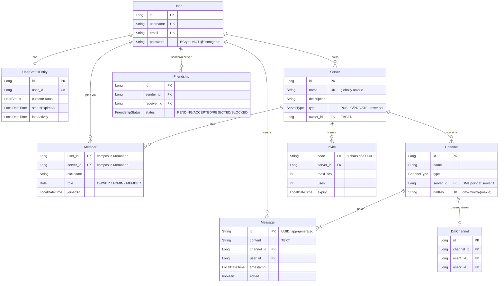
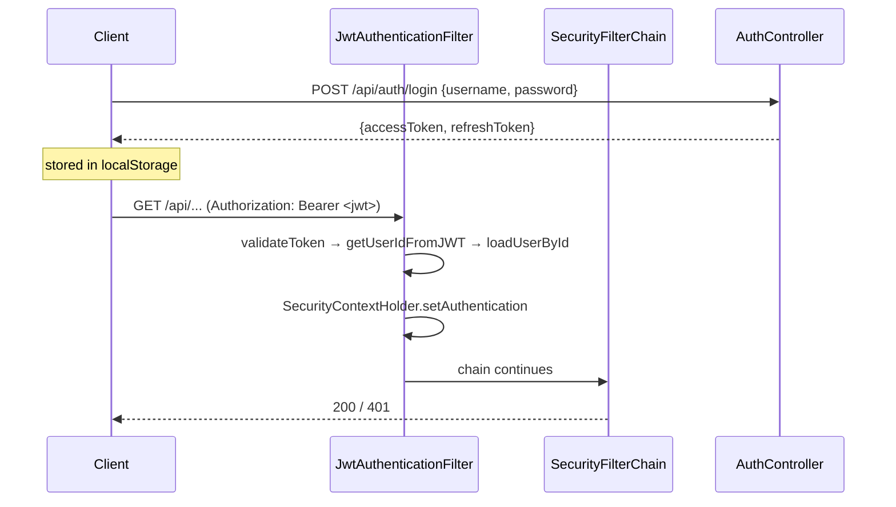
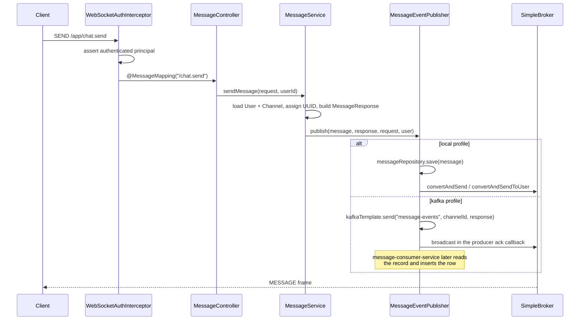
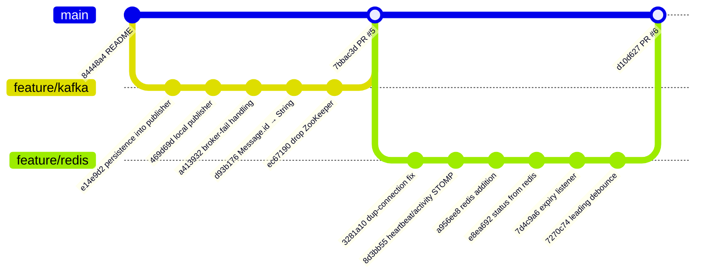

# Architecture

## 1. System overview

DiscordClone is a two-tier application: a Spring Boot 3.2.2 monolith (Java 17) serving a React 18 +
Vite single-page app. Real-time delivery runs over STOMP-on-WebSocket. PostgreSQL is the system of
record, Redis holds ephemeral presence state, and Kafka is an optional path for chat messages,
selected by Spring profile. On that path the monolith only produces events. A separate service,
[`message-consumer-service`](https://github.com/anilkr09/message-consumer-service), consumes them and
writes the messages to PostgreSQL.

```mermaid
graph TB
    subgraph Browser
        UI[React SPA<br/>Vite + MUI + Redux + React Query]
        STOMP[@stomp/stompjs Client]
    end

    subgraph Backend["Spring Boot monolith :8080"]
        REST[REST controllers<br/>/api/**]
        WS[STOMP endpoint /ws<br/>in-memory SimpleBroker]
        SVC[Service layer]
        PUB{{MessageEventPublisher<br/>profile-selected}}
    end

    subgraph Infra
        PG[(PostgreSQL<br/>system of record)]
        RD[(Redis<br/>presence TTL keys)]
        KF[[Kafka<br/>message-events]]
    end

    subgraph Consumer["message-consumer-service (separate repo, Boot 4)"]
        MKC[MessageKafkaConsumer<br/>group message-persistence-group]
    end

    UI -->|HTTP + JWT Bearer| REST
    STOMP <-->|WebSocket| WS
    REST --> SVC
    WS --> SVC
    SVC --> PUB
    PUB -->|local profile| PG
    PUB -->|kafka profile| KF
    SVC --> PG
    SVC --> RD
    RD -.->|keyevent expired| SVC
    KF --> MKC
    MKC -->|idempotent insert| PG
```

The consumer service is not part of this repository and nothing here runs it. Its behaviour, and its
problems, are covered in [KAFKA.md §4](KAFKA.md#4-the-consumer-service).

## 2. Runtime topology

`docker-compose.yml` provisions the full local environment:

| Service | Image | Port | Purpose |
|---|---|---|---|
| `db` | `postgres:16-alpine` | 5432 | System of record (`dev_database`) |
| `pgadmin` | `dpage/pgadmin4` | 5050 | DB browsing |
| `redis` | `redis:7-alpine` | 6379 | Presence state, password `redis123` |
| `kafka` | `confluentinc/cp-kafka:7.5.0` | 9092 | KRaft mode (no ZooKeeper), 4 partitions |
| `kafka-init` | `confluentinc/cp-kafka:7.5.0` | — | Creates `message-events` topic |
| `kafka-ui` | `provectuslabs/kafka-ui` | 8085 | Topic inspection |

Kafka runs in **KRaft mode** — `KAFKA_PROCESS_ROLES: broker,controller` with a single-node
controller quorum, so there is no ZooKeeper dependency. Two listeners are advertised:
`localhost:9092` for host processes (the Spring app) and `kafka:29092` for in-network containers
(`kafka-ui`, `kafka-init`).

Persistence differs by service. Postgres and Redis mount named volumes (`pgdata`, `redis-data`).
A `kafka-data` volume is declared but **never mounted** on the `kafka` service, so topic data is lost
whenever that container is recreated. `kafka-init` waits for the broker with a fixed `sleep 10`
rather than a health check, so on a slow start the topic creation can fail. The broker's
`KAFKA_AUTO_CREATE_TOPICS_ENABLE: "true"` hides this, because the first produce auto-creates
`message-events` with `KAFKA_NUM_PARTITIONS: 4` anyway.

The Spring app is **not** part of `docker-compose.yml`. In development it runs on the host via
`./gradlew bootRun` and reaches every dependency on `localhost`. For deployment there is a
`Dockerfile` (Temurin 17, copies `build/libs/*.jar`) and a manually triggered GitHub Actions
workflow that builds and pushes the image. The committed `frontend/.env.production` points the SPA
at `https://discordclone-hd22.onrender.com`, and `SecurityConfig` allows CORS from a Vercel origin,
so production appears to be a Render backend with a Vercel frontend. Two other compose files,
`docker-compose-bkp.yml` and `updated-docker-compose.yml`, define containerised backend, frontend,
and Jenkins-agent services, but neither includes Postgres, Redis, or Kafka.

The **consumer service** is not in any compose file either. It is a separate Spring Boot 4.0.5
application with no web server, run on the host with `./gradlew bootRun` from its own repository.
It connects to the same `localhost:9092` broker and the same `dev_database`. With the `kafka`
profile, it has to be started before the main app produces anything, because it begins reading at
the end of the topic ([KAFKA.md §4.7](KAFKA.md#47-offsets-what-happens-to-messages-produced-while-the-consumer-is-not-running)).

### Port note

`application.properties:33` sets `server.port=8080`, but `README.md` claims the backend starts on
8082. The property file is authoritative: **the backend listens on 8080**.

## 3. Module layout

```
src/main/java/com/discordclone/
├── DiscordCloneApplication.java   @SpringBootApplication, explicit @EntityScan/@EnableJpaRepositories
├── config/                        Cross-cutting Spring configuration
│   ├── AsyncConfig                @EnableAsync (backs @Async persistLastSeen)
│   ├── DataInitializer            Seed data
│   ├── KafkaProducerConfig        @Profile("kafka") — producer factory + template
│   ├── RedisConfig                StringRedisTemplate bean
│   ├── RedisKeyExpirationListenerConfig  Keyspace-expiry listener container
│   └── WebSocketConfig            @EnableWebSocketMessageBroker
├── constants/PresenceKeys         Redis key namespace
├── controller/                    REST (@RestController) + STOMP (@MessageMapping)
├── dto/, payload/                 Wire types (two parallel packages — see note below)
├── exception/                     Domain exceptions; @ControllerAdvice for HTTP and for STOMP
├── model/                         JPA entities + enums
├── repository/                    Spring Data JPA interfaces
├── security/                      JWT issuing/validation, filters, STOMP interceptor
├── service/                       Business logic; profile-selected publishers
│   └── impl/                      Concrete implementations for interfaced services
└── websocket/                     Destination constants, event envelope, lifecycle listener
```

### Two DTO packages

`dto/` and `payload/` both hold wire types, and both contain a class named `UserDTO`
(`dto/UserDTO.java` and `payload/UserDTO.java`). `MessageService` imports the `payload` one.
There is no structural rule separating the packages; treat this as accidental duplication rather
than a layering decision.

### Service interface convention

The convention is inconsistent. `UserStatusService` and `FriendshipService` are interfaces with
implementations under `service/impl/`. `MessageService`, `ChannelService`, `ServerService`, and
`InviteService` are concrete classes directly in `service/`. The two profile-swapped abstractions,
`MessageEventPublisher` and `MessagePersistenceService`, are interfaces whose implementations sit in
`service/`, not `service/impl/`.

`UserService` is the odd case. It is a **concrete `@Service` class**, and
`service/impl/UserServiceImpl` is a second `@Service` that `extends` it. That gives the context
**two beans of type `UserService`**. Every injection point declares a `UserService` parameter named
`userService`, so Spring breaks the tie by matching the parameter name to the bean name
(`userService`) and always injects the base class. The Spring Boot Gradle plugin compiles with
`-parameters`, which is what makes that fallback work. As a result `UserServiceImpl` is never
injected, and its overrides — which throw `ResourceNotFoundException` (404) where the base throws
`RuntimeException` (500) — never run. Renaming a constructor parameter, or compiling without
`-parameters`, would turn this into a `NoUniqueBeanDefinitionException` at startup.

## 4. Domain model



Design points worth noting:

- **`Message.id` is a `String`, not a generated `Long`.** `MessageService.sendMessage` assigns
  `UUID.randomUUID().toString()` at `MessageService.java:49`. The comment there — *"Generate ID in
  producer (important for kafka mode)"* — explains why: in the Kafka path the message is serialised
  onto the topic before any database write, so the ID must exist before persistence. This makes the
  producer the source of identity and keeps the ID stable across the WebSocket broadcast and any
  later consumer-side insert. The switch was made in commit `d93b176` ("change Message entity id to
  string to make compatible with Kafka").
- **DMs are ordinary `Channel` rows attached to a hard-coded server.**
  `ChannelService.getOrCreateDmChannel` builds the key `dm-{min(userId)}-{max(userId)}`, looks it up
  by `dmKey` + `type = DM`, and otherwise creates a channel with
  **`server = serverService.getServerById(1L)`** (`ChannelService.java:80`). It handles the
  concurrent-create race by catching `DataIntegrityViolationException` on the unique `dmKey` and
  re-reading. `Channel.server_id` is declared nullable, but no code path creates a server-less
  channel. Three consequences follow:
  - DMs **depend on server ID 1 existing**. On a fresh database, `DataInitializer` creates
    "Default Server", which gets ID 1 only if it is the first server inserted. If that row is
    missing, every DM creation throws `ResourceNotFoundException`.
  - Server-scoped permission checks treat DMs as channels of server 1. `DataInitializer` never
    creates a `Member` row for server 1, not even for its owner, so `getChannelById` rejects DM
    channels for everyone unless they have joined server 1. If a user *has* joined server 1,
    `checkUserIsMember` accepts **every** DM channel for them.
  - The `DmChannel` entity and `DmChannelRepository` are **never used**. Hibernate still creates the
    `dm_channels` table, but no code writes to it or reads from it.
- **`Server.name` is globally unique.** Two users cannot both own a server called "General".
  `ServerService.createServer` checks with `existsByName` first, then maps the constraint violation
  to `DuplicateResourceException` to cover the race.
- **Membership is a composite-key join entity.** `Member` uses `@EmbeddedId MemberId(userId,
  serverId)` with `@MapsId` on both sides and a `Role` (`OWNER`, `ADMIN`, `MEMBER`). This is the only
  form of role-based access control in the code. `@EnableMethodSecurity` is on, but there is no
  `@PreAuthorize` or `@Secured` anywhere. Every `UserPrincipal` has the single authority
  `ROLE_USER`.
- **`User` carries no status column.** Presence lives in Redis; `UserStatusEntity` persists only the
  *custom* status override and a `lastActivity` timestamp.
- **Schema is generated by Hibernate.** `spring.jpa.hibernate.ddl-auto=update`. There are no
  migrations (no Flyway/Liquibase), so schema drift between environments is unmanaged.

## 5. Request flows

### 5.1 Authentication



The filter is deliberately **non-blocking**: on a missing, invalid, or expired token it logs and
calls `filterChain.doFilter(...)` without throwing (`JwtAuthenticationFilter.java:71-76`). Rejection
is left entirely to `.anyRequest().authenticated()` in `SecurityConfig`. The consequence is that an
*invalid* token and *no* token are indistinguishable to the client — both yield a generic 401/403
from the authorization layer rather than a specific authentication error.

Sessions are stateless (`SessionCreationPolicy.STATELESS`), CSRF is disabled, and the public
matchers are `/`, `/ws/**`, `/error`, `/health`, `/api/auth/**`, `/h2-console/**`, plus all
`OPTIONS` preflights.

**Token refresh does not work end to end.** The frontend's axios interceptor
(`frontend/src/services/api.ts:27-31`) detects an expired access token and calls
`POST {API_BASE_URL}/api/refresh-token` with an empty body. The backend endpoint is
`POST /api/auth/refresh` and expects `{ "refreshToken": ... }` in the body. The path is wrong and no
token is sent, so every refresh attempt fails and the client logs the user out. In practice a
session lasts exactly as long as the 24-hour access token. The backend endpoint has problems of its
own too (see [IMPLEMENTATION.md](IMPLEMENTATION.md#89-apiauthrefresh-accepts-access-tokens-and-its-validity-check-is-unreachable)).

### 5.2 Sending a chat message



The branch at `publish` is the central architectural seam of the codebase — see
[KAFKA.md](KAFKA.md#1-the-profile-seam).

Four properties of this path that are easy to miss:

- **No authorization.** Neither `MessageController.sendMessage` nor `MessageService.sendMessage`
  checks that the sender belongs to the channel's server. Any authenticated user can post to any
  `channelId`. REST history (`GET /api/messages/channels/{channelId}`) has no check either.
- **The client routes DMs.** When `MessageRequest.dm` is true, the publisher delivers to the
  `receiver` username the client supplied. The server never checks that this username matches the
  other participant in the `dmKey`, or that the two users are not blocking each other.
- **In the `local` profile the broadcast happens before the commit.** `LocalMessageEventPublisher`
  saves and broadcasts inside `MessageService.sendMessage`'s `@Transactional`, so recipients receive
  the frame before the row is committed. If the commit then fails, clients have displayed a message
  that does not exist. A `TransactionSynchronization.afterCommit` hook, or
  `@TransactionalEventListener(phase = AFTER_COMMIT)`, would order these correctly.
- **In the `kafka` profile the broadcast happens before the row exists at all.** The row is written
  by another process whenever the consumer service gets to it. That is normally milliseconds, but it
  is unbounded while the consumer is down, and never if the consumer skips the message after a failed
  save ([KAFKA.md §4.8](KAFKA.md#48-consistency-between-the-two-services)).

### 5.3 Presence

Presence is heartbeat-driven rather than connection-driven. The client emits `/app/heartbeat` every
10 seconds and `/app/activity` on user input; the server writes TTL'd Redis keys and derives a
status. Disconnect deliberately does **not** set the user offline — Redis key expiry does, via
keyspace notification. Full detail in [REDIS.md](REDIS.md).

## 6. Security architecture

| Concern | Mechanism | Location |
|---|---|---|
| Password storage | BCrypt | `SecurityConfig.java:96` |
| Token format | JWT **HS512**, subject = user ID (see note) | `JwtService.java:44-54` |
| Access token TTL | 24h (`86400000` ms) | `application.properties:57` |
| Refresh token TTL | 7d (`604800000` ms) | `application.properties:58` |
| HTTP auth | `OncePerRequestFilter` before `UsernamePasswordAuthenticationFilter` | `JwtAuthenticationFilter` |
| STOMP auth | `ChannelInterceptor` on inbound channel, validated at `CONNECT` | `WebSocketAuthInterceptor.java:64` |
| CORS | `localhost:*` + one Vercel origin, credentials allowed | `SecurityConfig.java:109-122` |
| Method security | `@EnableMethodSecurity` enabled, but **no** `@PreAuthorize` anywhere | `SecurityConfig.java:27` |
| Resource authorization | Ad hoc, per service method, via `ServerService.isUserMember` / `isUserAdmin` | `ChannelService`, `InviteService`, `ServerService` |

**Algorithm.** `signWith(key)` in jjwt 0.11 chooses the strongest HMAC algorithm the key length
allows. The key is `jwtSecret.getBytes()`, and the secret is a 64-character string, so the key is
64 bytes (512 bits). That produces **HS512**, not HS256.

**Resource authorization is inconsistent.** Some paths check membership or role, and others check
nothing:

| Checked | Not checked |
|---|---|
| Channel create/update/delete (admin), channel list/get (member) | Sending to a channel, over STOMP or REST |
| Invite creation (member) | Reading channel history (`GET /api/messages/channels/{id}`) |
| Server update/delete/role change (owner) | **Adding or removing any member of any server** (`POST`/`DELETE /api/servers/{id}/members/{userId}`) |
| Friend accept/reject (receiver only) | Reading any server's details (`GET /api/servers/{id}`) |
| | Subscribing to any channel topic (see [WEBSOCKETS.md](WEBSOCKETS.md#32-subscribe-and-send)) |
| | Editing any message (`PUT /api/messages/{id}`) |
| | Reading any user's presence, or receiving everyone's presence (`/topic/status`) |

The membership endpoints are the worst of these. Any authenticated user can add themselves to a
private server, or remove any non-owner member from any server, by ID.

**Password hashes leak through entity serialization.** `User.password` has no `@JsonIgnore`, and
several controllers return JPA entities directly. `GET /api/users` returns every user's email and
BCrypt hash to any authenticated caller. `GET /api/users/{id}`, `/username/{name}`, and `/search`
do the same for single users. `Server.owner` is `EAGER`, so every endpoint that returns a `Server`
(`GET /api/servers`, `POST /api/servers`, `POST /api/invites/join/{code}`, the member add/remove
endpoints) includes the owner's hash as well. `/api/auth/login` makes this worse: it logs the whole
`LoginRequest` at INFO, and because that class is `@Data`, the log line contains the plaintext
password (`AuthController.java:72`).

The JWT subject is the numeric user ID, so every authenticated request performs a
`loadUserById` database lookup (`CustomUserDetailsService.java:28`). There is no user cache on this
path, meaning one extra `SELECT` per authenticated HTTP request and per STOMP `CONNECT`.

Two credentials are committed to the repository: the SonarCloud token (`build.gradle:29`) and the
JWT signing secret (`application.properties:56`). Anyone with the signing secret can mint tokens for
any user ID.

## 7. Branch topology



The first-parent history of `main` is two PR merges. PR #5 (`7bbac3d`) brought in `feature/kafka`,
and PR #6 (`d10d627`) brought in `feature/redis`, which carries 20 commits on top of PR #5. The graph
above shows a representative subset. `feature/kafka` is an ancestor of `main`
(`git merge-base --is-ancestor` returns true). `feature/redis` is tree-identical to `main`.

### Where the Redis dependency went

`spring-boot-starter-data-redis` was added to `build.gradle` in `2b8eea7` ("added redis service",
2025-04-23). It was then **removed in `cd97e97`** ("global exception handler update", 2026-02-14),
a commit whose message says nothing about dependencies. That removal is in `main`'s history *before*
the `feature/redis` work, which added Redis code back without restoring the dependency. That is why
the current tree imports `org.springframework.data.redis.*` with no starter on the classpath
([IMPLEMENTATION.md](IMPLEMENTATION.md#81-the-backend-does-not-compile-on-main)).

### What `feature/kafka` lacks relative to `main`

| Added after `feature/kafka` | Purpose |
|---|---|
| `config/AsyncConfig` | `@EnableAsync` for `persistLastSeen` |
| `config/RedisConfig` | `StringRedisTemplate` |
| `config/RedisKeyExpirationListenerConfig` | Keyspace-expiry subscription |
| `constants/PresenceKeys` | Redis key namespace |
| `service/PresenceExpirationListener` | Heartbeat-expiry → OFFLINE |
| `dto/SelfStatusResponse` | `/api/users/me/status` payload |

and a rewritten `UserStatusServiceImpl` (330 lines changed), `UserStatusController` (145),
`WebSocketEventListener` (100), plus a substantial frontend presence rewrite
(`PresenceProvider` −374, `WebSocketProvider` −442, `IdleProvider` −166 lines changed).

Kafka support is present on **all three** branches. It was introduced on `feature/kafka` and
carried forward unchanged: `git diff origin/feature/kafka main` is empty for `KafkaProducerConfig`,
all four publisher and persistence classes, `MessageService`, `application-kafka.properties`,
`docker-compose.yml`, and `build.gradle`. The `feature/redis` branch changed presence and the
frontend WebSocket plumbing. It also (re)introduced some non-source files that exist on `main` but
not on `feature/kafka`: `application1.properties`, `docker-compose-bkp.yml`,
`build_jar_command.txt`, `frontend/src/test_command`, and the H2 database files under `data/`. The
last three were committed together in `2ae8aa4` ("added getFriendsIds method"), which suggests they
were swept up by a broad `git add`.

## 8. Architectural assessment

**What the design gets right.** The `MessageEventPublisher` / `MessagePersistenceService` pair is a
clean strategy seam: swapping `SPRING_PROFILES_ACTIVE` moves the system between a synchronous
write-then-broadcast model and an async event-log model without touching `MessageService`.
Generating the message ID in the producer is the correct call for that seam. On the presence side,
deriving status from TTL'd Redis keys rather than from socket lifecycle is the right instinct — it
survives process restarts and abrupt disconnects that a connection-scoped map would not.

**Where it is incomplete.** The Kafka half of that seam is split across two repositories. This one
produces, and `message-consumer-service` persists, with an idempotent insert keyed on the
producer's UUID, which is the right design. But the consumer's error handler is never registered, so
it drops any message it fails to save after ten instant retries. It starts reading at the end of the
topic, so deployment order can lose messages. Both services also manage the same schema. The Redis
half depends on keyspace notifications that are not switched on, so the OFFLINE transition never
fires. Each half is a few small changes from working, but as committed neither delivers what its
design promises.

**Where it is unsafe.** Authorization is the weakest layer. It is applied per service method rather
than centrally, so it is missing wherever someone forgot it: message send and read, server
membership changes, channel subscriptions, and presence. Controllers also return JPA entities, which
exposes password hashes. None of these depends on the Kafka or Redis design, and each can be fixed
locally. They matter more than the infrastructure gaps, though, because they are exploitable by any
registered user today.

**Scaling limits.** `configureMessageBroker` uses `enableSimpleBroker`, an in-JVM broker. Every
subscription and every destination lives in the heap of one process, so the application **cannot run
more than one instance** — a second replica would hold a disjoint set of subscribers and neither
would see the other's broadcasts. This also undercuts the main justification for Kafka: the message
bus can distribute events between instances, but the broker cannot deliver them to clients attached
elsewhere. Horizontal scaling requires either a relay broker (RabbitMQ/ActiveMQ via
`enableStompBrokerRelay`) or a Redis pub/sub bridge feeding each instance's local broker.

See [IMPLEMENTATION.md](IMPLEMENTATION.md#8-known-issues) for the full defect list.
