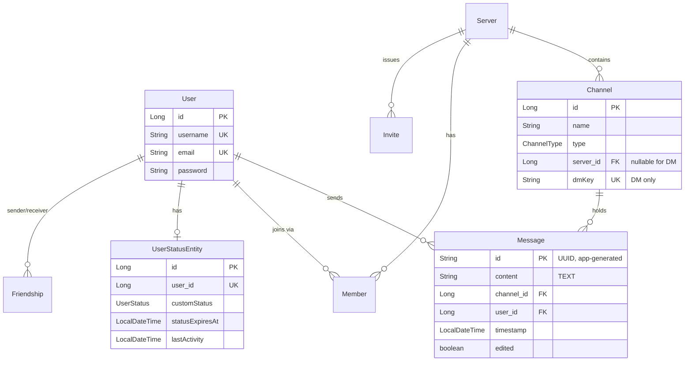
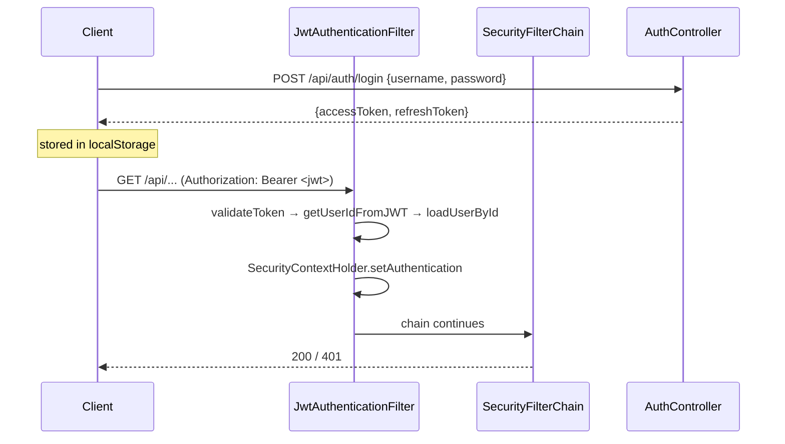
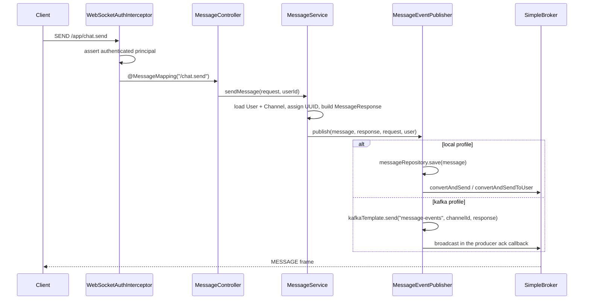
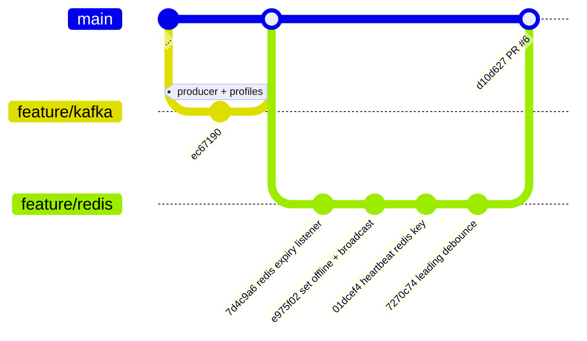

# Architecture

## 1. System overview

DiscordClone is a two-tier application: a Spring Boot 3.2.2 monolith (Java 17) serving a React 18 +
Vite single-page app. Real-time delivery runs over STOMP-on-WebSocket. PostgreSQL is the system of
record, Redis holds ephemeral presence state, and Kafka is an optional fan-out path for chat
messages selected by Spring profile.

```mermaid
graph TB
    subgraph Browser
        UI[React SPA<br/>Vite + MUI + Redux + React Query]
        STOMP[@stomp/stompjs Client]
    end

    subgraph Backend["Spring Boot monolith :8080"]
        REST[REST controllers<br/>/api/**]
        WS[STOMP endpoint /ws<br/>in-memory SimpleBroker]
        SVC[Service layer]
        PUB{{MessageEventPublisher<br/>profile-selected}}
    end

    subgraph Infra
        PG[(PostgreSQL<br/>system of record)]
        RD[(Redis<br/>presence TTL keys)]
        KF[[Kafka<br/>message-events]]
    end

    UI -->|HTTP + JWT Bearer| REST
    STOMP <-->|WebSocket| WS
    REST --> SVC
    WS --> SVC
    SVC --> PUB
    PUB -->|local profile| PG
    PUB -->|kafka profile| KF
    SVC --> PG
    SVC --> RD
    RD -.->|keyevent expired| SVC
    KF -.->|NO CONSUMER EXISTS| PG

    style KF stroke-dasharray: 5 5
```

The dashed Kafka→PostgreSQL edge is **not implemented**. See [KAFKA.md](KAFKA.md#4-the-missing-consumer).

## 2. Runtime topology

`docker-compose.yml` provisions the full local environment:

| Service | Image | Port | Purpose |
|---|---|---|---|
| `db` | `postgres:16-alpine` | 5432 | System of record (`dev_database`) |
| `pgadmin` | `dpage/pgadmin4` | 5050 | DB browsing |
| `redis` | `redis:7-alpine` | 6379 | Presence state, password `redis123` |
| `kafka` | `confluentinc/cp-kafka:7.5.0` | 9092 | KRaft mode (no ZooKeeper), 4 partitions |
| `kafka-init` | `confluentinc/cp-kafka:7.5.0` | — | Creates `message-events` topic |
| `kafka-ui` | `provectuslabs/kafka-ui` | 8085 | Topic inspection |

Kafka runs in **KRaft mode** — `KAFKA_PROCESS_ROLES: broker,controller` with a single-node
controller quorum, so there is no ZooKeeper dependency. Two listeners are advertised:
`localhost:9092` for host processes (the Spring app) and `kafka:29092` for in-network containers
(`kafka-ui`, `kafka-init`).

The Spring app itself is **not** containerised; it runs on the host via `./gradlew bootRun` and
reaches every dependency on `localhost`.

### Port note

`application.properties:33` sets `server.port=8080`, but `README.md` claims the backend starts on
8082. The property file is authoritative: **the backend listens on 8080**.

## 3. Module layout

```
src/main/java/com/discordclone/
├── DiscordCloneApplication.java   @SpringBootApplication, explicit @EntityScan/@EnableJpaRepositories
├── config/                        Cross-cutting Spring configuration
│   ├── AsyncConfig                @EnableAsync (backs @Async persistLastSeen)
│   ├── DataInitializer            Seed data
│   ├── KafkaProducerConfig        @Profile("kafka") — producer factory + template
│   ├── RedisConfig                StringRedisTemplate bean
│   ├── RedisKeyExpirationListenerConfig  Keyspace-expiry listener container
│   └── WebSocketConfig            @EnableWebSocketMessageBroker
├── constants/PresenceKeys         Redis key namespace
├── controller/                    REST (@RestController) + STOMP (@MessageMapping)
├── dto/, payload/                 Wire types (two parallel packages — see note below)
├── exception/                     Domain exceptions + @RestControllerAdvice
├── model/                         JPA entities + enums
├── repository/                    Spring Data JPA interfaces
├── security/                      JWT issuing/validation, filters, STOMP interceptor
├── service/                       Business logic; profile-selected publishers
│   └── impl/                      Concrete implementations for interfaced services
└── websocket/                     Destination constants, event envelope, lifecycle listener
```

### Two DTO packages

`dto/` and `payload/` both hold wire types, and both contain a class named `UserDTO`
(`dto/UserDTO.java` and `payload/UserDTO.java`). `MessageService` imports the `payload` one.
There is no structural rule separating the packages; treat this as accidental duplication rather
than a layering decision.

### Service interface convention

The convention is inconsistent. `UserStatusService`, `FriendshipService`, and `UserService` are
interfaces with implementations under `service/impl/`. `MessageService`, `ChannelService`,
`ServerService`, and `InviteService` are concrete classes directly in `service/`. The two
profile-swapped abstractions — `MessageEventPublisher` and `MessagePersistenceService` — are
interfaces whose implementations sit in `service/` (not `service/impl/`).

## 4. Domain model



Design points worth noting:

- **`Message.id` is a `String`, not a generated `Long`.** `MessageService.sendMessage` assigns
  `UUID.randomUUID().toString()` at `MessageService.java:49`. The comment there — *"Generate ID in
  producer (important for kafka mode)"* — explains why: in the Kafka path the message is serialised
  onto the topic before any database write, so the ID must exist before persistence. This makes the
  producer the source of identity and keeps the ID stable across the WebSocket broadcast and any
  later consumer-side insert.
- **`Channel` doubles as both a server channel and a DM channel.** `server_id` is nullable and
  `dmKey` is a unique column populated only for DMs. There is a separate `DmChannel` entity and
  repository as well, so two mechanisms coexist.
- **`User` carries no status column.** Presence lives in Redis; `UserStatusEntity` persists only the
  *custom* status override and a `lastActivity` timestamp.
- **Schema is generated by Hibernate.** `spring.jpa.hibernate.ddl-auto=update`. There are no
  migrations (no Flyway/Liquibase), so schema drift between environments is unmanaged.

## 5. Request flows

### 5.1 Authentication



The filter is deliberately **non-blocking**: on a missing, invalid, or expired token it logs and
calls `filterChain.doFilter(...)` without throwing (`JwtAuthenticationFilter.java:71-76`). Rejection
is left entirely to `.anyRequest().authenticated()` in `SecurityConfig`. The consequence is that an
*invalid* token and *no* token are indistinguishable to the client — both yield a generic 401/403
from the authorization layer rather than a specific authentication error.

Sessions are stateless (`SessionCreationPolicy.STATELESS`), CSRF is disabled, and the public
matchers are `/`, `/ws/**`, `/error`, `/health`, `/api/auth/**`, `/h2-console/**`, plus all
`OPTIONS` preflights.

### 5.2 Sending a chat message



The branch at `publish` is the central architectural seam of the codebase — see
[KAFKA.md](KAFKA.md#1-the-profile-seam).

### 5.3 Presence

Presence is heartbeat-driven rather than connection-driven. The client emits `/app/heartbeat` every
10 seconds and `/app/activity` on user input; the server writes TTL'd Redis keys and derives a
status. Disconnect deliberately does **not** set the user offline — Redis key expiry does, via
keyspace notification. Full detail in [REDIS.md](REDIS.md).

## 6. Security architecture

| Concern | Mechanism | Location |
|---|---|---|
| Password storage | BCrypt | `SecurityConfig.java:96` |
| Token format | JWT HS256, subject = user ID | `JwtService.java:44-54` |
| Access token TTL | 24h (`86400000` ms) | `application.properties:57` |
| Refresh token TTL | 7d (`604800000` ms) | `application.properties:58` |
| HTTP auth | `OncePerRequestFilter` before `UsernamePasswordAuthenticationFilter` | `JwtAuthenticationFilter` |
| STOMP auth | `ChannelInterceptor` on inbound channel, validated at `CONNECT` | `WebSocketAuthInterceptor.java:64` |
| CORS | `localhost:*` + one Vercel origin, credentials allowed | `SecurityConfig.java:109-122` |
| Method security | `@EnableMethodSecurity` enabled | `SecurityConfig.java:27` |

The JWT subject is the numeric user ID, so every authenticated request performs a
`loadUserById` database lookup (`CustomUserDetailsService.java:28`). There is no user cache on this
path, meaning one extra `SELECT` per authenticated HTTP request and per STOMP `CONNECT`.

Two credentials are committed to the repository: the SonarCloud token (`build.gradle:29`) and the
JWT signing secret (`application.properties:56`). Anyone with the signing secret can mint tokens for
any user ID.

## 7. Branch topology



`feature/kafka` is an ancestor of `main` (`git merge-base --is-ancestor` returns true).
`feature/redis` is tree-identical to `main`. What `feature/kafka` lacks relative to `main`:

| Added after `feature/kafka` | Purpose |
|---|---|
| `config/AsyncConfig` | `@EnableAsync` for `persistLastSeen` |
| `config/RedisConfig` | `StringRedisTemplate` |
| `config/RedisKeyExpirationListenerConfig` | Keyspace-expiry subscription |
| `constants/PresenceKeys` | Redis key namespace |
| `service/PresenceExpirationListener` | Heartbeat-expiry → OFFLINE |
| `dto/SelfStatusResponse` | `/api/users/me/status` payload |

and a rewritten `UserStatusServiceImpl` (330 lines changed), `UserStatusController` (145),
`WebSocketEventListener` (100), plus a substantial frontend presence rewrite
(`PresenceProvider` −374, `WebSocketProvider` −442, `IdleProvider` −166 lines changed).

Kafka support is present on **all three** branches — it was introduced on `feature/kafka` and
carried forward unchanged. The `feature/redis` branch changed only presence.

## 8. Architectural assessment

**What the design gets right.** The `MessageEventPublisher` / `MessagePersistenceService` pair is a
clean strategy seam: swapping `SPRING_PROFILES_ACTIVE` moves the system between a synchronous
write-then-broadcast model and an async event-log model without touching `MessageService`.
Generating the message ID in the producer is the correct call for that seam. On the presence side,
deriving status from TTL'd Redis keys rather than from socket lifecycle is the right instinct — it
survives process restarts and abrupt disconnects that a connection-scoped map would not.

**Where it is incomplete.** The Kafka half of that seam has a producer but no consumer, so the
`kafka` profile silently drops every message from durable storage. The Redis half depends on
keyspace notifications that are not switched on, so the OFFLINE transition never fires. Both halves
are one small change away from working, but as committed each is a functioning front end attached to
a missing back end.

**Scaling limits.** `configureMessageBroker` uses `enableSimpleBroker`, an in-JVM broker. Every
subscription and every destination lives in the heap of one process, so the application **cannot run
more than one instance** — a second replica would hold a disjoint set of subscribers and neither
would see the other's broadcasts. This also undercuts the main justification for Kafka: the message
bus can distribute events between instances, but the broker cannot deliver them to clients attached
elsewhere. Horizontal scaling requires either a relay broker (RabbitMQ/ActiveMQ via
`enableStompBrokerRelay`) or a Redis pub/sub bridge feeding each instance's local broker.

See [IMPLEMENTATION.md](IMPLEMENTATION.md#8-known-issues) for the full defect list.
