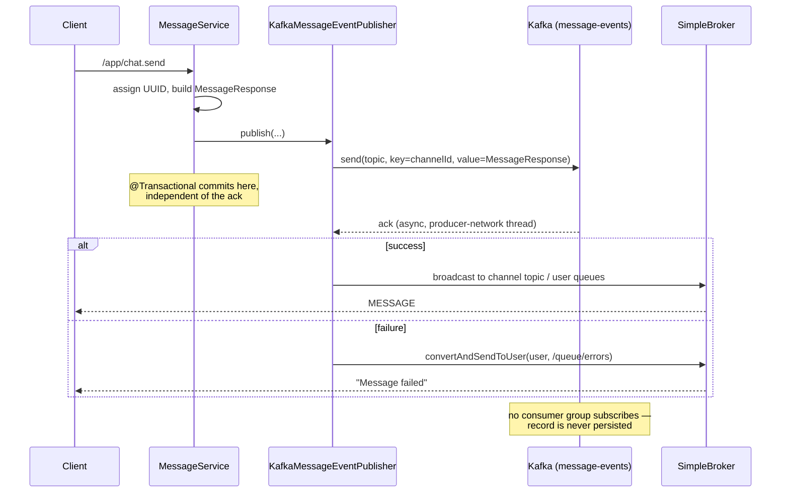

# Kafka

Kafka is an **optional, profile-activated** fan-out path for chat messages. This document covers the
profile seam, the producer configuration, delivery semantics, and the one structural gap: there is no
consumer.

## 1. The profile seam

The entire Kafka integration hangs off two interfaces and Spring's `@Profile` bean selection.

```java
// service/MessageEventPublisher.java
public interface MessageEventPublisher {
    void publish(Message message, MessageResponse response, MessageRequest request, User user);
}

// service/MessagePersistenceService.java
public interface MessagePersistenceService {
    Message save(Message message);
}
```

Implementations are selected by active profile:

| Bean | `local` profile | `kafka` profile |
|---|---|---|
| `MessageEventPublisher` | `LocalMessageEventPublisher` | `KafkaMessageEventPublisher` |
| `MessagePersistenceService` | `LocalMessagePersistenceService` | `NoOpMessagePersistenceService` |
| Producer config | — | `KafkaProducerConfig` |

`MessageService` depends only on the interfaces and is unaware of which is wired:

```java
// service/MessageService.java:35-36
private final MessagePersistenceService persistenceService;
private final MessageEventPublisher eventPublisher;

// ...:71
eventPublisher.publish(message, messageResponse, request, user);
```

The default profile is `local`, set at `application.properties:5`
(`spring.profiles.active=local`). Kafka is opt-in.

This is a genuinely clean seam. `MessageService` performs entity loading, ID assignment, and DTO
construction, then delegates the *delivery strategy* entirely. Swapping strategies is a
configuration change, not a code change.

### Why the message ID is generated in the producer

```java
// service/MessageService.java:48-49
// 🔥 Generate ID in producer (important for kafka mode)
message.setId(UUID.randomUUID().toString());
```

`Message.id` is a `String` UUID rather than a database-generated `Long` specifically to support the
Kafka path. In the `local` flow the database could assign the ID, because the row is written before
the WebSocket broadcast. In the Kafka flow there is no write before the broadcast — the message goes
onto the topic and is broadcast from the producer callback, with persistence deferred to a consumer.
An identity assigned downstream would be unavailable to the client that just sent the message, and
would differ from the one the broadcast carried.

Generating it upstream makes the ID stable across all three representations — the broadcast payload,
the topic record, and the eventual database row — and gives consumers a natural idempotency key for
deduplicating redelivered records.

## 2. Producer configuration

Configuration exists in **two places that disagree**, and the Java config wins.

### 2.1 `KafkaProducerConfig` (authoritative)

```java
// config/KafkaProducerConfig.java
@Configuration
@Profile("kafka")
public class KafkaProducerConfig {

    @Bean
    public ProducerFactory<String, MessageResponse> producerFactory() {
        Map<String, Object> config = new HashMap<>();
        config.put(ProducerConfig.BOOTSTRAP_SERVERS_CONFIG, "localhost:9092");  // hardcoded
        config.put(ProducerConfig.KEY_SERIALIZER_CLASS_CONFIG, StringSerializer.class);
        config.put(ProducerConfig.VALUE_SERIALIZER_CLASS_CONFIG, JsonSerializer.class);
        config.put(ProducerConfig.ACKS_CONFIG, "all");
        config.put(ProducerConfig.RETRIES_CONFIG, 3);
        config.put(ProducerConfig.ENABLE_IDEMPOTENCE_CONFIG, true);
        return new DefaultKafkaProducerFactory<>(config);
    }

    @Bean
    @Primary
    public KafkaTemplate<String, MessageResponse> kafkaTemplate() {
        return new KafkaTemplate<>(producerFactory());
    }
}
```

### 2.2 `application-kafka.properties` (mostly inert)

The properties file specifies serializers, `acks`, `retries`, idempotence, **plus** performance
tuning that the Java config never applies:

```properties
spring.kafka.producer.properties.linger.ms=5
spring.kafka.producer.properties.batch.size=16384
spring.kafka.producer.properties.compression.type=snappy
spring.kafka.producer.properties.max.in.flight.requests.per.connection=5
spring.kafka.producer.properties.spring.json.add.type.headers=false
spring.kafka.producer.properties.request.timeout.ms=30000
spring.kafka.producer.properties.delivery.timeout.ms=120000
```

**None of these take effect.** Spring Boot's auto-configured `ProducerFactory` is annotated
`@ConditionalOnMissingBean`; defining an explicit `producerFactory()` bean suppresses it, and with it
all `spring.kafka.producer.*` property binding. The hand-built `Map` is the complete producer
configuration.

Consequences:

- `linger.ms`, `batch.size`, and `compression.type=snappy` are silently ignored — the producer runs
  with defaults (`linger.ms=0`, no compression), so throughput tuning that appears configured is not.
- `spring.json.add.type.headers=false` is ignored, so `JsonSerializer` **does** write
  `__TypeId__` headers naming `com.discordclone.payload.MessageResponse`. A future consumer in a
  different package or service would need `JsonDeserializer` trusted-package configuration or type
  mapping to read the topic.
- `bootstrap-servers` is hardcoded to `localhost:9092`, so the broker address cannot be changed by
  environment variable or profile — it requires a recompile. This is the most deployment-hostile
  detail in the file.

The `@Primary` annotation on `kafkaTemplate()` (commented *"THIS IS THE FIX"*) resolves an ambiguity
against Boot's auto-configured `KafkaTemplate<Object, Object>`. It works, but the cleaner fix is to
delete the Java config and let the properties file drive auto-configuration — which would also make
every tuning property above actually apply.

## 3. Publish path

```java
// service/KafkaMessageEventPublisher.java:28-46
@Override
public void publish(Message message, MessageResponse response, MessageRequest request, User user) {
    kafkaTemplate.send("message-events", response.getChannelId().toString(), response)
        .whenComplete((result, ex) -> {
            if (ex != null) {
                log.error("Kafka failed", ex);
                messagingTemplate.convertAndSendToUser(
                        user.getUsername(), "/queue/errors", "Message failed");
            } else {
                sendToWebSocket(request, user, response);
            }
        });
}
```



### Partitioning

The record key is `channelId.toString()`. Kafka's default partitioner hashes the key, so **all
messages for one channel land on one partition**, and Kafka guarantees ordering within a partition.
This is the correct key choice: chat ordering matters per conversation, not globally, and keying by
channel gives per-channel ordering while still spreading load across the topic's 4 partitions
(`docker-compose.yml:81`, and `kafka-init` creates `message-events` with `--partitions 4`).

Keying by message ID or using no key would round-robin records across partitions and lose ordering —
two rapid messages in the same channel could be consumed out of order.

### Broadcast-on-ack

The WebSocket broadcast happens **inside the producer callback**, only after Kafka acknowledges.
This is a deliberate trade-off:

- **Benefit:** the client sees its message only once the event is durably logged, so the UI never
  shows a message that was subsequently lost. Failure produces an explicit `/queue/errors` frame.
- **Cost:** perceived latency now includes the full `acks=all` round trip — leader plus all in-sync
  replicas. The `local` profile broadcasts immediately after a database write instead.

Two subtleties follow from the callback running on the **producer's I/O thread**, not the request
thread:

1. `MessageService.sendMessage` is `@Transactional`, and that transaction **commits before the ack
   arrives**. With `NoOpMessagePersistenceService` the transaction has nothing to write, so this is
   harmless today — but it means the transaction boundary provides no atomicity between "message
   logged to Kafka" and any database state. A future consumer-side write cannot be rolled back by it.
2. Any exception thrown inside `whenComplete` surfaces on a Kafka internal thread, where it will be
   logged by the producer rather than propagated to the caller.

### Delivery semantics

`acks=all` + `enable.idempotence=true` + `retries=3` gives **exactly-once semantics per producer
session** for the write to the topic: the idempotent producer attaches a producer ID and sequence
number so broker-side retries cannot duplicate a record.

This does **not** extend to end-to-end exactly-once. There is no transactional producer
(`transactional.id` is unset), so the topic write and any consumer-side database write are separate
operations. When a consumer is added it must be idempotent on `MessageResponse.id` — which is
exactly why the UUID is generated upstream (§1).

## 4. The missing consumer

**There is no Kafka consumer anywhere in the repository.** Verified across all three branches:

```
$ git grep -n -E "KafkaListener|ConsumerFactory|group-id|group.id" main origin/feature/kafka origin/feature/redis -- src/main
main:src/main/resources/application1.properties:75:spring.kafka.consumer.group-id=discord-clone-group
origin/feature/redis:src/main/resources/application1.properties:75:spring.kafka.consumer.group-id=discord-clone-group
```

The single hit is in `application1.properties` — a file Spring **never loads**. Spring recognises
`application.properties` and `application-{profile}.properties`; `application1.properties` matches
neither pattern. It is a dead scratch file (and it does not exist on `feature/kafka` at all).

So in the `kafka` profile:

```java
// service/NoOpMessagePersistenceService.java
@Service
@Profile("kafka")
public class NoOpMessagePersistenceService implements MessagePersistenceService {
    @Override
    public Message save(Message message) {
        return message;   // returns unsaved
    }
}
```

`LocalMessageEventPublisher` is the only caller of `persistenceService.save(...)`, and it is not
active under the `kafka` profile. `KafkaMessageEventPublisher` never calls it. The result:

> **Running with `SPRING_PROFILES_ACTIVE=kafka` means no chat message is ever written to the
> database.** Messages are produced to `message-events`, broadcast live to connected clients, and
> then lost. `GET /api/messages/channels/{channelId}` returns an empty page, and message history
> does not survive a page refresh.

The no-op is not a bug in itself — deferring the write to a consumer is the standard pattern, and
`NoOpMessagePersistenceService` is the correct producer-side stand-in. The gap is that the consumer
that was supposed to do the writing was never built.

### What a consumer needs

To complete the design:

```java
@Component
@Profile("kafka")
@RequiredArgsConstructor
public class MessageEventConsumer {

    private final MessageRepository messageRepository;
    private final UserRepository userRepository;
    private final ChannelRepository channelRepository;

    @KafkaListener(topics = "message-events", groupId = "discord-clone-persistence")
    public void consume(MessageResponse event) {
        // idempotent: the UUID came from the producer
        if (messageRepository.existsById(event.getId())) return;

        Message m = new Message();
        m.setId(event.getId());
        m.setContent(event.getContent());
        m.setTimestamp(event.getTimestamp());
        m.setSender(userRepository.getReferenceById(event.getAuthor().getId()));
        m.setChannel(channelRepository.getReferenceById(event.getChannelId()));
        messageRepository.save(m);
    }
}
```

Required alongside it:

- **Consumer configuration** — `spring.kafka.consumer.group-id`, `auto-offset-reset`,
  `key-deserializer`/`value-deserializer`, and `spring.json.trusted.packages=com.discordclone.payload`
  (or a `JsonDeserializer` with an explicit target type, since type headers *are* being written — §2.2).
- **Error handling** — a `DefaultErrorHandler` with backoff plus a dead-letter topic. Note that
  `KafkaProducerConfig` already imports `DeadLetterPublishingRecoverer` but never uses it, suggesting
  this was planned.
- **A decision on `MessageResponse` as the topic schema.** It is currently both the WebSocket wire
  format and the event payload. Coupling them means any UI-driven change to the broadcast DTO is a
  breaking change to the event log. A dedicated `MessageCreatedEvent` would decouple them.

## 5. Operating the Kafka profile

```bash
docker compose up -d kafka kafka-init kafka-ui db redis
SPRING_PROFILES_ACTIVE=kafka ./gradlew bootRun
```

Inspect the topic at <http://localhost:8085> (Kafka UI). With no consumer running, the consumer-group
view is empty and lag is undefined — records accumulate until the retention window expires.

To verify the producer independently of the application:

```bash
docker exec -it kafka kafka-console-consumer \
  --bootstrap-server kafka:29092 \
  --topic message-events --from-beginning
```

## 6. Assessment

**Sound decisions.** Keying by `channelId` for per-channel ordering; generating the message UUID
upstream so the ID is stable across broadcast, topic, and future row; `acks=all` with idempotence for
a durable, non-duplicating write; broadcasting only after the ack so the UI never displays a message
that was lost; and isolating the whole thing behind a two-method interface so the `local` path stays
simple.

**What undermines it.** The absent consumer turns the `kafka` profile from an architecture into a
data-loss mode. The hand-written `ProducerFactory` silently disables every tuning property in
`application-kafka.properties` and pins the broker address at compile time. And Kafka cannot deliver
the scalability benefit it implies while the STOMP layer uses an in-JVM broker — events would reach
every application instance, but each instance can only push frames to its own connected clients (see
[WEBSOCKETS.md](WEBSOCKETS.md#why-the-simple-broker)).

| # | Finding | Location | Severity |
|---|---|---|---|
| 1 | No consumer; `kafka` profile loses all messages | repository-wide | **Critical** |
| 2 | `bootstrap-servers` hardcoded; not environment-configurable | `KafkaProducerConfig.java:27` | **High** |
| 3 | Explicit `ProducerFactory` silently disables `spring.kafka.producer.*` tuning | `KafkaProducerConfig.java` | Medium |
| 4 | `application1.properties` is dead config that reads as live | `src/main/resources/` | Medium |
| 5 | `MessageResponse` doubles as event schema and WS DTO | `payload/MessageResponse.java` | Medium |
| 6 | `DeadLetterPublishingRecoverer` imported but unused | `KafkaProducerConfig.java:13` | Low |
