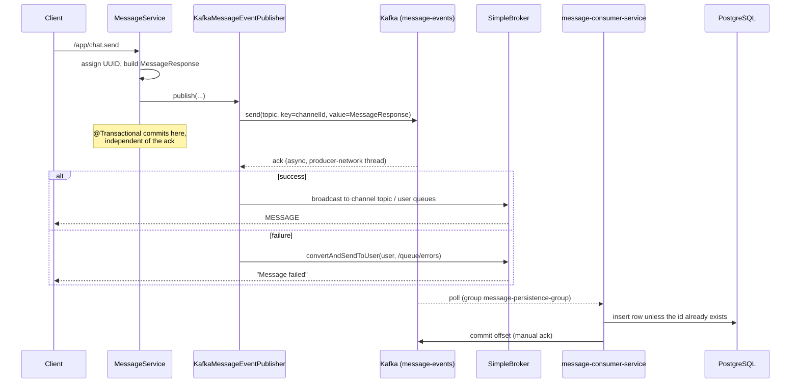

# Kafka

Kafka is an **optional, profile-activated** path for chat messages. The main application only
*produces* to the `message-events` topic. A separate service,
[`message-consumer-service`](https://github.com/anilkr09/message-consumer-service), consumes the topic
and writes the messages to PostgreSQL. This document covers the profile seam, the producer
configuration, the publish path and its delivery semantics, the consumer service, and how the two fit
together.

The consumer repository was reviewed at commit `4fcde05` ("initial commit", 2026-04-03), its only
commit at the time of writing.

## 1. The profile seam

The entire Kafka integration hangs off two interfaces and Spring's `@Profile` bean selection.

```java
// service/MessageEventPublisher.java
public interface MessageEventPublisher {
    void publish(Message message, MessageResponse response, MessageRequest request, User user);
}

// service/MessagePersistenceService.java
public interface MessagePersistenceService {
    Message save(Message message);
}
```

Implementations are selected by active profile:

| Bean | `local` profile | `kafka` profile |
|---|---|---|
| `MessageEventPublisher` | `LocalMessageEventPublisher` | `KafkaMessageEventPublisher` |
| `MessagePersistenceService` | `LocalMessagePersistenceService` | `NoOpMessagePersistenceService` |
| Producer config | — | `KafkaProducerConfig` |

`MessageService` depends only on the interfaces and is unaware of which is wired:

```java
// service/MessageService.java:35-36
private final MessagePersistenceService persistenceService;
private final MessageEventPublisher eventPublisher;

// ...:71
eventPublisher.publish(message, messageResponse, request, user);
```

The default profile is `local`, set at `application.properties:5`
(`spring.profiles.active=local`). Kafka is opt-in.

This is a genuinely clean seam. `MessageService` performs entity loading, ID assignment, and DTO
construction, then delegates the *delivery strategy* entirely. Swapping strategies is a
configuration change, not a code change.

The seam moves only the *write* off the hot path. `MessageService.sendMessage` still runs two
database reads per message in both profiles (`userRepository.findById`,
`channelRepository.findById`), so the Kafka path does not remove the database from the request path.
It removes the insert, not the lookups. Separately, the not-found error for a missing channel passes
the wrong ID: `new ResourceNotFoundException("Channel", "id", userId)` at `MessageService.java:46`.
Nobody sees that message, though, because STOMP handler exceptions are swallowed (see
[WEBSOCKETS.md](WEBSOCKETS.md#41-inbound-client--server-prefix-app)).

### Why the message ID is generated in the producer

```java
// service/MessageService.java:48-49
// 🔥 Generate ID in producer (important for kafka mode)
message.setId(UUID.randomUUID().toString());
```

`Message.id` is a `String` UUID rather than a database-generated `Long` specifically to support the
Kafka path. The commit that made the change says so directly: `d93b176`, "change Message entity id to
string to make compatible with Kafka". In the `local` flow the database could assign the ID, because the row is written before
the WebSocket broadcast. In the Kafka flow there is no write before the broadcast — the message goes
onto the topic and is broadcast from the producer callback, with persistence deferred to the consumer
service (§4).
An identity assigned downstream would be unavailable to the client that just sent the message, and
would differ from the one the broadcast carried.

Generating it upstream makes the ID stable across all three representations — the broadcast payload,
the topic record, and the eventual database row. It also gives the consumer a natural idempotency key
for deduplicating redelivered records, which it uses (§4.2).

## 2. Producer configuration

Configuration exists in **two places that disagree**, and the Java config wins.

### 2.1 `KafkaProducerConfig` (authoritative)

```java
// config/KafkaProducerConfig.java
@Configuration
@Profile("kafka")
public class KafkaProducerConfig {

    @Bean
    public ProducerFactory<String, MessageResponse> producerFactory() {
        Map<String, Object> config = new HashMap<>();
        config.put(ProducerConfig.BOOTSTRAP_SERVERS_CONFIG, "localhost:9092");  // hardcoded
        config.put(ProducerConfig.KEY_SERIALIZER_CLASS_CONFIG, StringSerializer.class);
        config.put(ProducerConfig.VALUE_SERIALIZER_CLASS_CONFIG, JsonSerializer.class);
        config.put(ProducerConfig.ACKS_CONFIG, "all");
        config.put(ProducerConfig.RETRIES_CONFIG, 3);
        config.put(ProducerConfig.ENABLE_IDEMPOTENCE_CONFIG, true);
        return new DefaultKafkaProducerFactory<>(config);
    }

    @Bean
    @Primary
    public KafkaTemplate<String, MessageResponse> kafkaTemplate() {
        return new KafkaTemplate<>(producerFactory());
    }
}
```

### 2.2 `application-kafka.properties` (mostly inert)

The properties file specifies serializers, `acks`, `retries`, idempotence, **plus** performance
tuning that the Java config never applies:

```properties
spring.kafka.producer.properties.linger.ms=5
spring.kafka.producer.properties.batch.size=16384
spring.kafka.producer.properties.compression.type=snappy
spring.kafka.producer.properties.max.in.flight.requests.per.connection=5
spring.kafka.producer.properties.spring.json.add.type.headers=false
spring.kafka.producer.properties.request.timeout.ms=30000
spring.kafka.producer.properties.delivery.timeout.ms=120000
```

**None of these take effect.** Spring Boot's auto-configured `ProducerFactory` is annotated
`@ConditionalOnMissingBean`; defining an explicit `producerFactory()` bean suppresses it, and with it
all `spring.kafka.producer.*` property binding. The hand-built `Map` is the complete producer
configuration.

Consequences:

- `linger.ms`, `batch.size`, and `compression.type=snappy` are silently ignored — the producer runs
  with defaults (`linger.ms=0`, no compression), so throughput tuning that appears configured is not.
- `spring.json.add.type.headers=false` is ignored, so `JsonSerializer` **does** write
  `__TypeId__` headers naming `com.discordclone.payload.MessageResponse`, a class that does not
  exist in the consumer. The consumer copes by ignoring type headers and always deserializing into
  its own `MessageResponse` (§4.3). The headers are harmless today, but they add bytes to every record
  and name a producer-side class on the wire.
- `bootstrap-servers` is hardcoded to `localhost:9092`, so the broker address cannot be changed by
  environment variable or profile — it requires a recompile. This is the most deployment-hostile
  detail in the file.

The `@Primary` annotation on `kafkaTemplate()` carries the comment *"THIS IS THE FIX"*, but it is
unclear what it fixes. Boot's `KafkaAutoConfiguration` declares both its `kafkaTemplate` and its
`kafkaProducerFactory` with `@ConditionalOnMissingBean`. Under the `kafka` profile this class
defines both types itself, so Boot creates neither, and only one `KafkaTemplate` bean exists for
`@Primary` to prefer. The annotation is most likely left over from an earlier configuration in which
two templates did coexist. The commit history does not record the original error. The cleaner route
is to delete this class entirely and let `application-kafka.properties` drive auto-configuration,
which would also make every tuning property above take effect.

Under the default `local` profile this class is inactive, so Boot's auto-configuration **does**
create a `KafkaTemplate`, because `spring-kafka` is on the classpath. Nothing injects it, and Kafka
producers connect lazily on first send, so the local profile runs without a broker. It is still an
unused bean in every local run.

## 3. Publish path

```java
// service/KafkaMessageEventPublisher.java:28-46
@Override
public void publish(Message message, MessageResponse response, MessageRequest request, User user) {
    kafkaTemplate.send("message-events", response.getChannelId().toString(), response)
        .whenComplete((result, ex) -> {
            if (ex != null) {
                log.error("Kafka failed", ex);
                messagingTemplate.convertAndSendToUser(
                        user.getUsername(), "/queue/errors", "Message failed");
            } else {
                sendToWebSocket(request, user, response);
            }
        });
}
```



The broadcast and the database write are **independent**. Recipients see the message as soon as Kafka
acknowledges it. The row appears whenever the consumer gets to it, which may be milliseconds later,
much later, or never (§4.4, §4.8).

### Partitioning

The record key is `channelId.toString()`. Kafka's default partitioner hashes the key, so **all
messages for one channel land on one partition**, and Kafka guarantees ordering within a partition.
This is the correct key choice: chat ordering matters per conversation, not globally, and keying by
channel gives per-channel ordering while still spreading load across the topic's 4 partitions
(`docker-compose.yml:81`, and `kafka-init` creates `message-events` with `--partitions 4`).

Keying by message ID or using no key would round-robin records across partitions and lose ordering —
two rapid messages in the same channel could be consumed out of order.

### Broadcast-on-ack

The WebSocket broadcast happens **inside the producer callback**, only after Kafka acknowledges.
This is a deliberate trade-off:

- **Benefit:** the client sees its message only once the event is durably logged in Kafka.
  Failure produces an explicit `/queue/errors` frame. "Durably logged" is not "stored", though: the
  message becomes history only when the consumer writes it, and the consumer currently skips messages
  it fails to save (§4.4). A broadcast message can therefore still vanish on the next reload.
- **Cost:** perceived latency now includes the full `acks=all` round trip — leader plus all in-sync
  replicas. The `local` profile broadcasts immediately after a database write instead.

Two subtleties follow from the callback running on the **producer's I/O thread**, not the request
thread:

1. `MessageService.sendMessage` is `@Transactional`, and that transaction **commits before the ack
   arrives**. With `NoOpMessagePersistenceService` the transaction has nothing to write, so this is
   harmless today. It does mean the transaction boundary provides no atomicity between "message
   logged to Kafka" and any database state. The consumer's write happens in another process, in its
   own transaction.
2. Any exception thrown inside `whenComplete` surfaces on a Kafka internal thread, where it will be
   logged by the producer rather than propagated to the caller.

### When the broker is down

`kafkaTemplate.send(...)` is asynchronous only once the producer has cluster metadata. If the
broker is unreachable, `KafkaProducer.send` **blocks the calling thread** for up to `max.block.ms`
(default 60 s) waiting for metadata, and only then fails the future. The calling thread here is a
worker from Spring's `clientInboundChannel` executor, the pool that processes every inbound STOMP
frame, including heartbeats and activity signals. A Kafka outage therefore does not just fail
message sends. Each send ties up an inbound worker for up to a minute, and a handful of concurrent
senders can exhaust the pool and stall **all** WebSocket traffic, presence included. Setting
`max.block.ms` low (around 1–2 s) in the producer config would bound the damage.

When the future does fail, the error goes to `/user/queue/errors`. **No frontend code subscribes to
that destination** (see [WEBSOCKETS.md](WEBSOCKETS.md#42-outbound-server--client)), so the sender's
UI shows nothing. The message simply never appears for anyone.

### Delivery semantics

`acks=all` + `enable.idempotence=true` + `retries=3` gives **exactly-once semantics per producer
session** for the write to the topic: the idempotent producer attaches a producer ID and sequence
number so broker-side retries cannot duplicate a record.

This does **not** extend to end-to-end exactly-once. There is no transactional producer
(`transactional.id` is unset), so the topic write and the consumer's database write are separate
operations. End to end, the design as written is:

- **At-least-once delivery to the consumer.** Auto-commit is off, and the offset is committed only
  after a successful save (`spring.kafka.listener.ack-mode=manual`).
- **Effectively-once rows.** The consumer skips any message whose UUID is already stored, so a
  redelivered record does not create a duplicate (§4.2).

As actually configured, a third property overrides both: **a message the consumer fails to save is
retried 10 times without delay and then dropped** (§4.4). So under failure, the guarantee degrades to
at-most-once.

## 4. The consumer service

### 4.1 What it is

[`message-consumer-service`](https://github.com/anilkr09/message-consumer-service) is a separate
Spring Boot application in its own repository. This repository contains no consumer; the only
consumer-like setting here is a `group-id` in `application1.properties`, a file Spring never loads.

| | |
|---|---|
| Repository state | One commit, `4fcde05` ("initial commit", 2026-04-03), branch `main` |
| Stack | Spring Boot **4.0.5**, Java 17, Spring Data JPA, Spring Kafka, PostgreSQL driver 42.7.3. The main app is on Boot 3.2.2 |
| Web server | None. There is no web starter, so `server.port=8081` in its properties has no effect, and there is no HTTP health endpoint |
| Consumer group | `message-persistence-group`, listening on `message-events` with 2 concurrent consumers |
| Database | The **same** `dev_database` as the main app, with the same credentials |
| Deployment | No Dockerfile, no compose service, no README. Nothing in this repository starts it |

In this section, consumer paths are relative to the consumer repo's
`src/main/java/com/discordclone/message/consumer/`.

| Class | Role |
|---|---|
| `consumer/MessageKafkaConsumer` | `@KafkaListener(topics = "message-events")`. Saves the event, then acknowledges it |
| `service/MessagePersistenceService` | Idempotent insert of one message row |
| `dto/MessageResponse`, `dto/UserDTO` | The consumer's own copy of the event payload |
| `entity/Message`, `Channel`, `User`, `Server` | The consumer's own JPA mappings of the main app's tables |
| `config/KafkaConsumerConfig` | Intended container factory with a dead-letter error handler. **Never registered** (§4.4) |
| `config/KafkaDLTProducerConfig` | Producer and template for the dead-letter topic. Misconfigured (§4.4) |
| `exception/KafkaErrorHandler` | Empty class |

### 4.2 What happens to each record

1. Spring Kafka deserializes the record value into the consumer's `MessageResponse` (§4.3).
2. `MessageKafkaConsumer.consume` calls `MessagePersistenceService.save`, which runs in one
   transaction:
   - If a row with the event's UUID already exists, it returns without writing. This makes
     redelivery harmless, and it is exactly what the producer-generated UUID (§1) was designed for.
   - Otherwise it loads the author (`users`) and the channel (`channels`) by ID, failing if either
     is missing, and saves a new `messages` row with the event's ID, content, and timestamp.
3. On success, the listener acknowledges the record, and the offset is committed.
4. On an exception, the listener logs it and rethrows, and the container's error handler decides
   what happens next (§4.4).

Records for one channel share a key, so they land on one partition and are consumed in order by one
consumer thread. With 2 consumers and 4 partitions, each thread owns two partitions.

Each message costs four queries: the existence check, the user lookup, the channel lookup, and a
`SELECT` that `save` issues before the `INSERT`. The `SELECT` happens because the entity has an
assigned ID, so Spring Data treats it as possibly existing and merges it. `getReferenceById` for the
user and channel, and implementing `Persistable` on `Message`, would bring this down to the existence
check and the insert.

### 4.3 Configuration

From the consumer's `src/main/resources/application.properties`:

| Setting | Value | Effect |
|---|---|---|
| `spring.kafka.bootstrap-servers` | `localhost:9092` | Overridable through the `SPRING_KAFKA_BOOTSTRAP_SERVERS` environment variable |
| `spring.kafka.consumer.group-id` | `message-persistence-group` | Offsets are tracked per group |
| `spring.kafka.consumer.auto-offset-reset` | **`latest`** (the `earliest` line is commented out) | A group with no committed offset starts at the **end** of the topic (§4.7) |
| `spring.kafka.consumer.enable-auto-commit` | `false` | Offsets are committed only by the container |
| `spring.kafka.listener.ack-mode` | `manual` | Committed when the listener calls `acknowledge()` |
| `spring.kafka.listener.concurrency` | `2` | Two consumer threads |
| key and value deserializers | `ErrorHandlingDeserializer` wrapping `StringDeserializer` and Spring Kafka's `JsonDeserializer` | A record that fails to deserialize goes to the error handler instead of crashing the consumer |
| `spring.json.use.type.headers` | `false` | Ignores the producer's `__TypeId__` header, which names a class the consumer does not have (§2.2) |
| `spring.json.value.default.type` | `com.discordclone.message.consumer.dto.MessageResponse` | Every value is read as this class |
| `spring.json.trusted.packages` | `*` | Has no effect while type headers are ignored. Should be narrowed if they are ever used |
| `spring.jpa.hibernate.ddl-auto` | `update` | The consumer also alters the shared schema (§4.6) |

**Jackson version.** Spring Kafka 4.0, which Boot 4 uses, adds Jackson 3 classes and deprecates the
Jackson 2 `JsonSerializer`/`JsonDeserializer`. The Jackson 2 classes "remain fully functional", in
Spring Kafka's own words, so the configuration works. It should move to `JacksonJsonDeserializer`
before a future major version removes them.

### 4.4 Error handling: what was written versus what runs

This is the most important finding in the consumer.

**What was written.** `KafkaConsumerConfig` builds a `ConcurrentKafkaListenerContainerFactory` with a
`DefaultErrorHandler` that retries a failed record 3 times, 2 s apart, and then publishes it to a
dead-letter topic.

**What runs.** The method that builds this factory (`KafkaConsumerConfig.java:19`) has **no `@Bean`
annotation**, so Spring never calls it. Spring Boot's own auto-configured
`kafkaListenerContainerFactory` is used instead. Boot only attaches an error handler that is defined
as a bean, and there is none, so the container falls back to Spring Kafka's default: a
`DefaultErrorHandler` with `FixedBackOff(0, 9)`. According to the Spring Kafka reference, that means
10 delivery attempts with **no delay** between them, after which "the failed record is logged (at the
ERROR level)", its offset is committed, and the consumer moves on.

Consequences:

- **Any transient failure loses messages.** If PostgreSQL is unreachable even briefly (a restart, a
  failover, a connection-pool stall), all ten attempts happen within milliseconds and fail, and the
  message is skipped for good. It was already broadcast live, so users saw it, and then it is missing
  from history on the next reload.
- **A missing user or channel loses the message after 10 pointless retries.** `orElseThrow()` with no
  message throws a `NoSuchElementException`, which the handler treats as retryable.
- **Records that cannot be deserialized are skipped at once.** Spring Kafka classifies
  `DeserializationException` as fatal and does not retry it. In practice this means the listener's
  `if (event == null)` branch is reached only for a genuinely null payload; malformed records never
  get that far.

**Why adding `@Bean` alone would make things worse.** Both of the following are inferred and were not
run:

1. The factory method asks for a `KafkaTemplate<String, MessageResponse>`, but the only template
   defined is `KafkaDLTProducerConfig`'s `KafkaTemplate<String, Object>`. Spring matches generic
   types when injecting, so that dependency would not resolve, and the consumer would fail to start.
2. `KafkaDLTProducerConfig` sets the value serializer to `com.fasterxml.jackson.databind.JsonSerializer`
   (line 3 imports it). That is Jackson's abstract serializer base class, not a Kafka `Serializer`.
   The producer is created lazily, so the problem would surface on the first dead-letter publish, when
   creating the producer fails. Spring Kafka documents that when the recoverer fails, the error
   handler resets its back-off and redelivers the record again. A single bad message would then be
   retried forever, blocking every channel on its partition.

**Correct fix.** Register a `DefaultErrorHandler` **bean**, which Boot attaches to its own container
factory, and delete the unused factory method. Give it an exponential back-off measured in seconds,
so that a database blip is ridden out, and a `DeadLetterPublishingRecoverer` built on a template that
uses Spring Kafka's JSON serializer, with the bootstrap address taken from properties. Mark
not-found failures as non-retryable. Create `message-events-dlt` up front with at least 4 partitions:
by default the recoverer publishes to `<topic>-dlt` on the same partition number, so the dead-letter
topic needs at least as many partitions as the source.

### 4.5 The event contract

Each service has its own `MessageResponse` class, kept in sync by hand:

| Field | Producer (`payload/MessageResponse`) | Consumer (`dto/MessageResponse`) |
|---|---|---|
| `id` | `String` (UUID) | `String` |
| `content` | `String` | `String` |
| `channelId` | `Long` | `Long` |
| `timestamp` | `LocalDateTime` | `LocalDateTime` |
| `author` | `UserDTO {id, username, avatarUrl}` | `UserDTO {id, username, email, avatarUrl}` |

They are compatible today. The consumer only needs `id`, `content`, `channelId`, `timestamp`, and
`author.id`, and its extra `email` field simply stays null. Nothing enforces that compatibility,
though. Renaming a field on the producer side, which is also the WebSocket DTO (§6), would make the
consumer read `null`. For `author` that becomes a `NullPointerException`, ten retries, and a dropped
message. A shared contract module or a schema registry would turn such a change into a build error.

The timestamp is a zone-less `LocalDateTime` produced on the main server and stored unchanged, so the
time-zone problem in [BUGS.md B20](BUGS.md#b20-message-times-are-wrong-outside-utc) applies to
consumer-written rows as well.

### 4.6 Two services, one schema

The consumer maps the main app's `users`, `servers`, `channels`, and `messages` tables with its own
copies of the entity classes, and it runs `ddl-auto=update` against the same database. Today the
copies match closely, with one difference: the consumer's `Message.channel` and `Message.sender` join
columns lack `nullable = false`.

- If the consumer starts first against an empty database, it creates those tables. `messages.channel_id`
  and `messages.user_id` are then created **nullable**, and the main app's later `update` will not
  tighten them, because `update` only adds columns and constraints, never alters them.
- Any future entity change made in one repository and not the other is applied by whichever service
  starts next, so the schema can drift silently.

The consumer should not manage schema at all. Set its `ddl-auto` to `validate` or `none`, and let a
single owner, the main app with migrations
([IMPROVEMENTS.md](IMPROVEMENTS.md#introduce-flyway-and-stop-using-ddl-autoupdate--now--m)), define
the tables.

### 4.7 Offsets: what happens to messages produced while the consumer is not running

| Situation | With `latest` (current) | With `earliest` |
|---|---|---|
| Consumer running normally | Persisted | Persisted |
| Consumer stopped and restarted within Kafka's offset retention (7 days by default) | Persisted on restart, from the committed offset | Same |
| **The group's very first start**, after the main app has already produced messages | **Lost**: the group starts at the end of the topic | Persisted |
| Consumer stopped longer than the offset retention, so its committed offsets expire | **Lost**: the reset jumps to the end of the topic | Persisted, if the records are still within the topic's own retention |
| Consumer stopped longer than the topic's retention (7 days by default) | Lost | Lost |

`latest` turns deployment order into a source of data loss. Use `earliest`. It is safe here, because
the idempotent insert (§4.2) makes re-reading old records harmless.

### 4.8 Consistency between the two services

In the `kafka` profile, a message is visible before it is stored:

- **Normal lag.** Between Kafka's acknowledgement and the consumer's insert, a reload of the channel
  or a call to `GET /api/messages/channels/{id}` can miss the message. This is usually milliseconds.
- **Consumer down or behind.** The gap grows without bound. Everyone sees new messages live, but none
  of them is in history until the consumer catches up. A reload in the meantime shows older messages
  only.
- **Consumer skips a message (§4.4).** It was shown live and never appears in history.
- **Edits and deletes.** Both are handled by the main app directly against the database, so they
  cannot find a message the consumer has not written yet. Both endpoints are broken for other reasons
  anyway ([BUGS.md B05, B21](BUGS.md#b05-any-message-can-be-rewritten)).

Nothing monitors this. The consumer group's lag, visible in Kafka UI, is the only signal.

### 4.9 Packaging and operations

- **`application { mainClass = 'com/discordclone/...' }` uses slashes.** The Spring Boot Gradle
  plugin takes the main class from the `application` plugin when it is applied, and `bootJar` writes
  it into the jar manifest. A slash-separated class name is not a valid binary class name, so the
  packaged jar is likely to fail at startup (inferred, not run). The `application` plugin is
  unnecessary with Spring Boot; remove it, or use the dotted name.
- **Hard-coded broker address** in `KafkaDLTProducerConfig` (`localhost:9092`), the same mistake as
  the producer's §2.1.
- **No health signal.** Without a web server there is no Actuator endpoint, so a stopped or stuck
  consumer is invisible apart from Kafka lag.
- **The only test**, `contextLoads`, starts the full context, so it needs live Kafka and PostgreSQL. It
  fails anywhere they are absent, such as CI. Testcontainers, or `@EmbeddedKafka` with an in-memory
  database, would make it self-contained.
- **Version skew.** The two services are on different Spring Boot major versions (3.2.2 and 4.0.5).
  That is not a defect in itself, but it means two dependency upgrade tracks and two sets of defaults.

## 5. Operating the Kafka profile

Start the infrastructure, then the **consumer first**, then the main app. The consumer has to have
joined its group before anything is produced, because of `auto-offset-reset=latest` (§4.7).

```bash
# this repository
docker compose up -d kafka kafka-init kafka-ui db redis

# message-consumer-service, cloned separately
./gradlew bootRun

# this repository
SPRING_PROFILES_ACTIVE=kafka ./gradlew bootRun
```

`bootRun` is used for the consumer rather than the packaged jar because of the main-class issue in
§4.9.

In Kafka UI (<http://localhost:8085>), the `message-persistence-group` consumer group shows the
consumer's lag per partition. Lag that stays above zero means messages are reaching users live but
not history (§4.8).

The compose file declares a `kafka-data` volume but does not mount it on the `kafka` service, so the
log directory lives in the container's writable layer. `docker compose down`, or any recreate,
discards every record and every committed offset. Now that a consumer exists, this matters: records
produced but not yet consumed are lost with the container.

To read the topic directly, independently of either service:

```bash
docker exec -it kafka kafka-console-consumer \
  --bootstrap-server kafka:29092 \
  --topic message-events --from-beginning
```

## 6. Assessment

**Sound decisions.**

- Keying records by `channelId`, for per-channel ordering.
- Generating the message UUID in the producer, which the consumer then uses for an idempotent insert.
- `acks=all` with idempotence, for a durable, non-duplicating write to the topic.
- Manual acknowledgement only after a successful save.
- Isolating the whole path behind a two-method interface, so that the `local` profile stays simple.

The overall shape, a producer plus a separate persistence consumer, is the standard one.

**What undermines it.**

- **The consumer's error handling is not wired.** It drops any message it cannot save after ten
  instant retries, and the dead-letter setup it was meant to use would fail if it were wired as
  written.
- **`latest` offset reset.** Deployment order, and long outages, can lose messages.
- **One schema, two owners.** Both services define the tables and run `ddl-auto=update` on them.
- **Nothing in this repository runs, documents, or monitors the consumer.**
- **Producer configuration.** The hand-written `ProducerFactory` silently disables every tuning
  property in `application-kafka.properties` and fixes the broker address at compile time.
- **No help with scaling.** Kafka cannot deliver the scalability benefit it implies while the STOMP
  layer uses an in-JVM broker. Events would reach every application instance, but each instance can
  only push frames to its own connected clients (see
  [WEBSOCKETS.md](WEBSOCKETS.md#why-the-simple-broker)).

| # | Finding | Location | Severity |
|---|---|---|---|
| 1 | Consumer error handler never registered: failed saves are retried 10 times instantly, then dropped | consumer `config/KafkaConsumerConfig.java:19` | **High** |
| 2 | `bootstrap-servers` hardcoded; not environment-configurable | `KafkaProducerConfig.java:27` | **High** |
| 3 | Broker outage blocks STOMP inbound workers up to 60 s per send (`max.block.ms`) | `KafkaMessageEventPublisher.java:28` | **High** |
| 4 | `auto-offset-reset=latest` loses messages produced before the group's first start or after its offsets expire | consumer `application.properties:14` | Medium |
| 5 | Two services run `ddl-auto=update` on one schema with separately maintained entity copies | consumer `entity/`, both `application.properties` | Medium |
| 6 | Messages are visible before they are stored; consumer lag or outage is unbounded and unmonitored | §4.8 | Medium |
| 7 | Dead-letter setup would fail if wired: template type mismatch, and Jackson's `JsonSerializer` instead of Kafka's | consumer `config/KafkaConsumerConfig.java:21`, `config/KafkaDLTProducerConfig.java:3,24` | Medium |
| 8 | `application.mainClass` uses slashes; packaged jar likely fails to start | consumer `build.gradle:9` | Medium |
| 9 | Explicit `ProducerFactory` silently disables `spring.kafka.producer.*` tuning | `KafkaProducerConfig.java` | Medium |
| 10 | `MessageResponse` doubles as event schema and WebSocket DTO, and is duplicated by hand in the consumer | `payload/MessageResponse.java`, consumer `dto/MessageResponse.java` | Medium |
| 11 | Send-failure notice goes to `/user/queue/errors`, which no client subscribes to | frontend | Medium |
| 12 | `application1.properties` is dead config that reads as live | `src/main/resources/` | Medium |
| 13 | Consumer is not in compose, has no Dockerfile, README, or health endpoint; its only test needs live infrastructure | consumer repo | Low |
| 14 | Four queries per consumed message where two would do | consumer `service/MessagePersistenceService.java` | Low |
| 15 | `kafka-data` volume declared but not mounted, so records and committed offsets die with the container | `docker-compose.yml` | Low |
| 16 | `DeadLetterPublishingRecoverer` imported but unused | `KafkaProducerConfig.java:13` | Low |

The consumer findings are also in [BUGS.md](BUGS.md) as B10 and B52–B58.
