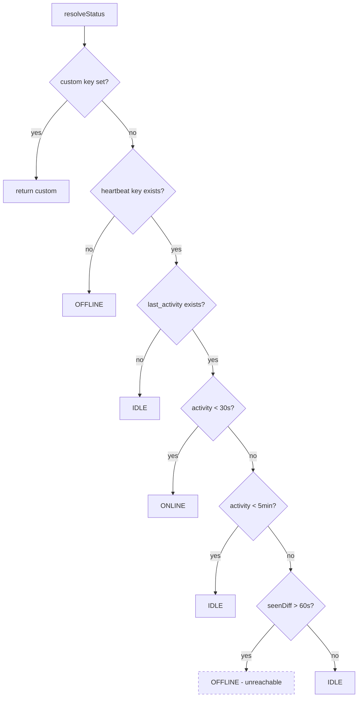
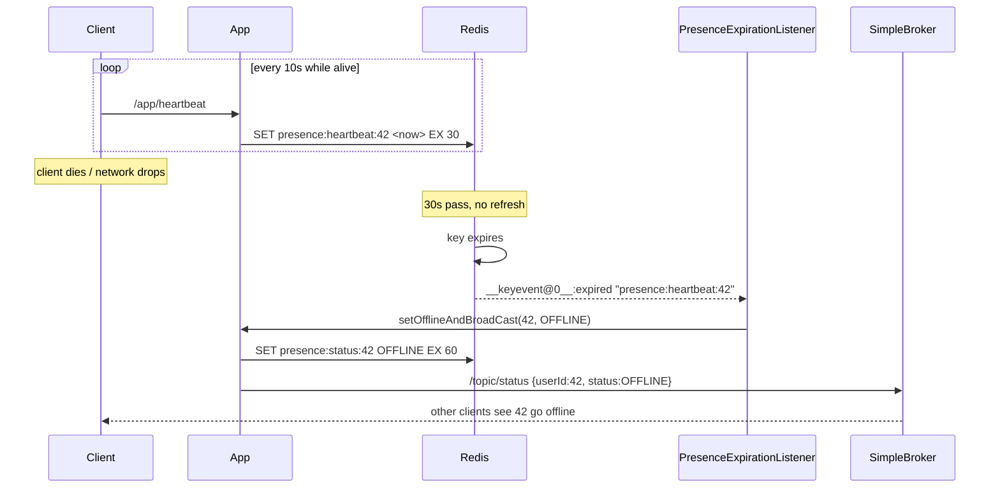
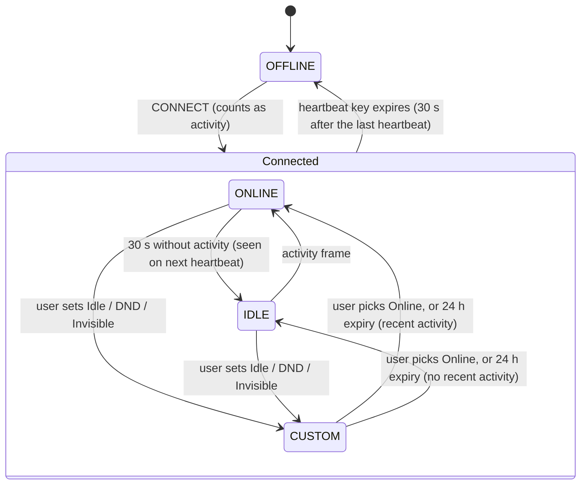

# Redis

Redis backs **presence** — the ONLINE / IDLE / OFFLINE / DO_NOT_DISTURB state shown next to each
user. It is not used as a cache for domain data, despite `spring.cache.type=redis` being set.

## 1. Why Redis for presence

Presence has a shape that fits Redis and fits PostgreSQL badly:

| Property | Consequence |
|---|---|
| Written constantly | Every client writes every 10 s. With 1 000 users that is ~100 writes/s of pure churn. |
| Worthless after seconds | A heartbeat from 60 s ago tells you nothing. |
| Must expire on its own | "Offline" is the *absence* of recent signal — not an event anyone sends. |
| Read in batches | Rendering a friends list needs N statuses at once. |

Putting this in PostgreSQL means high-frequency `UPDATE`s on a hot row per user, generating dead
tuples and vacuum pressure for data that is discarded seconds later. It also has no expiry: detecting
"stopped heartbeating" requires a polling job scanning for stale timestamps.

Redis answers all four directly — O(1) in-memory writes, native per-key `TTL`, `MGET` for batch
reads, and keyspace notifications that turn expiry into a push event. The last point is the decisive
one: **TTL expiry is what defines going offline**, so no polling job is needed. Whether that
mechanism actually works as committed is covered in §5.

## 2. Configuration

```java
// config/RedisConfig.java
@Bean
public StringRedisTemplate stringRedisTemplate(RedisConnectionFactory factory) {
    return new StringRedisTemplate(factory);
}
```

`StringRedisTemplate` is chosen over `RedisTemplate<String, Object>` deliberately: every value stored
is a millisecond epoch or a `UserStatus` enum name. Plain `String` serialisation keeps values
human-readable under `redis-cli`, avoids Java-serialisation or Jackson type metadata in the payload,
and sidesteps the deserialisation-compatibility problems that come with storing serialised objects.

Connection settings (`application.properties:65-68`):

```properties
spring.data.redis.host=localhost
spring.data.redis.port=6379
spring.data.redis.timeout=60000
spring.data.redis.password=redis123
```

> **The `spring-boot-starter-data-redis` dependency is missing from `build.gradle`.** The code
> imports `org.springframework.data.redis.*` throughout, but no Redis starter is declared and none
> arrives transitively through the declared dependencies. The starter was present once: it was added
> in `2b8eea7` and removed in `cd97e97` ("global exception handler update"), before the presence
> rewrite reintroduced Redis code. See
> [IMPLEMENTATION.md](IMPLEMENTATION.md#81-the-backend-does-not-compile-on-main).

`spring.cache.type=redis` and `spring.cache.redis.time-to-live=600000` are also set, but there is no
`@EnableCaching` and no `@Cacheable` anywhere in the codebase — Spring's cache abstraction is inert.
All Redis access is explicit through `StringRedisTemplate`.

## 3. Key schema

```java
// constants/PresenceKeys.java
"presence:last_seen:"     + userId
"presence:last_activity:" + userId
"presence:custom:"        + userId
"presence:status:"        + userId
"presence:heartbeat:"     + userId
```

| Key | Value | TTL | Written by | Read by |
|---|---|---|---|---|
| `presence:heartbeat:{id}` | epoch ms | **30 s** | `handleHeartbeat`, `handleActivity` | `resolveStatus` |
| `presence:last_activity:{id}` | epoch ms | 10 min | `handleActivity` | `resolveStatus`, `handleActivity` |
| `presence:status:{id}` | `UserStatus` name | 60 s | `updateAndBroadcast`, `setOfflineAndBroadCast` | `getUserStatus`, `getFriendsStatus`, `updateAndBroadcast` |
| `presence:custom:{id}` | `UserStatus` name | 24 h | `updateCustomStatus` | `resolveStatus` |
| `presence:last_seen:{id}` | epoch ms | **none** | `handleHeartbeat`, `handleActivity` | **never read** |

Centralising key construction in one class is good practice — it keeps the `presence:` namespace
consistent and makes the schema greppable.

Two observations on the table above:

- **`presence:last_seen:{id}` is write-only and never expires.** It is written on every heartbeat and
  activity event, deleted only by `resetPresence`, and read by nothing. Confusingly, the local
  variable that *looks* like it reads it actually reads the heartbeat key:
  ```java
  // service/impl/UserStatusServiceImpl.java:109
  String lastSeen = redisTemplate.opsForValue().get(PresenceKeys.heartbeat(userId));
  ```
  So these keys accumulate one per user and persist indefinitely.
- **`presence:heartbeat:` is the key whose expiry drives OFFLINE.** Its 30 s TTL against a 10 s client
  heartbeat interval tolerates two consecutive missed beats before a user is considered gone.

## 4. Status resolution

```java
// service/impl/UserStatusServiceImpl.java:100-128
private UserStatus resolveStatus(Long userId) {
    String custom = get(custom(userId));
    if (custom != null) return UserStatus.valueOf(custom);      // 1. manual override wins

    long now = System.currentTimeMillis();
    String lastSeen = get(heartbeat(userId));
    if (lastSeen == null) return OFFLINE;                       // 2. no heartbeat → offline

    String lastActivity = get(lastActivity(userId));
    if (lastActivity == null) return IDLE;                      // 3. connected, never interacted

    long activityDiff = now - parseLong(lastActivity);
    if (activityDiff < 30_000)  return ONLINE;                  // 4. active in last 30 s
    if (activityDiff < 300_000) return IDLE;                    // 5. active in last 5 min

    long seenDiff = now - parseLong(lastSeen);
    if (seenDiff > 60_000) return OFFLINE;                      // 6. UNREACHABLE — see below
    return IDLE;
}
```



### The custom override is checked before liveness

Branch 1 returns the custom status **before** branch 2 checks whether the user is connected at
all. A user who sets Do Not Disturb and then closes the app goes through this sequence:

1. The heartbeat key expires. With keyspace notifications enabled (§5), the listener writes
   `presence:status = OFFLINE` with a 60 s TTL and broadcasts OFFLINE.
2. Sixty seconds later the `status` key expires. The next `getUserStatus` or `getFriendsStatus`
   call misses the cache, falls through to `resolveStatus`, and gets **`DO_NOT_DISTURB`** from branch
   1, even though there is no heartbeat.
3. The user now shows as DND to anyone who pulls their status, for up to 24 hours (the custom key's
   TTL), while fully offline.

Clients that rely only on the push keep showing OFFLINE. Clients that fetch after a refresh show
DND, so different viewers disagree. The correct order is liveness first: return OFFLINE when there
is no heartbeat, and apply the override only to a connected user. That is also how Discord behaves,
where an offline DND user appears offline.

### Liveness versus engagement

The layering is the interesting part: **liveness and engagement are separate signals.**
`presence:heartbeat:` answers "is the socket alive?", `presence:last_activity:` answers "is the human
at the keyboard?". Discord's real model works the same way — you stay ONLINE while typing, drift to
IDLE when you walk away with the app open, and go OFFLINE only when the client stops reporting.
Collapsing these into one timestamp would make IDLE inexpressible.

### Branch 6 is dead code

`lastSeen` reads `presence:heartbeat:`, which has a 30 s TTL and is always written with the current
timestamp. If the key exists at all, its value is at most 30 s old — so `seenDiff` can never exceed
60 000 ms, and the `OFFLINE` return is unreachable. A user whose last activity was hours ago but whose
client still heartbeats resolves to `IDLE` via the final line, which is the intended behaviour
anyway. The check is harmless but misleading: it reads as the offline path when the real offline path
is branch 2, driven entirely by TTL expiry.

### Write suppression

Two layers throttle writes:

```java
// handleActivity — service/impl/UserStatusServiceImpl.java:70-73
if (existing != null) {
    long diff = now - Long.parseLong(existing);
    if (diff < 5000) return;        // ignore activity bursts inside 5 s
}
```

```java
// updateAndBroadcast — :134-139
String cached = get(status(userId));
if (cached != null && cached.equals(newStatus.name())) {
    return;                          // no status change → no Redis write, no broadcast
}
```

The second is the important one: it makes the broadcast **edge-triggered**. Without it, every
heartbeat from every user would fan out a `/topic/status` frame to every connected client — with
N users that is N²/10 frames per second. Suppressing unchanged statuses reduces steady-state
broadcast traffic to zero.

One wrinkle: `presence:status:` has a 60 s TTL while heartbeats arrive every 10 s, so the key is
refreshed well within its lifetime during normal operation. If it does lapse (client offline, then
returning), `cached` is `null`, the suppression is skipped, and a redundant broadcast is emitted.
Harmless, but it means "no change" is not a strict guarantee.

### Batch reads

```java
// getFriendsStatus — :173-177
List<String> keys = friendIds.stream().map(PresenceKeys::status).toList();
List<String> values = redisTemplate.opsForValue().multiGet(keys);
```

`MGET` fetches all friend statuses in one round trip rather than N. For any key that has expired, the
code falls back to `resolveStatus(fid)` per miss — so a friends list where every status key has
lapsed degrades to several sequential Redis calls per friend. Fine at small scale; a pipeline or Lua
script would be the fix if it mattered.

## 5. Expiry → OFFLINE

This is the mechanism that makes presence self-healing, and the part that is currently broken.

```java
// config/RedisKeyExpirationListenerConfig.java
container.addMessageListener(listenerAdapter, new PatternTopic("__keyevent@*__:expired"));

@Bean
public MessageListenerAdapter messageListenerAdapter() {
    return new MessageListenerAdapter(presenceExpirationListener, "handleMessage");
}
```

```java
// service/PresenceExpirationListener.java
public void handleMessage(String key) {
    if (!key.startsWith("presence:heartbeat:")) return;
    Long userId = extractUserId(key);
    if (userId == null) return;
    userStatusService.setOfflineAndBroadCast(userId, UserStatus.OFFLINE);
    userStatusService.broadcastStatusChange(userId, UserStatus.OFFLINE);
}
```



The `@*` wildcard in the pattern matches any Redis database index, so the subscription works
regardless of which logical DB is selected.

### Keyspace notifications are not enabled

```yaml
# docker-compose.yml:45
command: redis-server --requirepass redis123
```

Redis ships with `notify-keyspace-events` set to the **empty string** — notifications are off by
default because they cost CPU. No configuration anywhere in the repository enables them:

```
$ grep -rn "notify-keyspace-events" .        # no matches
```

**Consequence: the expiry event is never published, `handleMessage` never runs, and no user ever
transitions to OFFLINE via heartbeat expiry.** The heartbeat key expires silently. The visible
symptom is that a user who closes their browser stays at their last broadcast status indefinitely on
everyone else's friends list — because `WebSocketEventListener` deliberately does not force OFFLINE
on disconnect, trusting this mechanism instead.

Note that `resolveStatus` still returns OFFLINE correctly on a *pull* (branch 2 — the heartbeat key
is genuinely gone). So `GET /api/users/{id}/status` reports the truth; only the *push* is missing.
That makes the bug easy to miss in manual testing and easy to misdiagnose as a frontend problem.

The fix is one flag:

```yaml
command: redis-server --requirepass redis123 --notify-keyspace-events Ex
```

`E` enables keyevent notifications, `x` enables the expired-event class. Equivalently, at runtime:
`CONFIG SET notify-keyspace-events Ex`.

### Two caveats once it is enabled

1. **Expiry events are not punctual.** Redis deletes an expired key either when it is next accessed
   or when the background active-expiry cycle samples it. The event fires at *deletion*, not at
   logical expiry, so the OFFLINE transition can lag the 30 s TTL by a further second or more under
   load. Presence is eventually consistent, not real-time.
2. **Every instance receives every event.** Keyspace notifications are pub/sub broadcast. With more
   than one application instance, each one runs `handleMessage` and each one broadcasts — so the
   OFFLINE frame is emitted once per instance. This needs a guard (a short-lived `SETNX` lock on the
   user ID, for example) before the app can be scaled horizontally.

### Duplicate broadcast

`handleMessage` broadcasts twice for a single expiry:

```java
userStatusService.setOfflineAndBroadCast(userId, UserStatus.OFFLINE);  // broadcasts internally
userStatusService.broadcastStatusChange(userId, UserStatus.OFFLINE);   // broadcasts again
```

`setOfflineAndBroadCast` (`UserStatusServiceImpl.java:285-294`) already calls
`broadcastStatusChange` as its last statement. The second call is redundant — every client receives
the same OFFLINE frame twice. Harmless (the frontend applies last-write-wins) but it doubles presence
traffic on the one event that matters most.

Also note that `setOfflineAndBroadCast` takes a `status` parameter but hardcodes `OFFLINE` in the
Redis write while broadcasting the parameter — the two can disagree if it is ever called with
anything else. Today the only caller passes `OFFLINE`.

## 6. Custom status

`updateCustomStatus` writes to **both** Redis (24 h TTL) and PostgreSQL (`UserStatusEntity`), and
special-cases `ONLINE`:

```java
// :207-209
if (customStatus == UserStatus.ONLINE) {
    return clearCustomStatus(userId);
}
```

Setting yourself "Online" is modelled as *removing* the override rather than pinning a value — after
which status is derived from activity again. This is correct: ONLINE is a computed state, so pinning
it would mean "always appear online", which is a different feature.

The dual write exists so a custom status survives a Redis restart. But **nothing rehydrates Redis
from PostgreSQL.** `resolveStatus` reads only `presence:custom:`; no startup task or cache-miss path
consults `UserStatusEntity.customStatus`. If Redis is flushed or restarted, the override vanishes
from behaviour while remaining in the database — and the two expiry clocks (Redis `TTL` of 24 h,
`UserStatusEntity.statusExpiresAt` of `now + 1 day`) drift independently with nothing reconciling
them. The database row is effectively write-only for this purpose, mirroring the
`presence:last_seen:` situation.

### `@Async` and self-invocation

`persistLastSeen` is annotated `@Async`, which `AsyncConfig` enables. The annotation works only
through the Spring proxy. When `WebSocketEventListener` calls it on disconnect, the call goes
through the injected proxy and runs on the async executor, as intended. When `resetPresence` calls
it (`UserStatusServiceImpl.java:266`), the call is a plain `this.persistLastSeen(...)` and runs
**synchronously** on the request thread. The same self-invocation rule applies to `@Transactional`:
`updateCustomStatus` calling `clearCustomStatus` does not start a new transaction. That happens to
be harmless here, because the caller is already transactional.

### Presence visibility

Presence has no privacy boundary:

- **Push.** `broadcastStatusChange` sends every status change to `/topic/status`, a single global
  topic that every connected client subscribes to. Every user receives every other user's
  ONLINE/IDLE/OFFLINE/DND transitions, friends or not. `FriendStatusProvider` stores all of them.
- **Pull.** `GET /api/users/{userId}/status` returns any user's status to any authenticated caller.
  There is no friendship check.

For a chat app this leaks who is online and when, which is exactly the signal the BLOCKED friendship
state exists to withhold. A blocked user still receives the blocker's presence. The fix is to fan
out per recipient: resolve the user's friend IDs and send to each friend's
`/user/queue/presence`, which is what `getFriendIds` already makes cheap. The REST endpoint should
also require friendship or a shared server.

It also means the cost of fan-out grows with the square of the user count. Every status change goes
to every connected client, so with N users online each edge-triggered change produces N frames.
Edge-triggering (§4) keeps the number of *changes* low, but not the cost of each one.

## 7. Client cadence

| Signal | Source | Cadence |
|---|---|---|
| `/app/heartbeat` | `PresenceProvider` `setInterval` | every **10 s** while connected |
| `/app/activity` | `IdleProvider` DOM listeners | debounced **1 s, leading edge** |

```ts
// frontend/src/providers/IdleProvider.tsx
const handler = debounce(handleActivity, 1000, { leading: true });
["mousemove", "keydown", "click", "touchstart"].forEach(e =>
  window.addEventListener(e, handler));
```

`{ leading: true }` (commit `7270c74`) fires on the **first** event of a burst and suppresses the
rest of the window, rather than waiting 1 s to fire on the trailing edge. For presence this is the
right choice: the user's first mousemove after being idle should promote them to ONLINE immediately,
not a second later. Trailing-edge debounce would add a full second of latency to every
idle→online transition.

`handleActivity` further gates on current status:

```ts
if (status !== UserStatus.ONLINE) { sendActivity(); }
```

So while a user is ONLINE, the client sends **no** activity frames, only the 10 s heartbeat.
`handleHeartbeat` (`UserStatusServiceImpl.java:40-56`) writes `heartbeat` and `last_seen` but
**not** `last_activity`. Together these cause an oscillation for a user who is continuously active:

1. Input arrives while the status is IDLE. The client sends `/app/activity`, the server refreshes
   `last_activity`, resolves ONLINE, and broadcasts it.
2. The client now sees ONLINE, so the gate suppresses every further activity frame, however much
   the user types.
3. `last_activity` ages. On the first heartbeat after it passes 30 s, `resolveStatus` returns IDLE,
   and the server broadcasts IDLE.
4. The client sees IDLE, and the user's next keystroke sends activity. Back to step 1.

The result is an ONLINE→IDLE→ONLINE cycle roughly every 30–40 seconds. Each transition broadcasts
to every connected client (see [Presence visibility](#presence-visibility)), and friends watching
see an active user flicker to IDLE. The client gate and the heartbeat's key set disagree about who
refreshes `last_activity`. Either the gate should be removed, relying on the server's 5 s throttle
instead, or the client should keep sending activity at a low rate while ONLINE.

`IdleProvider` also arms a 30 s `idleTimer` whose callback, `markIdle`, only calls `console.log` —
it performs no state change and notifies nothing. The client-side idle timer is effectively dead
code; IDLE is determined server-side by `resolveStatus`.

## 8. Evolution: from `feature/kafka` to `main`

The presence rewrite is the substance of the `feature/redis` branch. On `feature/kafka`, presence was
connection-scoped and database-backed:

```java
// origin/feature/kafka — WebSocketEventListener
@EventListener
public void handleSessionConnected(SessionConnectedEvent event) {
    userStatusService.updateUserStatus(userId, UserStatus.ONLINE);   // DB write
    publisher.sendToTopic(WsDestinations.PRESENCE,
        WsEvent.builder().type(WsEventType.USER_ONLINE).payload(username).build());
}

@EventListener
public void handleSessionDisconnect(SessionDisconnectEvent event) {
    userStatusService.updateUserStatus(userId, UserStatus.OFFLINE);  // DB write
    // ... USER_OFFLINE event
}
```

| | `feature/kafka` | `main` / `feature/redis` |
|---|---|---|
| Store | PostgreSQL `UserStatusEntity` | Redis TTL keys |
| Trigger | STOMP connect/disconnect | Heartbeat + activity + TTL expiry |
| States | ONLINE / OFFLINE | ONLINE / IDLE / OFFLINE / DND |
| Offline detection | Disconnect event | Key expiry notification |
| Destination | `/topic/presence` (`WsEvent`) | `/topic/status` (raw map) |
| Write volume | 2 DB writes per session | Redis writes, suppressed when unchanged |

**What the rewrite fixed.** Connection-scoped presence flaps: every refresh, tunnel switch, or laptop
sleep fires disconnect→connect and broadcasts OFFLINE→ONLINE. It is also unrecoverable after a crash
— if the process dies, every user is left marked ONLINE in the database with no disconnect event
coming. And it cannot express IDLE at all, since a socket is either open or closed.

TTL-based presence fixes all three: a brief disconnect is absorbed if the client returns within 30 s;
a crashed process leaves keys that expire on their own; and separating liveness from engagement makes
IDLE representable.

**What it cost.** Correctness now depends on Redis configuration (`notify-keyspace-events`) that
lives outside the codebase and is currently unset — trading an obvious failure mode for a silent one.
It also left three vestigial artifacts behind: `WsDestinations.PRESENCE`, `WsEventType.USER_ONLINE`,
and `WsEventType.USER_OFFLINE` are all now unused.

## 9. Summary of findings

The corrective change for each finding is in [§10](#10-corrections).

| # | Finding | Location | Severity |
|---|---|---|---|
| 1 | `spring-boot-starter-data-redis` missing — code does not compile | `build.gradle` | **Critical** |
| 2 | `notify-keyspace-events` not enabled — OFFLINE never pushed | `docker-compose.yml:45` | **Critical** |
| 3 | Presence broadcast globally; any user can read any user's status, blocked users included | `UserStatusServiceImpl.java:305`, `UserStatusController.java:29` | **High** |
| 4 | Custom status checked before liveness; offline users reappear as DND/IDLE | `UserStatusServiceImpl.java:103-106` | Medium |
| 5 | Client activity gate vs. heartbeat key set causes ONLINE↔IDLE oscillation | `IdleProvider.tsx` + `UserStatusServiceImpl.java:40-56` | Medium |
| 6 | Custom status never rehydrated from DB; two expiry clocks drift | `UserStatusServiceImpl.java:199-231` | Medium |
| 7 | Duplicate OFFLINE broadcast on expiry | `PresenceExpirationListener.java` | Low |
| 8 | Expiry event fans out per instance — blocks horizontal scaling | `RedisKeyExpirationListenerConfig.java` | Low (today) |
| 9 | `@Async persistLastSeen` runs synchronously when called from `resetPresence` | `UserStatusServiceImpl.java:266` | Low |
| 10 | `presence:last_seen:` written, never read, never expires | `PresenceKeys.java` | Low |
| 11 | Unreachable OFFLINE branch in `resolveStatus` | `UserStatusServiceImpl.java:124-125` | Low |
| 12 | `markIdle` is a no-op; client idle timer is dead code | `IdleProvider.tsx` | Low |
| 13 | `spring.cache.type=redis` set but no `@EnableCaching`/`@Cacheable` | `application.properties:73` | Cosmetic |

## 10. Corrections

For each finding in [§9](#9-summary-of-findings), this section describes what has to change and
where. Several findings touch the same methods, so [§10.14](#1014-apply-order) gives an order that
applies cleanly, and [§10.15](#1015-userstatusserviceimpl-after-all-corrections) describes the
presence service once every correction is in.

Paths are relative to `src/main/java/com/discordclone/` unless they start with `frontend/` or name
a root file.

### 10.1 Finding 1 — add the Redis starter

- In `build.gradle`, add `org.springframework.boot:spring-boot-starter-data-redis` to the
  `dependencies` block, next to the WebSocket starter.
- Nothing else needs to change. The starter brings Spring Data Redis and the Lettuce client, and it
  auto-configures the connection factory from the existing `spring.data.redis.*` properties.
  Boot's own `StringRedisTemplate` backs off, because `config/RedisConfig` already defines one.

**Check:** `./gradlew compileJava` succeeds.

### 10.2 Finding 2 — enable expired-key events

- In `docker-compose.yml`, add `--notify-keyspace-events Ex` to the `redis-server` command of the
  `redis` service. `E` enables the keyevent channel, and `x` enables expired events. Recreate the
  Redis container so the new command takes effect; the data volume is preserved.
- **Code-side safety net:** the rewritten listener in
  [§10.8](#108-finding-8--process-each-expiry-once-across-instances) extends Spring Data Redis's
  `KeyExpirationEventMessageListener` and sets its keyspace-notification parameter to `Ex`. With
  that, the application itself runs `CONFIG SET` at startup when the server has no notification
  flags configured.
- **Managed Redis** (ElastiCache, Azure Cache, Upstash) usually blocks `CONFIG`. There, set that
  parameter to an empty string to skip the startup write, and configure `notify-keyspace-events` in
  the provider's parameter group instead.

**Check:** `CONFIG GET notify-keyspace-events` returns `xE`. Subscribe to `__keyevent@*__:expired`,
set any key with a 1-second TTL, and an event arrives about a second later.

### 10.3 Finding 3 — scope presence to self and friends

This needs four changes. The last one prevents a regression: today new friends see each other's
status only because everyone sees everyone's.

**a. Fan out to self and accepted friends instead of a global topic.**

- Add `getFriendUsernames(userId)` to `FriendshipService`. Implement it in `FriendshipServiceImpl` as
  a read-only transaction that loads the user and maps the existing `FriendshipRepository.findFriends`
  result to usernames. `findFriends` returns only `ACCEPTED` friendships, and blocking replaces the
  row with a `BLOCKED` one, so blocked users drop out with no extra check.
- In `UserStatusServiceImpl.broadcastStatusChange`, stop sending to `/topic/status`. Look up the
  user's own username, then send the same `{userId, status}` payload with `convertAndSendToUser` to
  `/queue/presence`, once for the user and once for each friend username. Clients receive it on
  `/user/queue/presence`.
- Broadcasts fire only on a status change, so the friend lookup runs once per *change*, not per
  heartbeat. If it ever shows up in profiles, cache each user's friend set in Redis and invalidate
  it on accept, remove, and block.

**b. Gate `GET /api/users/{userId}/status` to self or friends.**

- Add a `ForbiddenException` (a `RuntimeException`) to `exception/`, and a handler for it in
  `GlobalExceptionHandler` that returns **403** with the usual `ErrorResponse` body.
- Do not use Spring's `AccessDeniedException` for this. It is also a `RuntimeException`, so the
  existing catch-all handler would turn it into a 500.
- In `UserStatusController`, inject `FriendshipService`. In `getUserStatus`, throw
  `ForbiddenException` unless the requested ID is the caller's own or `areFriends(caller, userId)`
  is true.

**c. Move the client subscriptions.**

- In `frontend/src/providers/PresenceProvider.tsx` (line 45) and `FriendStatusProvider.tsx`
  (line 20), change the subscribed destination from `/topic/status` to `/user/queue/presence`.
- `WebSocketAuthInterceptor` needs no change, because `/user/queue/` is already an allowed prefix.

**d. Exchange current statuses when a friendship is accepted.**

- `FriendshipServiceImpl` cannot call `UserStatusService` directly. `UserStatusServiceImpl` already
  depends on `FriendshipService`, so the reverse dependency would be a constructor cycle. Use an
  application event instead:
  - Add a `FriendshipAcceptedEvent` record carrying the two user IDs.
  - Inject `ApplicationEventPublisher` into `FriendshipServiceImpl`, and publish the event after both
    places that set a friendship to `ACCEPTED`: `acceptFriendRequest`, and the auto-accept branch of
    `sendFriendRequest`.
  - In `UserStatusServiceImpl`, add a `@TransactionalEventListener` (phase `AFTER_COMMIT`) that sends
    each user the other's current status, from `getUserStatus`, on `/queue/presence`.

**Rollout:** changes (a) and (c) must ship in the same deploy. For a staggered deploy, have
`broadcastStatusChange` publish to both `/topic/status` and the per-user queue for one release,
then remove the topic.

**Check:** log in as users A, B (A's friend), and C (not a friend). A's status changes reach B but
not C. `GET /api/users/{A}/status` returns 200 for B and 403 for C. Accepting a friend request
immediately shows each side the other's current status.

### 10.4 Finding 4 — check liveness before the custom override

- Rewrite `resolveStatus` in `UserStatusServiceImpl` so its checks run in this order:
  1. No heartbeat key → **OFFLINE**, whatever else is set.
  2. A custom override is present → that status.
  3. No `last_activity` key → **IDLE**.
  4. `last_activity` less than 30 s old → **ONLINE**; otherwise **IDLE**.
- For every connected user without an override, the results are the same as today. The old
  "OFFLINE after 60 s" branch was unreachable ([finding 11](#1011-finding-11--remove-the-unreachable-branch)),
  so anything past the ONLINE window already resolved to IDLE.
- Make time injectable. Add a `Clock` bean (a new `config/ClockConfig`, using the system default
  zone), inject it into `UserStatusServiceImpl`, and replace every `System.currentTimeMillis()` in
  the class with the clock. Tests can then cover the exact 29 s and 31 s boundaries.

**Check:** a unit test in which the heartbeat key is missing but a DND override is present resolves
to OFFLINE.

### 10.5 Finding 5 — send activity on input, not only while not ONLINE

- In `frontend/src/providers/IdleProvider.tsx`, remove the `status !== ONLINE` condition. Send
  `/app/activity` on user input whatever the current status is, throttled to at most once every
  15 s on the **leading** edge, so the first input after a quiet period is reported immediately.
- Keep the server's existing 5 s throttle in `handleActivity` as a second guard.
- **Why 15 s:** it is half the server's 30 s ONLINE window, which keeps an active user ONLINE with one
  missed frame of slack, at a cost of at most four frames per minute per user.
- Leave `handleHeartbeat` as it is. Heartbeats prove the connection is alive, not that the user is
  engaged. If they refreshed `last_activity`, every open tab would stay ONLINE forever.
- The component rewrite is shared with finding 12. See
  [§10.12](#1012-finding-12--remove-the-dead-client-idle-timer).

**Check:** type continuously for two minutes and the user stays ONLINE with no IDLE broadcast. Stop
for more than 40 s and exactly one IDLE broadcast follows.

### 10.6 Finding 6 — rehydrate the custom status and keep one expiry clock

**a. Derive both expiries from one timestamp.** In `updateCustomStatus`, compute a single
`expiresAt` (now plus 24 h, from the injected clock). Use it for both the database's
`statusExpiresAt` and the Redis key's TTL, the TTL being the time remaining until `expiresAt`. This
replaces the fixed 24 h TTL and the separate `plusDays(1)`.

**b. Restore from Postgres when Redis has lost the override.**

- Add a query to `UserStatusRepository` that returns rows with a non-null custom status whose
  `statusExpiresAt` is still in the future.
- Add `restoreCustomStatus(userId)` to `UserStatusService`. If Redis has no custom key for the user
  but the database row holds an unexpired custom status, write it back to Redis with the remaining
  time as its TTL.
- Call it from `WebSocketEventListener.handleSessionConnected`, before `handleActivity`.
- On `ApplicationReadyEvent`, restore every unexpired custom status in a single pass.

**c. Make `resetPresence` clear the database too.** It must null out `customStatus` and
`statusExpiresAt` on the user's row. Otherwise the restore in (b) brings the override straight back
on the next connect.

**Remaining gap:** if Redis restarts while a user stays connected, their override is lost until
they reconnect or the application restarts. Closing that gap would need a database read on every
cache miss, or a negative-cache marker, and neither is worth it for a cosmetic field.

**Check:** set DND, restart Redis, and reconnect the client. The status is DND again, and the Redis
key's TTL matches `status_expires_at`.

### 10.7 Finding 7 — broadcast OFFLINE once, with a consistent value

- Replace `setOfflineAndBroadCast(userId, status)` in `UserStatusService` and its implementation
  with `setOfflineAndBroadcast(userId)`, which also fixes the casing. The new method writes OFFLINE
  to the status key (60 s TTL) and broadcasts OFFLINE. Both come from the same constant, so the
  stored and broadcast values can no longer disagree.
- In `PresenceExpirationListener`, call it once, and delete the second `broadcastStatusChange` call.
  This happens as part of the rewrite in §10.8.

### 10.8 Finding 8 — process each expiry once across instances

- Add an `offlineLock(userId)` key, `presence:offline_lock:{userId}`, to `PresenceKeys`.
- Rewrite `PresenceExpirationListener` to extend `KeyExpirationEventMessageListener`. Its
  constructor takes the `RedisMessageListenerContainer`, the base class subscribes to
  `__keyevent@*__:expired` itself, and the constructor sets the `Ex` parameter from §10.2. For each
  expired key, the handler should:
  1. Ignore keys that do not start with `presence:heartbeat:`. Parse the user ID, and log and ignore
     a malformed key.
  2. Claim the expiry with `SET NX` on the offline-lock key, with a 5 s TTL. If another instance
     already holds it, stop.
  3. If the heartbeat key exists again, the user reconnected between the expiry and this callback,
     so stop.
  4. Otherwise, call `setOfflineAndBroadcast` exactly once.
- Reduce `RedisKeyExpirationListenerConfig` to defining the listener container bean only. Remove
  the `MessageListenerAdapter` bean and the injected listener. The listener now registers itself,
  and keeping the injection would create a cycle.
- **Lock TTL:** it only has to outlast the spread between instances receiving the same event, which
  is milliseconds. One side effect: if a user goes offline, reconnects, and goes offline again
  within 5 s, the second OFFLINE is suppressed. That corrects itself when the cached status expires
  and the next read resolves to OFFLINE.
- For a design that needs neither keyspace events nor locks, see the sorted-set sweeper in
  [IMPROVEMENTS.md](IMPROVEMENTS.md#presence).

**Check:** run two instances on different ports and cut one client's network. Exactly one OFFLINE
frame is delivered.

### 10.9 Finding 9 — make `persistLastSeen` asynchronous for every caller

- Create a `LastSeenWriter` component with a single method, annotated `@Async` and `@Transactional`,
  that upserts `user_status.last_activity` for a user, using the injected clock.
- In `UserStatusServiceImpl`, inject it, and turn `persistLastSeen` into a plain delegate to it,
  removing `@Async` from the service method.
- Both callers, `WebSocketEventListener` on disconnect and `resetPresence`, now cross a Spring proxy
  boundary, so the write runs asynchronously in both cases.

### 10.10 Finding 10 — remove the write-only `last_seen` key

- Delete `PresenceKeys.lastSeen`.
- Remove the writes to that key from `handleHeartbeat` and `handleActivity`, and remove its delete
  from `resetPresence`.
- The durable "last seen" value stays in `user_status.last_activity` (§10.9).
- **One-time cleanup:** the existing keys have no TTL and will never expire on their own. Delete
  every key matching `presence:last_seen:*`, using `SCAN` with `UNLINK` rather than `KEYS`.

**Check:** no references to `lastSeen` remain in `src/main/java`, and a scan for
`presence:last_seen:*` returns nothing.

### 10.11 Finding 11 — remove the unreachable branch

This is resolved by the `resolveStatus` rewrite in
[§10.4](#104-finding-4--check-liveness-before-the-custom-override). The `seenDiff > 60 s` check and the
misleading `lastSeen` variable, which actually read the heartbeat key, both go away. Liveness
becomes a single existence check on the heartbeat key at the top of the method.

### 10.12 Finding 12 — remove the dead client idle timer

- Rewrite `IdleProvider` so that it contains only the activity reporting from §10.5. Remove the 30 s
  idle timer, its ref, `markIdle`, and the dependency on `status`. IDLE is decided on the server
  (§10.4), so the client timer has no purpose.
- Attach the throttled activity sender to `mousemove`, `keydown`, `click`, and `touchstart` as
  passive listeners. Also send activity on `visibilitychange` when the tab becomes visible.
- On cleanup, cancel the throttle and remove every listener.
- Use lodash `throttle` instead of `debounce`. `lodash` is already a dependency.

### 10.13 Finding 13 — delete the inert cache settings

- Delete the "Cache Configuration" block (`spring.cache.type` and
  `spring.cache.redis.time-to-live`) from `src/main/resources/application.properties`.
- If caching is wanted later, a good first target is `CustomUserDetailsService.loadUserById`, which
  runs a `SELECT` on every authenticated request. Enable caching, cache users by ID, evict on user
  update, and only then reintroduce these properties.

### 10.14 Apply order

| Step | Findings | Why this order |
|---|---|---|
| 1 | 1 | Nothing compiles without the starter |
| 2 | 13, 10 | Pure deletions; they shrink the code later steps touch |
| 3 | 4, 11 | One `resolveStatus` rewrite, plus the `Clock` bean later steps use |
| 4 | 7, 8, 2 | Interface rename, then the listener and configuration rewrite that depends on it; then the Redis flag |
| 5 | 9 | New `LastSeenWriter`; `resetPresence` still delegates |
| 6 | 6 | Uses the `Clock`; edits `resetPresence` after step 5 |
| 7 | 3 | Backend and frontend **in the same deploy** (see the §10.3 rollout note) |
| 8 | 5, 12 | One `IdleProvider` rewrite, frontend only |

`UserStatusServiceTest` still targets the removed `updateUserStatus` API (see
[BUGS.md B09](BUGS.md#b09-two-test-classes-do-not-compile)). Rewrite it alongside step 3. Use the
injected `Clock` to cover the 29 s and 31 s boundaries, the offline-with-override case, and the
no-activity case.

### 10.15 `UserStatusServiceImpl` after all corrections

Once every step is applied, the presence service should look like this:

- **Dependencies:** as today, plus the injected `Clock` and `LastSeenWriter`.
- **Constants:** named constants replace the literals scattered through the class: heartbeat TTL
  30 s, activity TTL 10 min, cached-status TTL 60 s, custom-status lifetime 24 h, ONLINE window 30 s,
  and activity throttle 5 s.
- **`handleHeartbeat`:** refreshes only the heartbeat key, with no `last_seen` write, then calls
  `updateAndBroadcast`.
- **`handleActivity`:** applies the 5 s throttle, writes `last_activity` and the heartbeat key, then
  calls `updateAndBroadcast`.
- **`resolveStatus`:** liveness, then override, then engagement, in the order from §10.4.
- **`updateAndBroadcast`:** resolves the status. If it equals the cached value, it **refreshes the
  cached key's TTL** and returns. Otherwise it writes the new value with the 60 s TTL and broadcasts.
  The TTL refresh is new. Today's code returns without refreshing it, so the cached key expires
  60 s after every change, and the next heartbeat re-broadcasts the unchanged status. Every
  connected user therefore re-announces their status roughly once a minute. This problem is not
  yet listed in §9.
- **`setOfflineAndBroadcast`:** single-argument; writes and broadcasts OFFLINE (§10.7).
- **`broadcastStatusChange`:** sends to the user and each accepted friend on `/queue/presence` (§10.3).
- **`persistLastSeen`:** delegates to `LastSeenWriter` (§10.9).
- **`updateCustomStatus`:** one `expiresAt` drives both the database expiry and the Redis TTL (§10.6).
- **New methods:** `restoreCustomStatus`, a startup restore on `ApplicationReadyEvent`, and the
  after-commit friendship-accepted listener (§10.3, §10.6).
- **`resetPresence`:** also clears the custom status in the database (§10.6).
- **Unchanged:** `getUserStatus`, `getFriendsStatus`, `clearCustomStatus`, and
  `getUserStatusEntity`.

## 11. Presence after the corrections: how status is resolved and broadcast

This section describes the system as it behaves once every change in [§10](#10-corrections) is
applied, including the cached-status TTL refresh noted in
[§10.15](#1015-userstatusserviceimpl-after-all-corrections). None of it is implemented yet. Where
behaviour is still wrong after §10, the scenario says so, and [§11.5](#115-what-is-still-not-right)
collects those problems.

### 11.1 The moving parts

Three signals feed presence, and each answers a different question:

| Signal | Question it answers | Sent by | Frequency |
|---|---|---|---|
| **Heartbeat** (`/app/heartbeat`) | Is the connection alive? | `PresenceProvider`, on a timer | Every 10 s while connected |
| **Activity** (`/app/activity`) | Is a person using the app? | `IdleProvider`, on input | At most once per 15 s while the user interacts (leading edge) |
| **Custom status** (REST) | Has the user chosen a status? | `UserStatusSelector` | On demand |

**Server side**

| Component | Triggered by | What it does |
|---|---|---|
| `WebSocketEventListener` (connect) | STOMP `CONNECT` succeeds | Restores the custom status from Postgres if Redis lacks it, then treats the connect as activity |
| `WebSocketEventListener` (disconnect) | Socket closes | Records last-seen in Postgres, asynchronously. Does **not** change status |
| `handleHeartbeat` | `/app/heartbeat` | Refreshes the heartbeat key (30 s TTL), then re-evaluates |
| `handleActivity` | `/app/activity`, or a connect | Ignores repeats within 5 s. Otherwise refreshes `last_activity` (10 min TTL) and the heartbeat key, then re-evaluates |
| `updateCustomStatus` / `clearCustomStatus` | REST calls | Writes or removes the override in Redis and Postgres (one expiry time), then re-evaluates |
| `PresenceExpirationListener` | Redis reports an expired heartbeat key | Claims the expiry (one instance only), confirms the user has not reconnected, then marks them OFFLINE |
| `onFriendshipAccepted` | A friendship is committed as ACCEPTED | Sends each user the other's current status |
| Startup restore | Application ready | Copies every unexpired custom status from Postgres into Redis |

"Re-evaluates" always means the same thing, `updateAndBroadcast`. It resolves the status (§11.2),
compares the result with the cached `presence:status:{id}`, and then:

- **Unchanged:** it refreshes the cache's 60 s TTL and sends nothing.
- **Changed:** it caches the new status and broadcasts it (§11.3).

**Client side**

| Component | What it does |
|---|---|
| `WebSocketProvider` | Opens the STOMP connection with the JWT, and reconnects automatically every 5 s after a drop |
| `PresenceProvider` | At login, fetches the user's own status (`GET /users/me/status`) and shows ONLINE until the answer arrives. Subscribes to `/user/queue/presence` and applies frames about the user themself. Runs the 10 s heartbeat timer. Exposes the set and clear calls for custom status |
| `IdleProvider` | Sends activity on `mousemove`, `keydown`, `click`, `touchstart`, and when the tab becomes visible, throttled to once per 15 s |
| `FriendStatusProvider` | At login, fetches every friend's status (`GET /users/friends/status`). Subscribes to `/user/queue/presence` and merges incoming frames into a map. Unknown users read as OFFLINE |
| `UserStatusSelector` | Online → clear the custom status. Idle, Do Not Disturb, or Invisible → set it as a custom status |

### 11.2 How a status is resolved

The server derives the status each time it is needed. Nothing stores it as the source of truth,
since the cached value only exists to detect changes. Resolution checks, in order:

1. **No heartbeat key → OFFLINE.** The connection is gone, whatever else is set.
2. **Custom status present → that status.** This covers Idle, Do Not Disturb, and Invisible (which is
   stored as OFFLINE).
3. **No `last_activity` key → IDLE.** Connected, but no input for over 10 minutes (the key's TTL),
   or none since connecting.
4. **`last_activity` under 30 s old → ONLINE, otherwise IDLE.**

Resolution runs on every heartbeat, every accepted activity frame, every custom-status change, and
on status reads that miss the cache. Because heartbeats arrive every 10 s, time-based changes such
as "30 s without activity" or "custom status expired" are picked up within 10 s of happening.
The one exception is OFFLINE, which is pushed by the expiry listener rather than discovered on a
heartbeat, since a user who is offline no longer sends heartbeats.



### 11.3 How a status is broadcast

- **Changes only.** A broadcast happens only when the resolved status differs from the cached one,
  so a user whose status is stable produces no presence traffic, however many heartbeats and
  activity frames arrive.
- **Recipients.** The frame `{userId, status}` goes to the user themself and to each **accepted**
  friend, through each person's own `/user/queue/presence`. Spring delivers it to every open session
  of each recipient, so all of a user's tabs and devices agree. Non-friends and blocked users
  receive nothing.
- **OFFLINE.** It comes from a different path. When a heartbeat key expires, Redis publishes an
  expired-key event. The listener takes a 5 s lock so that only one application instance acts on it,
  checks that the heartbeat has not reappeared, then caches and broadcasts OFFLINE once.
- **New friendships.** When a friendship is accepted, both users receive each other's current status
  after the transaction commits. Without this, they would not see each other until one of them
  changed status.
- **Pulls.** Only two reads happen on their own: at login, the client fetches its own status and its
  friends' statuses. `GET /api/users/{id}/status` is limited to the user themself and their friends,
  and anyone else gets 403.

On the client, `PresenceProvider` applies frames whose `userId` matches the logged-in user, and
`FriendStatusProvider` records every frame in its map. Both listen on the same subscription.

### 11.4 Scenarios

"Friends see" means what the friends' clients display. Timings assume the §10 values: 10 s
heartbeat, 30 s heartbeat TTL, 30 s ONLINE window, and 15 s client activity throttle.

#### Connecting and disconnecting

**1. Logging in (first session)**

- *Client:* after login, the socket connects with the JWT. At the same time, `PresenceProvider`
  fetches the user's own status and `FriendStatusProvider` fetches the friend statuses. Once
  connected, both subscribe to `/user/queue/presence`, the heartbeat timer starts (first beat after
  10 s), and `IdleProvider` begins listening for input.
- *Server:* the connect event restores any saved custom status, then counts as activity. The
  heartbeat and `last_activity` keys are written, and resolution gives ONLINE, or the custom status
  if one is set. That differs from the cached value (missing, or OFFLINE from the last session), so
  it is broadcast.
- *Friends see:* the user go ONLINE (or DND and so on) immediately.
- *Still wrong:* the user's **own** badge can be wrong. The server broadcasts at the connect event,
  which is before the client has subscribed, so the user misses their own frame. If the
  `/me/status` request reached the server before the connect, it returned OFFLINE, and the user's
  own badge shows OFFLINE until their next status change, typically when they go idle. See §11.5.

**2. Page reload or a brief network blip**

- *Client:* the socket closes. A reload loads a fresh app, and a blip triggers the 5 s automatic
  reconnect.
- *Server:* the disconnect only records last-seen. The heartbeat key keeps living until 30 s after
  the last heartbeat. On reconnect, the connect counts as activity, and resolution gives the same
  status as before. The cache matches, so nothing is broadcast.
- *Friends see:* nothing, as long as the gap is shorter than what remains of the TTL. That is 20–30 s,
  depending on where in the heartbeat cycle the drop happened. A longer gap becomes scenario 3,
  followed by scenario 1.

**3. Closing the tab, quitting the browser, or logging out**

- *Client:* the socket closes; logout tears the connection down. Heartbeats stop.
- *Server:* the disconnect records last-seen and nothing else. About 30 s after the last heartbeat,
  Redis expires the heartbeat key and publishes the event. The listener claims it, sees no new
  heartbeat, and caches and broadcasts OFFLINE. `last_activity` and any custom status may still be
  in Redis, but resolution returns OFFLINE because liveness is checked first.
- *Friends see:* OFFLINE **20–30 s after the tab closed**, plus the usual sub-second delay before
  Redis actually deletes an expired key.

**4. Unclean disconnect: Wi-Fi drop, laptop sleep, or crash**

- *Client:* nothing is sent, and the socket may not even close cleanly.
- *Server:* it may not notice the dead socket for a long time, and it does not need to. The missing
  heartbeats let the key expire exactly as in scenario 3.
- *Friends see:* OFFLINE 20–30 s after the last heartbeat that reached the server.

**5. Reconnecting just as the key expires**

- If the reconnect writes a new heartbeat before the listener runs, the listener finds the key
  present and does nothing. Friends see no change.
- If the listener runs first, OFFLINE is broadcast. The reconnect then resolves ONLINE, which
  differs from the cached OFFLINE, so ONLINE follows. Friends see a brief OFFLINE → ONLINE.

**6. Several tabs or devices at once**

- *Client:* every tab runs its own heartbeat and activity reporting.
- *Server:* all of them refresh the **same** per-user heartbeat and `last_activity` keys. The user is
  connected while any tab heartbeats, and ONLINE while any tab sees input.
- *Friends see:* one status for the user. Closing one tab changes nothing, and OFFLINE follows only
  after the last tab's heartbeats stop (scenario 3). Every tab shows the same status for the user,
  because their own frames reach all their sessions.

#### Engagement while connected

**7. Actively using the app**

- *Client:* input sends an activity frame at most every 15 s, and heartbeats continue every 10 s.
- *Server:* each frame refreshes its key. Resolution keeps giving ONLINE, which matches the cache,
  so only the cache's TTL is refreshed.
- *Friends see:* nothing. A stable ONLINE status generates no presence traffic.

**8. Walking away (the app stays open)**

- *Client:* input stops, so activity frames stop. Heartbeats continue.
- *Server:* the heartbeat after `last_activity` turns 30 s old resolves IDLE, which differs from
  the cached ONLINE, so it is broadcast.
- *Friends see:* IDLE **15–40 s after the last input**. The spread comes from two sources: the
  15 s client throttle means the last recorded activity can be up to 15 s earlier than the last
  real input, and the 10 s heartbeat cycle means detection can lag by up to 10 s.
- *The user sees:* their own badge turn IDLE, from their own frame.

**9. Coming back**

- *Client:* the first input after the pause sends activity immediately (leading edge; the last frame
  was at least 30 s earlier).
- *Server:* the 5 s throttle does not apply, `last_activity` is refreshed, and resolution gives
  ONLINE, which differs from IDLE, so it is broadcast.
- *Friends see:* ONLINE within a round trip of the first mouse movement or keystroke.

**10. Idle for a long time with the app open**

- *Server:* after 10 minutes, `last_activity` expires. Resolution still gives IDLE (step 3), which
  matches the cache, so nothing is broadcast.
- *Friends see:* the user stays IDLE for as long as the app is open and heartbeating, overnight
  included. They go OFFLINE only once the app closes or the connection drops.

**11. Tab in the background**

- *Client:* heartbeats continue and input stops, so this is scenario 8. Returning to the tab fires
  `visibilitychange`, which sends activity immediately (scenario 9) even before the mouse moves.
- *Caveat:* browsers slow down timers in tabs that have been hidden for a long time. Chrome, for
  example, reduces some timers to about once a minute after roughly five minutes. That has not been
  verified against this app. If it applies, heartbeats could arrive less often than the 30 s TTL,
  and the user would flap OFFLINE and back. See §11.5.

#### Statuses the user sets

**12. Setting Idle or Do Not Disturb**

- *Client:* the selector calls `POST /api/users/status/custom?status=...`.
- *Server:* stores the override in Redis and Postgres with a single expiry time 24 h away, then
  re-evaluates. The user is connected, so resolution returns the override, which differs from the
  cache, and it is broadcast. From then on, activity and idle time are still recorded but do not
  change the displayed status.
- *Friends see:* the chosen status immediately.

**13. Going Invisible**

- Same as scenario 12, with OFFLINE as the override. The user stays connected and heartbeating, but
  resolution returns OFFLINE, and the broadcast says OFFLINE.
- *Friends see:* OFFLINE, which is indistinguishable from really being offline. That is the point
  of the feature. The user's own badge shows OFFLINE too.

**14. Switching back to Online**

- *Client:* the selector calls `DELETE /api/users/status/custom`.
- *Server:* removes the override from Redis and Postgres, then re-evaluates. The derived status is
  usually ONLINE, because the click itself counted as activity. It is broadcast if it differs from
  the override.
- *Friends see:* ONLINE (or IDLE) immediately.

**15. A set status reaching its 24-hour limit**

- *Server:* the override key expires in Redis. The expiry listener ignores it, because it only
  handles heartbeat keys. The next heartbeat re-evaluates, resolution now gives the derived
  status, and that differs from the cached override, so it is broadcast. The database row still
  holds the expired value, but restores skip expired rows.
- *Friends see:* the derived status within 10 s of the expiry. If the user is offline at the time,
  nothing changes, and they stay OFFLINE.

**16. Going offline while a status is set**

- *Server:* the heartbeat expires and OFFLINE is broadcast, as in scenario 3. Later reads also say
  OFFLINE, because liveness now comes first. The override itself is kept.
- On the next connect, the override is restored if Redis lost it, and resolution returns it, so
  *friends see* DND (or whatever was set) as soon as the user is back.

**17. Resetting presence (`DELETE /api/users/status/reset`)**

- *Server:* deletes the activity key, the cached status, and the override (in Redis and Postgres),
  broadcasts OFFLINE, and records last-seen. It does **not** delete the heartbeat key. So the next
  heartbeat resolves IDLE (no activity), which differs from the now-empty cache, and IDLE is
  broadcast. The next input then makes the user ONLINE.
- *Friends see:* OFFLINE → IDLE → ONLINE within seconds. No UI calls this endpoint; it is API-only.
  See §11.5.

#### Friendships

**18. A friend request is accepted**

- *Server:* once the acceptance commits, each user is sent the other's current status on their
  presence queue. The friends list itself updates separately, through the `FRIEND_ACCEPTED` event on
  `/user/queue/friends`.
- *Friends see:* each other's real status straight away, and every later change.

**19. A friend is removed or blocked**

- *Server:* from the next status change on, fan-out no longer includes them, because only accepted
  friendships count. REST reads of each other's status return 403.
- *Client:* the removed friend drops out of the friends list. Their last status stays in
  `FriendStatusProvider`'s map, but nothing displays it any more.

**20. A non-friend asks for a status**

- `GET /api/users/{id}/status` returns 403, and no presence frames are ever pushed to them.

#### Infrastructure events

**21. Redis restarts and loses its data**

- *Server:* every presence key is gone, and no expiry events fire for them. For each connected user,
  the next heartbeat recreates the heartbeat key. Resolution gives IDLE (no activity key, and the
  override is also gone), the cache is empty, so IDLE is broadcast. The next input makes them ONLINE.
  Custom statuses come back only when the user reconnects or the application restarts
  ([§10.6](#106-finding-6--rehydrate-the-custom-status-and-keep-one-expiry-clock)).
- *Friends see:* connected users drop to IDLE within 10 s, then return to ONLINE as they interact.
  Users with a set status appear without it until they reconnect.
- The compose file mounts a volume for Redis, and Redis saves snapshots by default, so a plain
  restart may keep most keys. This scenario is the case where the data is actually lost.

**22. The backend restarts or is redeployed**

- *Client:* every socket drops, and each client retries every 5 s.
- *Server:* heartbeat keys live in Redis, so they survive the restart. At startup, saved custom
  statuses are restored.
  - **Back within the TTL (about 20–30 s):** reconnects count as activity and resolve to the same
    status as before, so nothing is broadcast.
  - **Down for longer:** heartbeat keys expire while no instance is listening. Redis does not queue
    those events, so no OFFLINE is sent for users who did not come back. Users who do reconnect are
    broadcast as ONLINE.
- *Still wrong:* clients do not re-fetch friend statuses after reconnecting, so users who left
  during a long outage keep their last status on their friends' screens until those friends reload.
  See §11.5.

**23. Running more than one backend instance**

- The expiry lock ensures exactly one instance sends OFFLINE.
- *Still wrong:* the in-memory STOMP broker delivers a frame only to sessions connected to the
  instance that sent it. A friend attached to another instance misses the update. §10 does not
  change this; multi-instance presence needs a broker relay (see
  [WEBSOCKETS.md](WEBSOCKETS.md#why-the-simple-broker) and
  [IMPROVEMENTS.md](IMPROVEMENTS.md#move-off-the-in-memory-broker--later--l)).

### 11.5 What is still not right

§10 fixes the thirteen findings in §9, but these gaps remain in the corrected design:

| Problem | Scenario | Suggested change |
|---|---|---|
| The user's own status can be wrong at login: the server broadcasts before the client subscribes | 1 | Have the client re-fetch `/users/me/status` once its presence subscription is active, or have the server push the current status on the subscribe event |
| Friend statuses are fetched only at login, never after a reconnect | 22 | Re-fetch `/users/friends/status` and `/users/me/status` whenever the STOMP connection is re-established |
| Frames processed in the same React batch are dropped, because providers read only the last element | 21, 22 | Handle each frame in the subscription callback ([BUGS.md B27](BUGS.md#b27-batched-status-updates-are-dropped)) |
| OFFLINE takes 20–30 s even when the tab closed cleanly | 3 | Mark OFFLINE on the disconnect event, after a short grace period and only when the user has no sessions left, and keep the TTL as the fallback for unclean drops |
| Background-tab timer throttling could make heartbeats slower than the TTL | 11 | Run the heartbeat timer in a Web Worker (unverified; test with a tab hidden for more than 5 minutes) |
| Reset shows OFFLINE, then IDLE, then ONLINE | 17 | Either also delete the heartbeat key and close the sessions, or make reset only clear the override and re-evaluate |
| Presence does not work across more than one instance | 23 | STOMP broker relay, or a Redis/Kafka fan-out bridge |

### 11.6 Timing summary

| Event | Friends see | When |
|---|---|---|
| User connects | ONLINE, or their set status | Immediately |
| User stops interacting | IDLE | 15–40 s after the last input |
| User interacts again | ONLINE | Immediately |
| Tab closes, logout, network loss, sleep | OFFLINE | 20–30 s after the last heartbeat |
| Reload or network blip shorter than the TTL remainder | No change | — |
| User sets or clears a status | The new status | Immediately |
| A set status expires after 24 h | The derived status | Within 10 s |
| Friend request accepted | Each other's current status | Right after the commit |
| Redis loses its data | IDLE, then ONLINE on input | Within 10 s |
