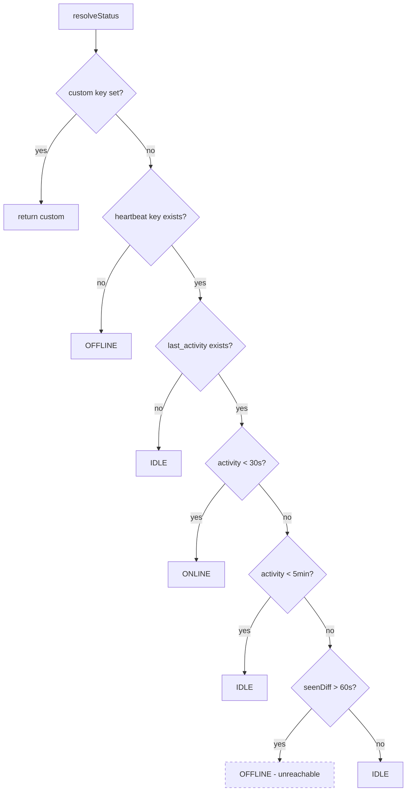
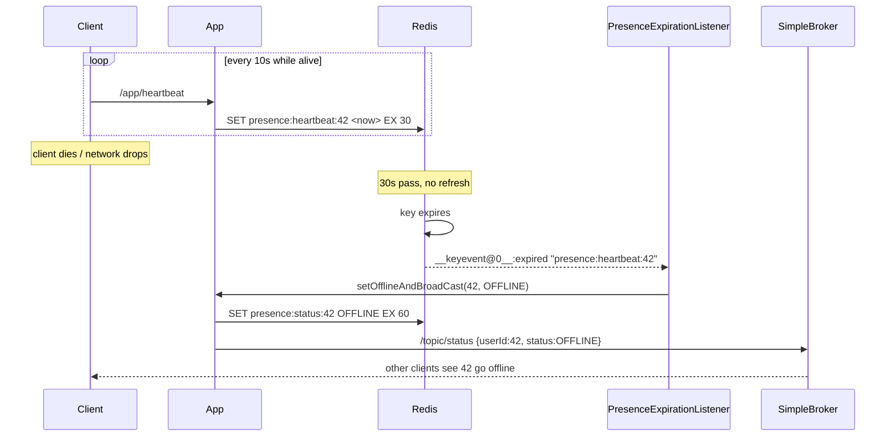

# Redis

Redis backs **presence** — the ONLINE / IDLE / OFFLINE / DO_NOT_DISTURB state shown next to each
user. It is not used as a cache for domain data, despite `spring.cache.type=redis` being set.

## 1. Why Redis for presence

Presence has a shape that fits Redis and fits PostgreSQL badly:

| Property | Consequence |
|---|---|
| Written constantly | Every client writes every 10 s. With 1 000 users that is ~100 writes/s of pure churn. |
| Worthless after seconds | A heartbeat from 60 s ago tells you nothing. |
| Must expire on its own | "Offline" is the *absence* of recent signal — not an event anyone sends. |
| Read in batches | Rendering a friends list needs N statuses at once. |

Putting this in PostgreSQL means high-frequency `UPDATE`s on a hot row per user, generating dead
tuples and vacuum pressure for data that is discarded seconds later. It also has no expiry: detecting
"stopped heartbeating" requires a polling job scanning for stale timestamps.

Redis answers all four directly — O(1) in-memory writes, native per-key `TTL`, `MGET` for batch
reads, and keyspace notifications that turn expiry into a push event. The last point is the decisive
one: **TTL expiry is what defines going offline**, so no polling job is needed. Whether that
mechanism actually works as committed is covered in §5.

## 2. Configuration

```java
// config/RedisConfig.java
@Bean
public StringRedisTemplate stringRedisTemplate(RedisConnectionFactory factory) {
    return new StringRedisTemplate(factory);
}
```

`StringRedisTemplate` is chosen over `RedisTemplate<String, Object>` deliberately: every value stored
is a millisecond epoch or a `UserStatus` enum name. Plain `String` serialisation keeps values
human-readable under `redis-cli`, avoids Java-serialisation or Jackson type metadata in the payload,
and sidesteps the deserialisation-compatibility problems that come with storing serialised objects.

Connection settings (`application.properties:65-68`):

```properties
spring.data.redis.host=localhost
spring.data.redis.port=6379
spring.data.redis.timeout=60000
spring.data.redis.password=redis123
```

> **The `spring-boot-starter-data-redis` dependency is missing from `build.gradle`.** The code
> imports `org.springframework.data.redis.*` throughout, but no Redis starter is declared and none
> arrives transitively through the declared dependencies. See
> [IMPLEMENTATION.md](IMPLEMENTATION.md#81-the-backend-does-not-compile-on-main).

`spring.cache.type=redis` and `spring.cache.redis.time-to-live=600000` are also set, but there is no
`@EnableCaching` and no `@Cacheable` anywhere in the codebase — Spring's cache abstraction is inert.
All Redis access is explicit through `StringRedisTemplate`.

## 3. Key schema

```java
// constants/PresenceKeys.java
"presence:last_seen:"     + userId
"presence:last_activity:" + userId
"presence:custom:"        + userId
"presence:status:"        + userId
"presence:heartbeat:"     + userId
```

| Key | Value | TTL | Written by | Read by |
|---|---|---|---|---|
| `presence:heartbeat:{id}` | epoch ms | **30 s** | `handleHeartbeat`, `handleActivity` | `resolveStatus` |
| `presence:last_activity:{id}` | epoch ms | 10 min | `handleActivity` | `resolveStatus`, `handleActivity` |
| `presence:status:{id}` | `UserStatus` name | 60 s | `updateAndBroadcast`, `setOfflineAndBroadCast` | `getUserStatus`, `getFriendsStatus`, `updateAndBroadcast` |
| `presence:custom:{id}` | `UserStatus` name | 24 h | `updateCustomStatus` | `resolveStatus` |
| `presence:last_seen:{id}` | epoch ms | **none** | `handleHeartbeat`, `handleActivity` | **never read** |

Centralising key construction in one class is good practice — it keeps the `presence:` namespace
consistent and makes the schema greppable.

Two observations on the table above:

- **`presence:last_seen:{id}` is write-only and never expires.** It is written on every heartbeat and
  activity event, deleted only by `resetPresence`, and read by nothing. Confusingly, the local
  variable that *looks* like it reads it actually reads the heartbeat key:
  ```java
  // service/impl/UserStatusServiceImpl.java:109
  String lastSeen = redisTemplate.opsForValue().get(PresenceKeys.heartbeat(userId));
  ```
  So these keys accumulate one per user and persist indefinitely.
- **`presence:heartbeat:` is the key whose expiry drives OFFLINE.** Its 30 s TTL against a 10 s client
  heartbeat interval tolerates two consecutive missed beats before a user is considered gone.

## 4. Status resolution

```java
// service/impl/UserStatusServiceImpl.java:100-128
private UserStatus resolveStatus(Long userId) {
    String custom = get(custom(userId));
    if (custom != null) return UserStatus.valueOf(custom);      // 1. manual override wins

    long now = System.currentTimeMillis();
    String lastSeen = get(heartbeat(userId));
    if (lastSeen == null) return OFFLINE;                       // 2. no heartbeat → offline

    String lastActivity = get(lastActivity(userId));
    if (lastActivity == null) return IDLE;                      // 3. connected, never interacted

    long activityDiff = now - parseLong(lastActivity);
    if (activityDiff < 30_000)  return ONLINE;                  // 4. active in last 30 s
    if (activityDiff < 300_000) return IDLE;                    // 5. active in last 5 min

    long seenDiff = now - parseLong(lastSeen);
    if (seenDiff > 60_000) return OFFLINE;                      // 6. UNREACHABLE — see below
    return IDLE;
}
```



The layering is the interesting part: **liveness and engagement are separate signals.**
`presence:heartbeat:` answers "is the socket alive?", `presence:last_activity:` answers "is the human
at the keyboard?". Discord's real model works the same way — you stay ONLINE while typing, drift to
IDLE when you walk away with the app open, and go OFFLINE only when the client stops reporting.
Collapsing these into one timestamp would make IDLE inexpressible.

### Branch 6 is dead code

`lastSeen` reads `presence:heartbeat:`, which has a 30 s TTL and is always written with the current
timestamp. If the key exists at all, its value is at most 30 s old — so `seenDiff` can never exceed
60 000 ms, and the `OFFLINE` return is unreachable. A user whose last activity was hours ago but whose
client still heartbeats resolves to `IDLE` via the final line, which is the intended behaviour
anyway. The check is harmless but misleading: it reads as the offline path when the real offline path
is branch 2, driven entirely by TTL expiry.

### Write suppression

Two layers throttle writes:

```java
// handleActivity — service/impl/UserStatusServiceImpl.java:70-73
if (existing != null) {
    long diff = now - Long.parseLong(existing);
    if (diff < 5000) return;        // ignore activity bursts inside 5 s
}
```

```java
// updateAndBroadcast — :134-139
String cached = get(status(userId));
if (cached != null && cached.equals(newStatus.name())) {
    return;                          // no status change → no Redis write, no broadcast
}
```

The second is the important one: it makes the broadcast **edge-triggered**. Without it, every
heartbeat from every user would fan out a `/topic/status` frame to every connected client — with
N users that is N²/10 frames per second. Suppressing unchanged statuses reduces steady-state
broadcast traffic to zero.

One wrinkle: `presence:status:` has a 60 s TTL while heartbeats arrive every 10 s, so the key is
refreshed well within its lifetime during normal operation. If it does lapse (client offline, then
returning), `cached` is `null`, the suppression is skipped, and a redundant broadcast is emitted.
Harmless, but it means "no change" is not a strict guarantee.

### Batch reads

```java
// getFriendsStatus — :173-177
List<String> keys = friendIds.stream().map(PresenceKeys::status).toList();
List<String> values = redisTemplate.opsForValue().multiGet(keys);
```

`MGET` fetches all friend statuses in one round trip rather than N. For any key that has expired, the
code falls back to `resolveStatus(fid)` per miss — so a friends list where every status key has
lapsed degrades to several sequential Redis calls per friend. Fine at small scale; a pipeline or Lua
script would be the fix if it mattered.

## 5. Expiry → OFFLINE

This is the mechanism that makes presence self-healing, and the part that is currently broken.

```java
// config/RedisKeyExpirationListenerConfig.java
container.addMessageListener(listenerAdapter, new PatternTopic("__keyevent@*__:expired"));

@Bean
public MessageListenerAdapter messageListenerAdapter() {
    return new MessageListenerAdapter(presenceExpirationListener, "handleMessage");
}
```

```java
// service/PresenceExpirationListener.java
public void handleMessage(String key) {
    if (!key.startsWith("presence:heartbeat:")) return;
    Long userId = extractUserId(key);
    if (userId == null) return;
    userStatusService.setOfflineAndBroadCast(userId, UserStatus.OFFLINE);
    userStatusService.broadcastStatusChange(userId, UserStatus.OFFLINE);
}
```



The `@*` wildcard in the pattern matches any Redis database index, so the subscription works
regardless of which logical DB is selected.

### Keyspace notifications are not enabled

```yaml
# docker-compose.yml:45
command: redis-server --requirepass redis123
```

Redis ships with `notify-keyspace-events` set to the **empty string** — notifications are off by
default because they cost CPU. No configuration anywhere in the repository enables them:

```
$ grep -rn "notify-keyspace-events" .        # no matches
```

**Consequence: the expiry event is never published, `handleMessage` never runs, and no user ever
transitions to OFFLINE via heartbeat expiry.** The heartbeat key expires silently. The visible
symptom is that a user who closes their browser stays at their last broadcast status indefinitely on
everyone else's friends list — because `WebSocketEventListener` deliberately does not force OFFLINE
on disconnect, trusting this mechanism instead.

Note that `resolveStatus` still returns OFFLINE correctly on a *pull* (branch 2 — the heartbeat key
is genuinely gone). So `GET /api/users/{id}/status` reports the truth; only the *push* is missing.
That makes the bug easy to miss in manual testing and easy to misdiagnose as a frontend problem.

The fix is one flag:

```yaml
command: redis-server --requirepass redis123 --notify-keyspace-events Ex
```

`E` enables keyevent notifications, `x` enables the expired-event class. Equivalently, at runtime:
`CONFIG SET notify-keyspace-events Ex`.

### Two caveats once it is enabled

1. **Expiry events are not punctual.** Redis deletes an expired key either when it is next accessed
   or when the background active-expiry cycle samples it. The event fires at *deletion*, not at
   logical expiry, so the OFFLINE transition can lag the 30 s TTL by a further second or more under
   load. Presence is eventually consistent, not real-time.
2. **Every instance receives every event.** Keyspace notifications are pub/sub broadcast. With more
   than one application instance, each one runs `handleMessage` and each one broadcasts — so the
   OFFLINE frame is emitted once per instance. This needs a guard (a short-lived `SETNX` lock on the
   user ID, for example) before the app can be scaled horizontally.

### Duplicate broadcast

`handleMessage` broadcasts twice for a single expiry:

```java
userStatusService.setOfflineAndBroadCast(userId, UserStatus.OFFLINE);  // broadcasts internally
userStatusService.broadcastStatusChange(userId, UserStatus.OFFLINE);   // broadcasts again
```

`setOfflineAndBroadCast` (`UserStatusServiceImpl.java:285-294`) already calls
`broadcastStatusChange` as its last statement. The second call is redundant — every client receives
the same OFFLINE frame twice. Harmless (the frontend applies last-write-wins) but it doubles presence
traffic on the one event that matters most.

Also note that `setOfflineAndBroadCast` takes a `status` parameter but hardcodes `OFFLINE` in the
Redis write while broadcasting the parameter — the two can disagree if it is ever called with
anything else. Today the only caller passes `OFFLINE`.

## 6. Custom status

`updateCustomStatus` writes to **both** Redis (24 h TTL) and PostgreSQL (`UserStatusEntity`), and
special-cases `ONLINE`:

```java
// :207-209
if (customStatus == UserStatus.ONLINE) {
    return clearCustomStatus(userId);
}
```

Setting yourself "Online" is modelled as *removing* the override rather than pinning a value — after
which status is derived from activity again. This is correct: ONLINE is a computed state, so pinning
it would mean "always appear online", which is a different feature.

The dual write exists so a custom status survives a Redis restart. But **nothing rehydrates Redis
from PostgreSQL.** `resolveStatus` reads only `presence:custom:`; no startup task or cache-miss path
consults `UserStatusEntity.customStatus`. If Redis is flushed or restarted, the override vanishes
from behaviour while remaining in the database — and the two expiry clocks (Redis `TTL` of 24 h,
`UserStatusEntity.statusExpiresAt` of `now + 1 day`) drift independently with nothing reconciling
them. The database row is effectively write-only for this purpose, mirroring the
`presence:last_seen:` situation.

## 7. Client cadence

| Signal | Source | Cadence |
|---|---|---|
| `/app/heartbeat` | `PresenceProvider` `setInterval` | every **10 s** while connected |
| `/app/activity` | `IdleProvider` DOM listeners | debounced **1 s, leading edge** |

```ts
// frontend/src/providers/IdleProvider.tsx
const handler = debounce(handleActivity, 1000, { leading: true });
["mousemove", "keydown", "click", "touchstart"].forEach(e =>
  window.addEventListener(e, handler));
```

`{ leading: true }` (commit `7270c74`) fires on the **first** event of a burst and suppresses the
rest of the window, rather than waiting 1 s to fire on the trailing edge. For presence this is the
right choice: the user's first mousemove after being idle should promote them to ONLINE immediately,
not a second later. Trailing-edge debounce would add a full second of latency to every
idle→online transition.

`handleActivity` further gates on current status:

```ts
if (status !== UserStatus.ONLINE) { sendActivity(); }
```

So a continuously active user sends **no** activity frames at all — only the 10 s heartbeat, which
also refreshes `last_activity`... except it does not. `handleHeartbeat`
(`UserStatusServiceImpl.java:40-56`) writes `heartbeat` and `last_seen` but **not** `last_activity`.
Combined with the client-side gate, a user who stays ONLINE and keeps moving the mouse stops sending
activity events, `last_activity` ages past 30 s, `resolveStatus` returns IDLE, and only then does the
client resume sending activity — producing a slow ONLINE↔IDLE oscillation for continuously active
users. Either the client gate or the heartbeat's key set needs adjusting for the two to agree.

`IdleProvider` also arms a 30 s `idleTimer` whose callback, `markIdle`, only calls `console.log` —
it performs no state change and notifies nothing. The client-side idle timer is effectively dead
code; IDLE is determined server-side by `resolveStatus`.

## 8. Evolution: from `feature/kafka` to `main`

The presence rewrite is the substance of the `feature/redis` branch. On `feature/kafka`, presence was
connection-scoped and database-backed:

```java
// origin/feature/kafka — WebSocketEventListener
@EventListener
public void handleSessionConnected(SessionConnectedEvent event) {
    userStatusService.updateUserStatus(userId, UserStatus.ONLINE);   // DB write
    publisher.sendToTopic(WsDestinations.PRESENCE,
        WsEvent.builder().type(WsEventType.USER_ONLINE).payload(username).build());
}

@EventListener
public void handleSessionDisconnect(SessionDisconnectEvent event) {
    userStatusService.updateUserStatus(userId, UserStatus.OFFLINE);  // DB write
    // ... USER_OFFLINE event
}
```

| | `feature/kafka` | `main` / `feature/redis` |
|---|---|---|
| Store | PostgreSQL `UserStatusEntity` | Redis TTL keys |
| Trigger | STOMP connect/disconnect | Heartbeat + activity + TTL expiry |
| States | ONLINE / OFFLINE | ONLINE / IDLE / OFFLINE / DND |
| Offline detection | Disconnect event | Key expiry notification |
| Destination | `/topic/presence` (`WsEvent`) | `/topic/status` (raw map) |
| Write volume | 2 DB writes per session | Redis writes, suppressed when unchanged |

**What the rewrite fixed.** Connection-scoped presence flaps: every refresh, tunnel switch, or laptop
sleep fires disconnect→connect and broadcasts OFFLINE→ONLINE. It is also unrecoverable after a crash
— if the process dies, every user is left marked ONLINE in the database with no disconnect event
coming. And it cannot express IDLE at all, since a socket is either open or closed.

TTL-based presence fixes all three: a brief disconnect is absorbed if the client returns within 30 s;
a crashed process leaves keys that expire on their own; and separating liveness from engagement makes
IDLE representable.

**What it cost.** Correctness now depends on Redis configuration (`notify-keyspace-events`) that
lives outside the codebase and is currently unset — trading an obvious failure mode for a silent one.
It also left three vestigial artifacts behind: `WsDestinations.PRESENCE`, `WsEventType.USER_ONLINE`,
and `WsEventType.USER_OFFLINE` are all now unused.

## 9. Summary of findings

| # | Finding | Location | Severity |
|---|---|---|---|
| 1 | `spring-boot-starter-data-redis` missing — code does not compile | `build.gradle` | **Critical** |
| 2 | `notify-keyspace-events` not enabled — OFFLINE never pushed | `docker-compose.yml:45` | **Critical** |
| 3 | Client activity gate vs. heartbeat key set causes ONLINE↔IDLE oscillation | `IdleProvider.tsx` + `UserStatusServiceImpl.java:40-56` | Medium |
| 4 | Custom status never rehydrated from DB; two expiry clocks drift | `UserStatusServiceImpl.java:199-231` | Medium |
| 5 | Duplicate OFFLINE broadcast on expiry | `PresenceExpirationListener.java` | Low |
| 6 | Expiry event fans out per instance — blocks horizontal scaling | `RedisKeyExpirationListenerConfig.java` | Low (today) |
| 7 | `presence:last_seen:` written, never read, never expires | `PresenceKeys.java` | Low |
| 8 | Unreachable OFFLINE branch in `resolveStatus` | `UserStatusServiceImpl.java:124-125` | Low |
| 9 | `markIdle` is a no-op; client idle timer is dead code | `IdleProvider.tsx` | Low |
| 10 | `spring.cache.type=redis` set but no `@EnableCaching`/`@Cacheable` | `application.properties:73` | Cosmetic |
