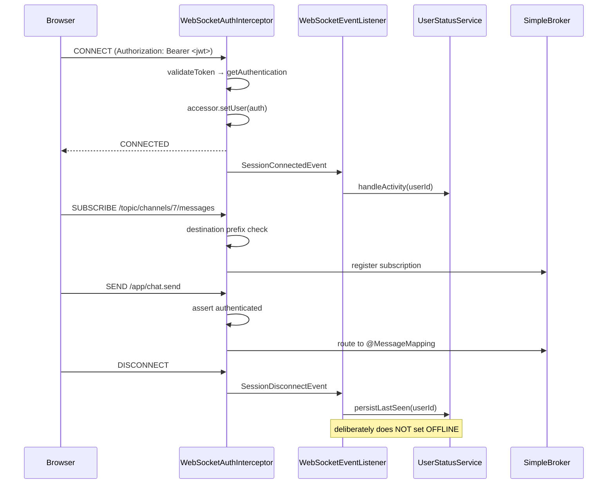

# WebSockets

How real-time transport works in DiscordClone: the broker, the handshake, authentication, the
destination map, and the browser client.

## 1. Choice of stack

The application uses **STOMP over native WebSocket**, served by Spring's
`@EnableWebSocketMessageBroker` with an **in-memory simple broker**.

```java
// config/WebSocketConfig.java:26-36
config.enableSimpleBroker("/topic", "/queue");
config.setApplicationDestinationPrefixes("/app");
config.setUserDestinationPrefix("/user");

registry.addEndpoint("/ws").setAllowedOriginPatterns("*");
```

### Why STOMP rather than raw WebSocket

Raw WebSocket gives a single untyped byte/text pipe per connection. Everything above that — routing,
subscription management, request/response correlation — has to be hand-built. STOMP supplies a frame
format (`CONNECT`, `SUBSCRIBE`, `SEND`, `MESSAGE`, `ERROR`) and a destination hierarchy, which buys
three things this codebase actively uses:

1. **Server-side routing by destination.** `@MessageMapping("/chat.send")` works like
   `@RequestMapping` — Spring dispatches frames to controller methods with argument resolution and
   payload deserialisation, so chat handlers look like REST handlers.
2. **Multiplexing.** One TCP connection carries channel messages, DM messages, friend events,
   presence updates, and error frames as independent subscriptions.
3. **User destinations.** `/user/**` resolves per-principal, so the server can address one user
   without tracking session IDs itself (see §4.2).

### Why the simple broker

`enableSimpleBroker` runs the broker inside the application JVM. It requires no external
infrastructure, which suits local development — but it is the binding constraint on deployment.
Subscription registries are per-process heap state, so **the application cannot be scaled past a
single instance**. A second replica would maintain a separate subscriber set, and a broadcast on
instance A would never reach a client attached to instance B.

Moving to multiple instances means replacing this line with either:

- `config.enableStompBrokerRelay("/topic", "/queue")` pointed at RabbitMQ or ActiveMQ, which makes
  the external broker authoritative for all subscriptions; or
- a Redis pub/sub bridge where each instance republishes inbound events to a Redis channel and
  relays received events into its own local `SimpMessagingTemplate`.

Note that adding Kafka does **not** solve this. Kafka distributes events between *instances*; it
does not deliver frames to *browsers*. The broker is a separate concern.

### SockJS is not used

`frontend/package.json` lists `sockjs-client` and `sockjs` as dependencies, and the backend imports
`StompEndpointRegistry`. However, `registerStompEndpoints` does **not** call `.withSockJS()`, and the
client connects with `brokerURL` (a native WebSocket URL) rather than a SockJS `webSocketFactory`:

```ts
// frontend/src/providers/WebSocketProvider.tsx:57-64
const socketUrl = `${WS_BASE_URL}/ws`;
const stompClient = new Client({
  brokerURL: socketUrl,
  connectHeaders: { Authorization: `Bearer ${accessToken}` },
  ...
});
```

So the transport is raw WebSocket end to end, with no XHR-streaming or long-polling fallback. The
SockJS packages are unused weight. `WS_BASE_URL` is derived in `frontend/src/config/api.ts` by
rewriting the API base URL's scheme — `http→ws`, and correspondingly `https→wss`.

## 2. Connection lifecycle



## 3. Authentication

Authentication happens on the **inbound channel interceptor**, registered via
`configureClientInboundChannel` (`WebSocketConfig.java:39-41`). The interceptor sees every inbound
frame and switches on the STOMP command.

### 3.1 CONNECT — the only place the JWT is checked

```java
// security/WebSocketAuthInterceptor.java:64-99
if (StompCommand.CONNECT.equals(accessor.getCommand())) {
    List<String> authHeaders = accessor.getNativeHeader("Authorization");
    if (authHeaders == null || authHeaders.isEmpty()) return null;   // reject

    String token = authHeaders.get(0);
    if (!StringUtils.hasText(token) || !token.startsWith("Bearer ")) return null;
    token = token.substring(7);

    if (!jwtService.validateToken(token)) return null;

    Authentication auth = jwtService.getAuthentication(token);
    accessor.setUser(auth);   // binds principal for the whole session
}
```

Returning `null` from `preSend` drops the frame, which aborts the connection attempt.

The critical line is `accessor.setUser(auth)`. It binds the `Principal` to the **STOMP session**, not
to a thread-local, and Spring retains it for the session's lifetime. Every later frame on that
connection arrives with `accessor.getUser()` populated, which is what makes `/user/**` destinations
and `SimpMessageHeaderAccessor`-based user extraction work.

Because the token is validated only at `CONNECT`, **a session outlives its token**. A connection
established with a token that expires ten minutes later stays fully authenticated until the client
disconnects — the 24-hour access-token TTL is not enforced on long-lived sockets. Closing this gap
requires either periodic revalidation on the interceptor or a server-initiated disconnect scheduled
at token expiry.

The JWT is carried in a STOMP `CONNECT` **frame header**, not in the HTTP upgrade request. This is
deliberate and necessary: browsers give no API for setting custom headers on a WebSocket handshake,
so the token cannot travel as an HTTP `Authorization` header. Passing it as a query parameter would
leak it into access logs. A STOMP header is the correct channel. It also explains why `/ws/**` is
`permitAll()` in `SecurityConfig` — the HTTP upgrade genuinely is unauthenticated; authentication
happens one layer up, inside the STOMP protocol.

### 3.2 SUBSCRIBE and SEND

`SUBSCRIBE` validates only the destination *prefix*:

```java
// security/WebSocketAuthInterceptor.java:173-178
private boolean isValidDestination(String destination) {
    return destination.startsWith("/topic/")
        || destination.startsWith("/app/")
        || destination.startsWith("/user/queue/");
}
```

**There is no per-resource authorization.** Any authenticated user may subscribe to
`/topic/channels/{anyId}/messages` for any channel, whether or not they are a member of the
containing server. The membership check that would prevent this is present but commented out
(`WebSocketAuthInterceptor.java:119-128`), along with the `channelService.checkUserIsMember` call it
depended on. This is the most significant security gap in the real-time layer: channel messages are
readable by any authenticated account that can guess a numeric channel ID.

`SEND` asserts an authenticated principal (`:131-144`). Two latent `NullPointerException`s sit in
these branches:

- At `:111`, `SUBSCRIBE` casts `authentication.getPrincipal()` after the guarding
  `if (authentication != null ...)` was commented out — a subscribe frame without a principal throws.
- At `:139`, `SEND` logs `auth.getName()` **before** the `auth == null` check on the following line.

Neither is reachable through the normal client flow, because `CONNECT` rejects unauthenticated
sessions before any `SUBSCRIBE` or `SEND` can arrive. They become reachable if the `CONNECT` guard is
ever relaxed.

## 4. Destination map

### 4.1 Inbound (client → server), prefix `/app`

| Destination | Handler | Payload |
|---|---|---|
| `/app/chat.send` | `MessageController.sendMessage` | `MessageRequest` |
| `/app/heartbeat` | `StatusWebSocketController.heartbeat` | `{}` |
| `/app/activity` | `StatusWebSocketController.activity` | `{}` |

### 4.2 Outbound (server → client)

| Destination | Emitted by | Contents |
|---|---|---|
| `/topic/channels/{channelId}/messages` | `Local`/`KafkaMessageEventPublisher` | `MessageResponse` |
| `/topic/channels/{channelId}/messages/delete` | `MessageService.deleteMessage` | message ID |
| `/user/queue/messages` | both publishers (DM path) | `MessageResponse` |
| `/user/queue/friends` | `FriendshipServiceImpl` via `WebSocketPublisher` | `WsEvent` |
| `/user/queue/errors` | `KafkaMessageEventPublisher` on send failure | `"Message failed"` |
| `/topic/status` | `UserStatusServiceImpl.broadcastStatusChange` | `{userId, status}` |

**How `/user/**` resolves.** `convertAndSendToUser(username, "/queue/messages", payload)` does not
send to a destination literally named `/user/queue/messages`. Spring's `UserDestinationResolver`
rewrites it to a session-scoped destination (`/queue/messages-user{sessionId}`) for each of that
user's active sessions. The client subscribes to the *logical* name `/user/queue/messages` and Spring
performs the same rewrite on the subscribe side. The lookup key is `Principal.getName()` — which here
is the **username**, since `UserPrincipal.getUsername()` returns the username field. This is why
`MessageRequest.receiver` carries a username string rather than a user ID.

### 4.3 Destination-constant drift

`websocket/destination/WsDestinations.java` defines:

```java
FRIENDS  = "/queue/friends";
MESSAGES = "/queue/messages";
PRESENCE = "/topic/presence";
CHANNELS = "/topic/channels";
```

`FRIENDS` is used by `FriendshipServiceImpl` (four call sites) and `CHANNELS` by
`ChannelService.java:56`, both via `WebSocketPublisher`. `MESSAGES` is unused — the two message
publishers hardcode their destination strings instead — and, importantly, **`PRESENCE` is dead on
`main`**. Presence is
broadcast to the hardcoded `"/topic/status"` in `UserStatusServiceImpl.java:305`, while
`/topic/presence` is a leftover from `feature/kafka`, where `WebSocketEventListener` published
`WsEvent{USER_ONLINE|USER_OFFLINE}` to it. The frontend subscribes to `/topic/status`, so the two
agree — but the constant is misleading and `WsEventType.USER_ONLINE`/`USER_OFFLINE` are now unused.

### 4.4 Two payload shapes

Friend events use a typed envelope:

```java
WsEvent { WsEventType type; Object payload; }
```

Presence events do not — `broadcastStatusChange` builds a bare `HashMap`:

```java
// service/impl/UserStatusServiceImpl.java:301-305
var payload = new java.util.HashMap<String, Object>();
payload.put("userId", userId);
payload.put("status", status);
messagingTemplate.convertAndSend("/topic/status", payload);
```

Message events use a third shape (`MessageResponse` sent bare). So three destinations carry three
unrelated envelope conventions, and clients must know which applies per destination.

## 5. Server-side lifecycle hooks

`websocket/listener/WebSocketEventListener.java` subscribes to Spring's session events:

| Event | Action |
|---|---|
| `SessionConnectedEvent` | `userStatusService.handleActivity(userId)` — fast path to ONLINE |
| `SessionDisconnectEvent` | `userStatusService.persistLastSeen(userId)` only |

The disconnect handler carries an explicit comment — *"DO NOT force OFFLINE / Let Redis TTL handle
it"*. This is the key design decision of the presence rewrite. Connection-scoped presence marks a
user offline on every transient network blip, tab refresh, or laptop-lid close, producing visible
status flapping. Deferring to a TTL means a brief disconnect is absorbed silently: if the client
reconnects and resumes heartbeats within 30 seconds, the key never expires and no status change is
broadcast. Rationale and mechanics in [REDIS.md](REDIS.md).

## 6. Browser client

### 6.1 Connection management

`frontend/src/providers/WebSocketProvider.tsx` owns a single `Client` in React state, created in a
`useEffect` keyed on `[isLoggedIn, accessToken]`.

An `isConnecting` ref guards against duplicate connections under React 18 StrictMode, which
double-invokes effects in development:

```ts
// WebSocketProvider.tsx:48-53
if (isConnecting.current) return;
if (!accessToken) return;
isConnecting.current = true;
```

Note that the guard is reset in `onDisconnect` and in the effect's cleanup, but **not** in
`onWebSocketError`. A connection that fails without a clean disconnect can leave `isConnecting.current`
stuck at `true`, blocking subsequent attempts until the effect's dependencies change.

`@stomp/stompjs` reconnects automatically by default (5 s `reconnectDelay`). No heartbeat
configuration is supplied on either side, so the library's defaults apply — this is STOMP-level
heartbeating, independent of the application's own `/app/heartbeat` presence signal. The two are
easily confused: the STOMP heartbeat keeps the *socket* alive, the application heartbeat drives
*presence*.

### 6.2 Subscription bookkeeping

`subscribeToTopic` de-duplicates by destination against a `subscriptions` record, and
`useWebSocketTopic(topic)` wraps subscribe/unsubscribe in an effect. Received frames are accumulated
into `messageStore[topic]`, an **append-only array** — nothing prunes it, so a long-lived session
grows this array without bound for every subscribed topic. Consumers read only the last element:

```ts
// PresenceProvider.tsx
const last = messages[messages.length - 1];
```

Two providers (`PresenceProvider`, `FriendStatusProvider`) both call `useWebSocketTopic("/topic/status")`
and both read `messages[messages.length - 1]`, filtering by user ID. The de-duplication in
`subscribeToTopic` means one underlying STOMP subscription serves both.

There is also a dependency-array inconsistency worth flagging: `subscribeToTopic` is memoised with
`[client, connected, subscriptions]`, so it changes identity on every subscription added, while
`useWebSocketTopic`'s effect deliberately omits it from its deps (`[topic, connected]`) to avoid a
resubscribe loop. This works, but only because the omission is intentional — it is a stale-closure
hazard if either side is edited.

### 6.3 Provider composition

`StatusProvider` composes the three presence providers, and `App.tsx` mounts it inside
`WebSocketProvider`:

```
AuthProvider → Redux Provider → WebSocketProvider → StatusProvider → QueryClientProvider → Router
                                                     └─ PresenceProvider
                                                        └─ IdleProvider
                                                           └─ FriendStatusProvider
```

The ordering matters: `PresenceProvider` calls `useWebSocketSender`, so it must sit inside
`WebSocketProvider`; `IdleProvider` calls `usePresence`, so it must sit inside `PresenceProvider`.

### 6.4 Message reception

`frontend/src/websocket/message.socket.ts` registers the DM subscription once per connection inside
`onConnect`, dispatching into the Redux store:

```ts
socket.subscribe("/user/queue/messages", (msg) => {
  const message: Message = JSON.parse(msg.body);
  store.dispatch(addMessage({ channelId: message.channelId, message }));
});
```

`registerGroupMessageSocket(socket, channelId)` does the same for
`/topic/channels/{channelId}/messages`. Note that the group variant returns no handle and is not
tracked by the provider's `subscriptions` map, so subscriptions created through it are never
unsubscribed — switching channels repeatedly accumulates live subscriptions on the connection.

## 7. Summary of findings

| # | Finding | Location | Severity |
|---|---|---|---|
| 1 | No per-channel subscription authorization; any user can subscribe to any channel | `WebSocketAuthInterceptor.java:119-128` (commented out) | **High** |
| 2 | Simple broker prevents multi-instance deployment | `WebSocketConfig.java:27` | **High** |
| 3 | JWT validated only at CONNECT; sessions outlive token expiry | `WebSocketAuthInterceptor.java:64` | Medium |
| 4 | `isConnecting` guard not reset on `onWebSocketError` | `WebSocketProvider.tsx` | Medium |
| 5 | `registerGroupMessageSocket` subscriptions never unsubscribed | `message.socket.ts` | Medium |
| 6 | `messageStore` grows unbounded | `WebSocketProvider.tsx` | Low |
| 7 | NPE if SUBSCRIBE/SEND arrives without principal | `WebSocketAuthInterceptor.java:111,139` | Low (unreachable today) |
| 8 | `WsDestinations.PRESENCE` dead; three envelope conventions | `WsDestinations.java` | Low |
| 9 | Unused SockJS dependencies | `frontend/package.json` | Cosmetic |
