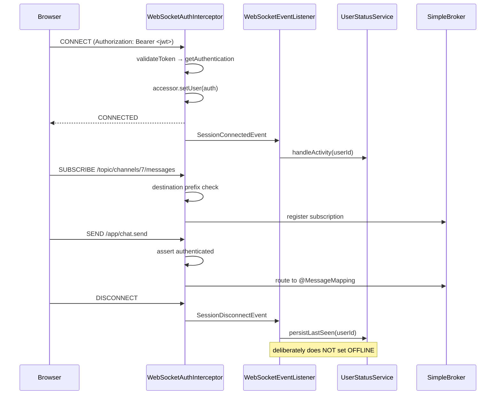

# WebSockets

How real-time transport works in DiscordClone: the broker, the handshake, authentication, the
destination map, and the browser client.

## 1. Choice of stack

The application uses **STOMP over native WebSocket**, served by Spring's
`@EnableWebSocketMessageBroker` with an **in-memory simple broker**.

```java
// config/WebSocketConfig.java:26-36
config.enableSimpleBroker("/topic", "/queue");
config.setApplicationDestinationPrefixes("/app");
config.setUserDestinationPrefix("/user");

registry.addEndpoint("/ws").setAllowedOriginPatterns("*");
```

### Why STOMP rather than raw WebSocket

Raw WebSocket gives a single untyped byte/text pipe per connection. Everything above that — routing,
subscription management, request/response correlation — has to be hand-built. STOMP supplies a frame
format (`CONNECT`, `SUBSCRIBE`, `SEND`, `MESSAGE`, `ERROR`) and a destination hierarchy, which buys
three things this codebase actively uses:

1. **Server-side routing by destination.** `@MessageMapping("/chat.send")` works like
   `@RequestMapping` — Spring dispatches frames to controller methods with argument resolution and
   payload deserialisation, so chat handlers look like REST handlers.
2. **Multiplexing.** One TCP connection carries channel messages, DM messages, friend events,
   presence updates, and error frames as independent subscriptions.
3. **User destinations.** `/user/**` resolves per-principal, so the server can address one user
   without tracking session IDs itself (see §4.2).

### Why the simple broker

`enableSimpleBroker` runs the broker inside the application JVM. It requires no external
infrastructure, which suits local development — but it is the binding constraint on deployment.
Subscription registries are per-process heap state, so **the application cannot be scaled past a
single instance**. A second replica would maintain a separate subscriber set, and a broadcast on
instance A would never reach a client attached to instance B.

Moving to multiple instances means replacing this line with either:

- `config.enableStompBrokerRelay("/topic", "/queue")` pointed at RabbitMQ or ActiveMQ, which makes
  the external broker authoritative for all subscriptions; or
- a Redis pub/sub bridge where each instance republishes inbound events to a Redis channel and
  relays received events into its own local `SimpMessagingTemplate`.

Note that adding Kafka does **not** solve this. Kafka distributes events between *instances*; it
does not deliver frames to *browsers*. The broker is a separate concern.

### SockJS is not used

`frontend/package.json` lists `sockjs-client` and `sockjs` as dependencies, and the backend imports
`StompEndpointRegistry`. However, `registerStompEndpoints` does **not** call `.withSockJS()`, and the
client connects with `brokerURL` (a native WebSocket URL) rather than a SockJS `webSocketFactory`:

```ts
// frontend/src/providers/WebSocketProvider.tsx:57-64
const socketUrl = `${WS_BASE_URL}/ws`;
const stompClient = new Client({
  brokerURL: socketUrl,
  connectHeaders: { Authorization: `Bearer ${accessToken}` },
  ...
});
```

So the transport is raw WebSocket end to end, with no XHR-streaming or long-polling fallback. The
SockJS packages are unused weight. `WS_BASE_URL` is derived in `frontend/src/config/api.ts` by
rewriting the API base URL's scheme — `http→ws`, and correspondingly `https→wss`.

## 2. Connection lifecycle



## 3. Authentication

Authentication happens on the **inbound channel interceptor**, registered via
`configureClientInboundChannel` (`WebSocketConfig.java:39-41`). The interceptor sees every inbound
frame and switches on the STOMP command.

### 3.1 CONNECT — the only place the JWT is checked

```java
// security/WebSocketAuthInterceptor.java:64-99
if (StompCommand.CONNECT.equals(accessor.getCommand())) {
    List<String> authHeaders = accessor.getNativeHeader("Authorization");
    if (authHeaders == null || authHeaders.isEmpty()) return null;   // reject

    String token = authHeaders.get(0);
    if (!StringUtils.hasText(token) || !token.startsWith("Bearer ")) return null;
    token = token.substring(7);

    if (!jwtService.validateToken(token)) return null;

    Authentication auth = jwtService.getAuthentication(token);
    accessor.setUser(auth);   // binds principal for the whole session
}
```

There are two ways a `CONNECT` gets rejected, and the client sees them differently:

- **Missing or malformed `Authorization` header.** `preSend` returns `null`, so the channel drops the
  frame. Spring never sends `CONNECTED`, and no error is reported. The client sits on an open socket
  that never completes the handshake.
- **Invalid, expired, or forged token.** The `if (!jwtService.validateToken(token)) return null;`
  guard **never takes the false branch**, because `JwtService.validateToken` throws
  `JwtAuthenticationException` on every failure and can only return `true`. The exception
  propagates out of `preSend`, and Spring's `StompSubProtocolHandler` catches it and replies with a
  STOMP `ERROR` frame. The rejection works, but through an exception path rather than the explicit
  guard the code appears to rely on.

`WebSocketExceptionHandler` (`@MessageExceptionHandler(JwtAuthenticationException.class)` →
`@SendToUser("/queue/errors")`) cannot handle this case. `@MessageExceptionHandler` covers only
exceptions thrown from `@MessageMapping` methods, not from channel interceptors, and an
unauthenticated session has no user to address anyway.

The critical line is `accessor.setUser(auth)`. It binds the `Principal` to the **STOMP session**, not
to a thread-local, and Spring retains it for the session's lifetime. Every later frame on that
connection arrives with `accessor.getUser()` populated, which is what makes `/user/**` destinations
and `SimpMessageHeaderAccessor`-based user extraction work.

Because the token is validated only at `CONNECT`, **a session outlives its token**. A connection
established with a token that expires ten minutes later stays fully authenticated until the client
disconnects — the 24-hour access-token TTL is not enforced on long-lived sockets. Closing this gap
requires either periodic revalidation on the interceptor or a server-initiated disconnect scheduled
at token expiry.

The JWT is carried in a STOMP `CONNECT` **frame header**, not in the HTTP upgrade request. This is
deliberate and necessary: browsers give no API for setting custom headers on a WebSocket handshake,
so the token cannot travel as an HTTP `Authorization` header. Passing it as a query parameter would
leak it into access logs. A STOMP header is the correct channel. It also explains why `/ws/**` is
`permitAll()` in `SecurityConfig` — the HTTP upgrade genuinely is unauthenticated; authentication
happens one layer up, inside the STOMP protocol.

### 3.2 SUBSCRIBE and SEND

`SUBSCRIBE` validates only the destination *prefix*:

```java
// security/WebSocketAuthInterceptor.java:173-178
private boolean isValidDestination(String destination) {
    return destination.startsWith("/topic/")
        || destination.startsWith("/app/")
        || destination.startsWith("/user/queue/");
}
```

**There is no per-resource authorization.** Any authenticated user may subscribe to
`/topic/channels/{anyId}/messages` for any channel, whether or not they are a member of the
containing server. The membership check that would prevent this is present but commented out
(`WebSocketAuthInterceptor.java:119-128`). This is the most significant security gap in the
real-time layer: channel messages are readable by any authenticated account that can guess a numeric
channel ID. Numeric IDs are sequential, so guessing is trivial.

The method the commented-out block calls, `ChannelService.checkUserIsMember(channelId, userId)`,
**still exists** (`ChannelService.java:38`). Restoring the check is mostly a matter of uncommenting
it and injecting `ChannelService`. It would be **wrong for DMs**, though. Every DM channel belongs
to server 1 (see [ARCHITECTURE.md](ARCHITECTURE.md#4-domain-model)), so server membership says
nothing about DM participants. A correct check has to branch on `ChannelType.DM` and compare the
user ID against the two IDs encoded in `dmKey`.

The same gap exists on the write side. `SEND /app/chat.send` checks only that the session is
authenticated. Neither `MessageController.sendMessage` nor `MessageService.sendMessage` verifies
membership of `request.channelId`, so any user can post to any channel.

`SEND` asserts an authenticated principal (`:131-144`). Two latent `NullPointerException`s sit in
these branches:

- At `:111`, `SUBSCRIBE` casts `authentication.getPrincipal()` after the guarding
  `if (authentication != null ...)` was commented out — a subscribe frame without a principal throws.
- At `:139`, `SEND` logs `auth.getName()` **before** the `auth == null` check on the following line.

Neither is reachable through the normal client flow, because `CONNECT` rejects unauthenticated
sessions before any `SUBSCRIBE` or `SEND` can arrive. They become reachable if the `CONNECT` guard is
ever relaxed.

## 4. Destination map

### 4.1 Inbound (client → server), prefix `/app`

| Destination | Handler | Payload |
|---|---|---|
| `/app/chat.send` | `MessageController.sendMessage` | `MessageRequest` |
| `/app/heartbeat` | `StatusWebSocketController.heartbeat` | `{}` |
| `/app/activity` | `StatusWebSocketController.activity` | `{}` |

There are no `@SubscribeMapping` handlers. The frontend's `MessageInput` nevertheless calls
`useWebSocketTopic('/app/chat.send')`, which **subscribes** to `/app/chat.send` as a side effect of
reusing that hook to get a sender. The interceptor lets it through (`/app/` is an allowed prefix), and
Spring routes it to the annotated-method handler, which finds no match. It is harmless, but it
leaves a dead subscription for every mounted input.

Exceptions thrown inside these handlers are mostly invisible. `WebSocketExceptionHandler` maps
only `JwtAuthenticationException`. Anything else, for example `ResourceNotFoundException` for an
unknown `channelId`, is logged by Spring and dropped, and the sender gets no response.

### 4.2 Outbound (server → client)

| Destination | Emitted by | Contents | Frontend subscriber |
|---|---|---|---|
| `/topic/channels/{channelId}/messages` | `Local`/`KafkaMessageEventPublisher` | `MessageResponse` | `ChatArea` via `registerGroupMessageSocket` |
| `/topic/channels/{channelId}/messages/delete` | `MessageService.deleteMessage` | message ID | **none** |
| `/topic/channels` | `ChannelService.createChannel` via `WebSocketPublisher` | `WsEvent{CHANNEL_CREATED, ChannelDTO}` | `useChannels` (filters by `serverId` client-side) |
| `/user/queue/messages` | both publishers (DM path) | `MessageResponse` | `registerMessageSocket` in `onConnect` |
| `/user/queue/friends` | `FriendshipServiceImpl` via `WebSocketPublisher` | `WsEvent` | `WebSocketProvider` `onConnect` → `handleFriendEvent` |
| `/user/queue/errors` | `KafkaMessageEventPublisher` on send failure; `WebSocketExceptionHandler` | `String` | **none** |
| `/topic/status` | `UserStatusServiceImpl.broadcastStatusChange` | `{userId, status}` | `PresenceProvider`, `FriendStatusProvider` |

Three rows need comment:

- **`/user/queue/errors` has no subscriber.** Both server-side error paths, the Kafka send failure
  and the STOMP JWT exception handler, publish to a destination that no client listens on. The user
  never learns that a message failed to send.
- **`/topic/channels` is global.** `CHANNEL_CREATED` goes to every connected user, including
  non-members of the server and members of private servers. `useChannels` drops events for other
  servers on the client, but the payload (channel name, description, server ID) has already
  reached every browser. It should be a per-server topic, `/topic/servers/{id}/channels`, gated by
  the same membership check as channel topics.
- **`/topic/status` is global.** Every presence change goes to every connected user, not just
  friends. `FriendStatusProvider` writes every received `{userId, status}` into its map,
  friend or not. See [REDIS.md](REDIS.md#presence-visibility).

`FriendshipServiceImpl` emits `FRIEND_REQUEST_RECEIVED`, `FRIEND_ACCEPTED`, `FRIEND_REJECTED`, and
`FRIEND_REMOVED`. The frontend router (`websocket/friends.events.ts`) also handles
`FRIEND_REQUEST_CANCELLED` and `FRIEND_REQUEST_SENT`, which the backend never emits and which are not
in `WsEventType`. Cancelling an outgoing request is not implemented server-side at all.

**How `/user/**` resolves.** `convertAndSendToUser(username, "/queue/messages", payload)` does not
send to a destination literally named `/user/queue/messages`. Spring's `UserDestinationResolver`
rewrites it to a session-scoped destination (`/queue/messages-user{sessionId}`) for each of that
user's active sessions. The client subscribes to the *logical* name `/user/queue/messages` and Spring
performs the same rewrite on the subscribe side. The lookup key is `Principal.getName()` — which here
is the **username**, since `UserPrincipal.getUsername()` returns the username field. This is why
`MessageRequest.receiver` carries a username string rather than a user ID.

### 4.3 Destination-constant drift

`websocket/destination/WsDestinations.java` defines:

```java
FRIENDS  = "/queue/friends";
MESSAGES = "/queue/messages";
PRESENCE = "/topic/presence";
CHANNELS = "/topic/channels";
```

`FRIENDS` is used by `FriendshipServiceImpl` (four call sites) and `CHANNELS` by
`ChannelService.java:56`, both via `WebSocketPublisher`. `MESSAGES` is unused — the two message
publishers hardcode their destination strings instead — and, importantly, **`PRESENCE` is dead on
`main`**. Presence is
broadcast to the hardcoded `"/topic/status"` in `UserStatusServiceImpl.java:305`, while
`/topic/presence` is a leftover from `feature/kafka`, where `WebSocketEventListener` published
`WsEvent{USER_ONLINE|USER_OFFLINE}` to it. The frontend subscribes to `/topic/status`, so the two
agree — but the constant is misleading and `WsEventType.USER_ONLINE`/`USER_OFFLINE` are now unused.

### 4.4 Two payload shapes

Friend events use a typed envelope:

```java
WsEvent { WsEventType type; Object payload; }
```

Presence events do not — `broadcastStatusChange` builds a bare `HashMap`:

```java
// service/impl/UserStatusServiceImpl.java:301-305
var payload = new java.util.HashMap<String, Object>();
payload.put("userId", userId);
payload.put("status", status);
messagingTemplate.convertAndSend("/topic/status", payload);
```

Message events use a third shape (`MessageResponse` sent bare). So three destinations carry three
unrelated envelope conventions, and clients must know which applies per destination.

## 5. Server-side lifecycle hooks

`websocket/listener/WebSocketEventListener.java` subscribes to Spring's session events:

| Event | Action |
|---|---|
| `SessionConnectedEvent` | `userStatusService.handleActivity(userId)` — fast path to ONLINE |
| `SessionDisconnectEvent` | `userStatusService.persistLastSeen(userId)` only |

The disconnect handler carries an explicit comment — *"DO NOT force OFFLINE / Let Redis TTL handle
it"*. This is the key design decision of the presence rewrite. Connection-scoped presence marks a
user offline on every transient network blip, tab refresh, or laptop-lid close, producing visible
status flapping. Deferring to a TTL means a brief disconnect is absorbed silently: if the client
reconnects and resumes heartbeats within 30 seconds, the key never expires and no status change is
broadcast. Rationale and mechanics in [REDIS.md](REDIS.md).

## 6. Browser client

### 6.1 Connection management

`frontend/src/providers/WebSocketProvider.tsx` owns a single `Client` in React state, created in a
`useEffect` keyed on `[isLoggedIn, accessToken]`.

An `isConnecting` ref guards against duplicate connections under React 18 StrictMode, which
double-invokes effects in development:

```ts
// WebSocketProvider.tsx:48-53
if (isConnecting.current) return;
if (!accessToken) return;
isConnecting.current = true;
```

Note that the guard is reset in `onDisconnect` and in the effect's cleanup, but **not** in
`onWebSocketError`. A connection that fails without a clean disconnect can leave `isConnecting.current`
stuck at `true`, blocking subsequent attempts until the effect's dependencies change.

`@stomp/stompjs` reconnects automatically by default (5 s `reconnectDelay`). A reconnect reuses
the `connectHeaders` captured when the `Client` was constructed, so it presents **the original access
token**. After that token expires, every automatic reconnect is rejected with an `ERROR` frame (see
§3.1) until the provider's effect re-runs with a new token. Frontend refresh is broken as well
(see [ARCHITECTURE.md](ARCHITECTURE.md#51-authentication)), so in practice a socket that drops more
than 24 hours after login cannot recover without a fresh login.

**STOMP heart-beating is effectively off.** The client asks for the library default of
`10000,10000`, but Spring's simple broker only supports heart-beats when a `TaskScheduler` is
configured through `enableSimpleBroker(...).setTaskScheduler(...).setHeartbeatValue(...)`.
`WebSocketConfig` sets neither, so the broker answers `0,0` and neither side sends transport-level
heart-beats. The application's `/app/heartbeat` frame every 10 s is therefore the only liveness
signal on the connection. It drives presence, not socket health, so a half-open TCP connection is
detected only by the OS or by an intermediary's idle timeout. The two are easy to confuse:
STOMP heart-beats keep the *socket* honest, while the application heartbeat drives *presence*.

The token is read from `localStorage` during render (`const accessToken =
localStorage.getItem("accessToken")`) rather than held in state. So the effect's `[isLoggedIn,
accessToken]` dependency changes only when something else causes the provider to re-render.

### 6.2 Subscription bookkeeping

`subscribeToTopic` de-duplicates by destination against a `subscriptions` record, and
`useWebSocketTopic(topic)` wraps subscribe/unsubscribe in an effect. Received frames are accumulated
into `messageStore[topic]`, an **append-only array** — nothing prunes it, so a long-lived session
grows this array without bound for every subscribed topic. Consumers read only the last element:

```ts
// PresenceProvider.tsx
const last = messages[messages.length - 1];
```

Two providers (`PresenceProvider`, `FriendStatusProvider`) both call `useWebSocketTopic("/topic/status")`
and both read `messages[messages.length - 1]`. `PresenceProvider` ignores frames for other users.
`FriendStatusProvider` applies every frame, friend or not. The de-duplication in `subscribeToTopic`
means one underlying STOMP subscription serves both. As a side effect, whichever provider unmounts
first unsubscribes that shared subscription for both.

**Reading only the last element loses updates.** React batches the state updates from frames that
arrive close together, and both consumers run their effect once per batch against
`messages[messages.length - 1]`. If users A and B change status within the same batch,
`FriendStatusProvider` applies only B's frame and keeps A's stale status until A's next change.
Presence changes cluster naturally (a server restart, a network partition healing, a burst of
expiries), so this happens in exactly the situations where accuracy matters. The fix is to track a
processed index, or to handle frames in the subscription callback instead of through an
accumulated array.

There is also a dependency-array inconsistency worth flagging: `subscribeToTopic` is memoised with
`[client, connected, subscriptions]`, so it changes identity on every subscription added, while
`useWebSocketTopic`'s effect deliberately omits it from its deps (`[topic, connected]`) to avoid a
resubscribe loop. This works, but only because the omission is intentional — it is a stale-closure
hazard if either side is edited.

### 6.3 Provider composition

`StatusProvider` composes the three presence providers, and `App.tsx` mounts it inside
`WebSocketProvider`:

```
AuthProvider → Redux Provider → WebSocketProvider → StatusProvider → QueryClientProvider → Router
                                                     └─ PresenceProvider
                                                        └─ IdleProvider
                                                           └─ FriendStatusProvider
```

The ordering matters: `PresenceProvider` calls `useWebSocketSender`, so it must sit inside
`WebSocketProvider`; `IdleProvider` calls `usePresence`, so it must sit inside `PresenceProvider`.

### 6.4 Message reception

`frontend/src/websocket/message.socket.ts` registers the DM subscription once per connection inside
`onConnect`, dispatching into the Redux store:

```ts
socket.subscribe("/user/queue/messages", (msg) => {
  const message: Message = JSON.parse(msg.body);
  store.dispatch(addMessage({ channelId: message.channelId, message }));
});
```

`registerGroupMessageSocket(socket, channelId)` does the same for
`/topic/channels/{channelId}/messages`. It is called in a way that multiplies subscriptions:

```tsx
// components/chat/ChatArea.tsx:18-20
export default function ChatArea({ id, name, isDM = false }: ChatAreaProps) {
  const { connected, client } = useWebSocket();
  if (!isDM && connected) registerGroupMessageSocket(client, id);   // runs on EVERY render
```

The call sits in the **component body**, not in a `useEffect`, so every render of `ChatArea` opens
another STOMP subscription to the same channel topic. Each incoming message updates the Redux store,
which re-renders `ChatArea`, which subscribes again. The subscription count therefore grows with
every message received and every unrelated re-render. The function returns no handle and bypasses the
provider's `subscriptions` map, so none of these subscriptions is ever released, not even after
navigating away from the channel.

Users do not see duplicate messages only because the Redux reducer de-duplicates. `addMessage`
passes through `dedupeAndSort` and caps each channel at `MAX_MESSAGES_PER_CHANNEL`. The cost shows up
elsewhere: the broker delivers N copies of every frame, the browser parses N copies, and N dispatches
run through the reducer. The fix is to move the call into
`useEffect(() => { const s = client.subscribe(...); return () => s.unsubscribe(); }, [client, id,
connected])`.

`hooks/useChannels.ts:87` has a milder version of the same leak. It subscribes to `/topic/channels`
inside an effect that returns no cleanup, so each change of `serverId` (every server switch) adds
another permanent subscription.

Two frontend files are dead: `components/chat/ChatArea copy.tsx` and `services/StatusProvider.tsx`.
Nothing imports them. They reference destinations the backend does not handle (`/app/chat`,
`/app/status`, `/topic/channels/{id}`), and they are worth deleting so that nobody reads them as
current. `services/message.service.ts` is partly live: `store/messages/messages.thunks.ts` imports
it for history fetches. Its `put`/`delete` helpers, however, target
`/channels/{id}/messages/{messageId}`, which does not exist on the backend.

## 7. Summary of findings

| # | Finding | Location | Severity |
|---|---|---|---|
| 1 | No per-channel subscription authorization; any user can subscribe to any channel | `WebSocketAuthInterceptor.java:119-128` (commented out) | **High** |
| 2 | No membership check on `SEND /app/chat.send`; any user can post to any channel | `MessageService.sendMessage` | **High** |
| 3 | Simple broker prevents multi-instance deployment | `WebSocketConfig.java:27` | **High** |
| 4 | `ChatArea` subscribes on every render; subscriptions grow without bound | `ChatArea.tsx:20` | **High** |
| 5 | `/topic/channels` and `/topic/status` broadcast to every user | `ChannelService.java:56`, `UserStatusServiceImpl.java:305` | Medium |
| 6 | `/user/queue/errors` has no subscriber; send failures are silent | frontend | Medium |
| 7 | JWT validated only at CONNECT; sessions outlive token expiry | `WebSocketAuthInterceptor.java:64` | Medium |
| 8 | Reconnect reuses the original token from `connectHeaders` | `WebSocketProvider.tsx` | Medium |
| 9 | Status frames batched by React are dropped (last-element read) | `FriendStatusProvider.tsx` | Medium |
| 10 | STOMP heart-beats negotiated to `0,0` (no scheduler on simple broker) | `WebSocketConfig.java` | Medium |
| 11 | `isConnecting` guard not reset on `onWebSocketError` | `WebSocketProvider.tsx` | Medium |
| 12 | `/topic/channels` subscription in `useChannels` has no cleanup | `useChannels.ts:87` | Low |
| 13 | `messageStore` grows unbounded | `WebSocketProvider.tsx` | Low |
| 14 | Exceptions in `@MessageMapping` handlers (other than JWT) are swallowed | `WebSocketExceptionHandler.java` | Low |
| 15 | Invalid-token rejection relies on an exception, not the `validateToken` guard | `WebSocketAuthInterceptor.java:82` | Low |
| 16 | NPE if SUBSCRIBE/SEND arrives without principal | `WebSocketAuthInterceptor.java:111,139` | Low (unreachable today) |
| 17 | Frontend handles `FRIEND_REQUEST_CANCELLED`/`SENT`, which the backend never emits | `friends.events.ts` | Low |
| 18 | `WsDestinations.PRESENCE`/`MESSAGES` dead; three envelope conventions | `WsDestinations.java` | Low |
| 19 | Dead files `ChatArea copy.tsx`, `services/StatusProvider.tsx`; stray subscribe to `/app/chat.send` | frontend | Cosmetic |
| 20 | Unused SockJS dependencies | `frontend/package.json` | Cosmetic |
